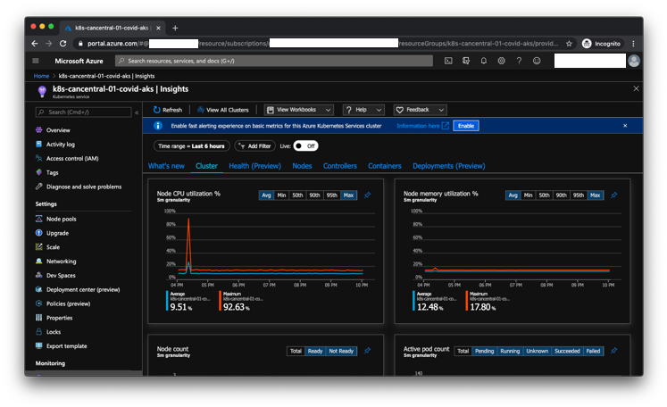
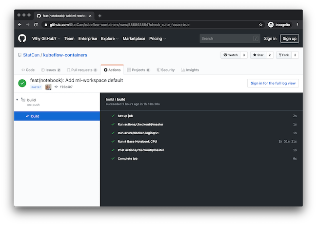
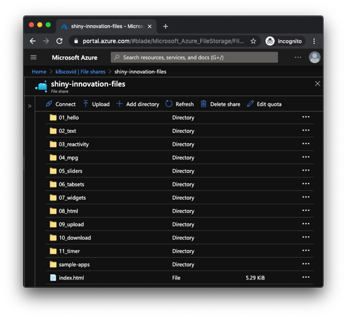
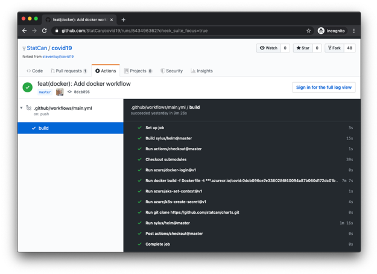
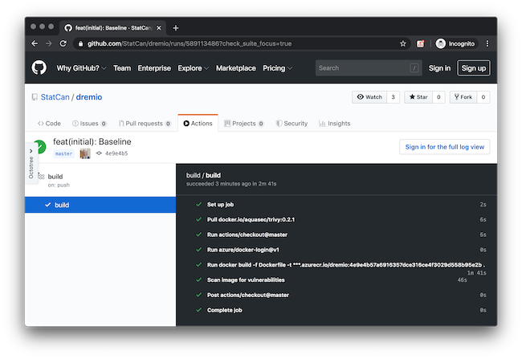

<!-- markdownlint-disable no-bare-urls no-duplicate-header -->

# Data Analytics as a Service

A presentation was given at Statistics Canada:

[Advanced Analytics Workspace](https://govcloud.blob.core.windows.net/docs/kubeflow-aaw.pdf)

## Background

In order to help guide the general direction of DAaaS and what we think can help
quickly on-board data scientists to a public cloud environment a proof of
concept prototype has been created using primarily open source technologies.

Firstly, we're interested in leveraging the tools and experience that we have
already obtained at Statistics Canada. This would mean utilizing Kubernetes (via
Azure Kubernetes Service) to orchestrate all of the data science workloads. The
Terraform configuration (Infrastructure as Code) already exists and we have
launched a cluster within a day with all of our common platform tools and the
various data analytics tools; KubeFlow, JupyterHub, and the Databricks operator
to name a few, as well as access to CPU and GPU machines that can autoscale on
demand. The Databricks operator allows us to manage Databricks from a unified
control plane, utilizing Desired State Configuration and showcases an example of
how Kubernetes can control PAAS services. All these tools align with industry
standards for data analytics.

> **Note**: To learn more about why Kubernetes is a good fit to manage Azure
> Databricks, we recommend quickly reading over the first half of the
> [Azure Data Bricks Operator](https://blog.openshift.com/wp-content/uploads/OpenShift-Commons-MSFT-Azure-Databricks-Operator.pdf)
> presentation by Microsoft which essentially describes vision. Then to see how
> Kubeflow can launch complex databricks operations as a pipeline which can be
> one of many potential outcomes; please see these
> [examples](https://github.com/kubeflow/pipelines/tree/0708cd723e088696ee86d523576c2daf08b5aa01/samples/contrib/azure-samples/kfp-azure-databricks).
> Additionally, in the links below we highlighted some reference architectures.

Statistics Canada has experience operating Kubernetes and data analytics/science
pipelines on top of it. Since Kubernetes is a general computation orchestrator,
we can run supporting services, applications, and more following a common
deployment and management methodology. Additionally with the integration with
Kubernetes Role-Based Access Control (RBAC) and the Open Policy Agent, we can
have fine-grained control over the configuration of data analytics pipelines.

> Note: We had to remove all references to the hostname at the moment but hope
> in the future can make available.

## Key Highlights

When you want to work with cloud native services in `Azure`, `AWS`, `GCP`, etc.
you start to think about how you can nicely manage these services without having
to have a whole second paradigm in your flows and actually deliver and bring
disparate systems up.

### Pipelines

- When you break down pipelines into their semantic parts the reality is they
  are a highly cohesive system, but they're loosely coupled meaning some of the
  components might not know about each other. They typically use a common agreed
  upon interface, so they know what to expect
- With respect to pipelines **relationship is king** and should be a first-class
  consideration as part of software delivery
- In current DAaaS the pipeline system is being developed so that it can
  support:
  - Unknown component configuration and relationships at build time
  - High flexibility and reusable components reducing on-boarding and
    operational time
  - Has 1 to many custom transforms whether is a bunch of spark jobs, python
    scripts, or anything else that can be run as part of a pipeline
  - Support for forks in the data stream where some of the data could go off to
    modern data warehouses such as Azure Synapse, others can simply go to object
    or regular storage, and others through a path on the system we might not
    know at design-time
  - Support single point of configuration for a pipeline where all the
    components, relationships, and parameters are defined in the same place
  - Create a unified workflow for the 200 data scientists that can embrace both
    open source software but also work with external dependencies (Databricks,
    PaaS services)

### Kubernetes

- Kubernetes is an industry-standard, unified control plane using Desired State
  Configuration
  - Well-defined catalog of operations that can be performed
  - Kubernetes enabled centralized control of access policies
  - Desired State Configuration allows for configuration modularity and re-use,
    allowing for packaging and compartmentalization of complexity across clouds
  - The operator pattern enables the configuration of external resources using
    standard and familiar constructs (e.g. a simple YAML file to maintain an
    external resource)
  - Enables the integration with custom components such as Event Hubs
    (streaming), Databricks, and even Azure Synapse
  - Where possible we align with the TBS directive that says we should be using
    open-source technologies first
- Through the Databricks Operator created by Azure, we can:
  - Launch customizable Spark notebooks through Kubernetes objects, which call
    the Databricks API (and the operator also updates the status of the job in
    Kubernetes)
  - Interact with Kubernetes secrets backed by Azure Keyvault enabling secure
    storage

## Security

We have currently completed all of the Priority 1 (P1) security controls during
the security assessment process of the Kubernetes platform within the Statistics
Canada IT Security team.

- Kubernetes CIS benchmarks (KubeBench)
- Docker Bench Security (DockerBench)
- ITSG-33 Baseline Policies / TBS recommended controls

We have leveraged the following tools / practices to assist with the above
security controls.

### GateKeeper

All of the Kubernetes Clusters (SDLC) which includes DAaaS have GateKeeper
installed on top of them. GateKeeper is a validating / mutating webhook that
enforces CRD-based policiies executed by the Open Policy Agent for the
Kubernetes Platform.

- https://github.com/StatCan/gatekeeper-policies

This repo contains common policies needed in Pod Security Policy but implemented
as Constraints and Constraint Templates with Gatekeeper.

A Pod Security Policy is a cluster-level resource that controls security
sensitive aspects of the pod specification. The PodSecurityPolicy objects define
a set of conditions that a pod must run with in order to be accepted into the
system, as well as defaults for the related fields.

### Starboard

Starboard integrates security tools into the Kubernetes environment, so that
users can find and view the risks that relate to different resources in a
Kubernetes-native way. Starboard provides custom security resources definitions
to work with a range of existing security tools. In addition, Starboard provides
a kubectl-compatible command-line tool and an Octant plug-in that make security
reports available through familiar Kubernetes tools.

- https://github.com/aquasecurity/starboard

We are leveraging the following CustomResourceDefinitions (CRDs) that relate to
both security and compliance checks in all of our Kubernetes clusters (SDLC).
While Starboard does provide more these are the three that we primarily use to
increase our security posture.

| Name                | Shortnames  | APIGROUP               | Namespaced | Kind               |
| ------------------- | ----------- | ---------------------- | ---------- | ------------------ |
| vulnerabilities     | vulns, vuln | aquasecurity.github.io | true       | Vulnerability      |
| ciskubebenchreports | kubebench   | aquasecurity.github.io | false      | CISKubeBenchReport |
| kubehunterreports   | kubehunter  | aquasecurity.github.io | false      | KubeHunterReport   |

1. **Vulnerabilities**: Behind the scenes, this uses
   [Trivy](https://github.com/aquasecurity/trivy) to identify vulnerabilities in
   the container images associated with the specified deployment.
2. **CIS KubeBench Reports**: Behind the scenes, this uses
   [KubeBench](https://github.com/aquasecurity/kube-bench) which checks whether
   Kubernetes is deployed securely by running the checks documented in the
   [CIS Kubernetes Benchmark](https://www.cisecurity.org/benchmark/kubernetes/).
   Tests are configured with YAML files, making this tool easy to update as test
   specifications evolve.
3. **KubeHunter Reports**: Behind the scenes, this uses
   [KubeHunter](https://github.com/aquasecurity/kube-hunter) which hunts for
   security weaknesses in Kubernetes clusters. The tool was developed to
   increase awareness and visibility for security issues in Kubernetes
   environments.

## Azure Kubernetes Service

Launched a secured Cloud Native Platform for Government based on the version we
open sourced to the
[GC Accelerators](https://github.com/canada-ca-terraform-modules?q=kubernetes).
The platform is built using open source software projects, primarily from the
Cloud Native Computing Foundation (CNCF).

What can you do it with / what have we done with it?

- Infrastructure and platform tools deployed using Infrastructure as Code
  (Terraform)
  - Cluster, monitoring, logging and deployment tools
- Public-available cluster and web endpoints
- Authentication against the Statistics Canada Cloud directory
- Base for all of the components discussed later
- Access to different machine types (CPU, GPU and high-memory) based on use-case

### Services

- https://istio-kiali.covid.cloud.statcan.ca (private)
- https://grafana.covid.cloud.statcan.ca
- https://istio-grafana.covid.cloud.statcan.ca (private)
- https://prometheus.covid.cloud.statcan.ca (private)
- https://alertmanager.covid.cloud.statcan.ca (private)

### Source Code

- https://github.com/StatCan/terraform-kubernetes-aks-daaas
- https://github.com/StatCan/terraform-kubernetes-aks-platform-daaas
- https://github.com/StatCan/charts
- https://github.com/StatCan/gatekeeper-policies
- https://govcloud.ca
- https://govcloud.blob.core.windows.net/docs/azure-aks-platform.pdf

## Kubeflow

Kubeflow is a suite of tools for running Machine Learning (ML) workflows on
Kubernetes. It is an open-source tool used by large research institutions (like
CERN) for machine learning workloads and backed by a large community (10k stars
on GitHub). It has been deployed into our AKS cluster, and connected to the
Statistics Canada Cloud user directory for authentication and will be expanded
to others through integration with GitHub authentication.

What can you do it with / what have we done with it?

- Created and open sourced GitHub Action for KubeFlow (upgrade API, and added
  support for X-Auth-Token)
- Authorization done via OpenID Connect (OIDC)
- Cluster will autoscale automatically based on demand
- Pipeline created from GitHub Actions
- Pipelines controlled through code
- Pipelines calling PAAS services like DataBricks
- Shared and individual workspaces for Jupyter Notebooks
- Launched KubeFlow via Kustomize to AKS

The two images demonstrate a pipeline definition and an execution.

These pipelines were deployed through GitHub Actions, and the bottom one was
executed in an Azure Databricks cluster.

The above picture demonstrates the GitHub Action deploying the pipeline.

The below picture demonstrates sharing a workspace with other contributors.

### Source Code

- https://github.com/StatCan/actions/tree/master/kubeflow-databricks
- https://github.com/StatCan/gpu-toleration-injector
- https://github.com/StatCan/kubeflow-containers
- https://github.com/StatCan/kubeflow-controller
- https://github.com/StatCan/kubeflow-manifest

## Kubeflow Containers

Created a set of of ready-to-run container images for various types of roles
related to data science. We provide a convenient and tailored experience of
Jupyter including all the tools data scientists need to do their work.

What can you do it with / what have we done with it?

- Built and deployed all container images to Azure Container Registry via GitHub
  Actions
- Extended from the officially supported Jupyter container images providing
  additional data science tools
- Task-specific images based on required tools
  - Geomatics (R and Geo specific tooling)
  - Machine learning (Tensorflow, Tensorboard, Keras, etc)
  - Full workspace: VS Code, VNC Server, and other graphical tools
- Images are built for CPU compute and GPU compute (NVIDIA/CUDA)

The above picture demonstrates the GitHub Actions workflow to build and deploy
container images to the Azure Container Registry.

### Source Code

- https://github.com/StatCan/kubeflow-containers
- https://github.com/StatCan/kubeflow-containers/actions

## Jupyter Notebooks (Examples)

We have created a variety of example Jupyter Notebooks utilizing the data
science tools deployed. This includes simple examples to complete, training to
model serving pipelines (MLOps).

What can you do it with / what have we done with it?

- Languages: Python, R
- Technologies: Tensorflow, PyTorch, Keras
- Storage: Accessing data stored in S3-compatible storage
- Integration with PAaaS offerings: Azure Databricks and MLflow
- Demonstration of a fully baked end to end pipeline from training to model
  serving in Kubeflow
- Custom data science containers / algorithms for analyzing, processing, and
  training data:
  - [Tensorflow Transform](https://github.com/StatCan/datascience-containers/blob/master/preprocessing/tft/src/transform.py)
    for preprocessing raw data to data used to train a ML model
  - [Tensorflow Boosted Trees Classifier](https://github.com/StatCan/datascience-containers/blob/master/training/dnntrainer/src/trainer/boosted.py)
    to predict and work with structured data
  - [Prediction](https://github.com/StatCan/datascience-containers/blob/master/training/predict/src/predict.py)
    runs data through the predicted model
  - [Confusion Matrix](https://github.com/StatCan/datascience-containers/blob/master/metrics/confusion_matrix/src/confusion_matrix.py)
    for visualization of algorithm performance
  - [Receiver Operating Characteristic](https://github.com/StatCan/datascience-containers/blob/master/metrics/roc/src/roc.py)
    for performance measurement for classification problem
  - [Tensorflow Serving](https://github.com/StatCan/datascience-containers/blob/master/serving/deployer/src/deploy.sh)
    for delivering and updating the model

The above picture demonstrates an advanced learning and training pipeline on
Kubeflow.

### Source Code

- https://github.com/StatCan/datascience-containers
- https://github.com/StatCan/jupyter-notebooks

## MinIO

MinIO provides an S3-compatible API to access data stored locally or within an
Azure Blob storage account.

What can you do it with / what have we done with it?

- Built and deployed through GitHub Actions
- Expose acccess to data stored in multiple types of backends (cloud, local) via
  an S3-compatible API
- Available for use within Kubeflow pipelines and from Jupyter notebooks
- Basic SQL-like access to data files
- MinIO platform configuration leveraging the MinIO Operator, Kustomize and OPA
  - Multiple tenants backed by multiple drives in a distributed fashion (erasure
    code)
  - Lifecycle management handled via automated snapshots (velero) and backups
    (mc mirror)
  - Integrated with OIDC linked to Azure Tenant via MinIO Security Token Service
  - Authorization and access to different types of buckets done through the Open
    Policy Agent

Different types of tenants:

- Minimal (Default)
- Application Level (High Storage)
- Premium (SSD and improved IOPS)

The above picture demonstrates a Jupyter Notebook interacting with MinIO through
an API.

## Shiny

Shiny is an application server for serving R-based visualization applications
created by data scientists.

What can you do it with / what have we done with it?

- Launched Shiny Server to AKS via GitHub Actions
- Created a helm chart to be called by GitHub Actions
- Shiny Server extended behind Nginx proxy
- Integrated with Azure Files for application hosting

The above picture demonstrates the GitHub Actions workflow to build and deploy
it to AKS.

The below picture demonstrates the file share containing all R applications
served by Shiny.

### Source Code

- https://github.com/StatCan/shiny
- https://github.com/StatCan/shiny/actions
- https://github.com/StatCan/charts/tree/master/stable/shiny

## Node.js (https://covid19.covid.cloud.statcan.ca)

Covid-19 is an interactive, animated COVID-19 coronavirus map to track the
outbreak over time by country and by region for selected countries (including
China, Italy, Korea, Japan, France, Germany, United States). It was launched
into our environment to demonstrate running web applications and we saw
opportunity to improve it to better demonstrate the spread of COVID-19 across
Canada.

What can you do it with / what have we done with it?

- Launched Node.js react application to AKS via GitHub Actions
- Created a helm chart to be called by GitHub Actions
- Forked popular open source repo on GitHub and containerized
- Started to work on french interface and design improvements
- Looking at integrating with the Statistics Canada dataset
- Looking at feasibility of KubeFlow (Machine Learning) to add spread prediction

The above picture demonstrates the action which builds and deploys the COVID-19
application.

### Source Code

- https://github.com/StatCan/covid19
- https://github.com/StatCan/covid19/actions
- https://github.com/StatCan/charts/tree/master/stable/covid

## .NET (https://portal.covid.cloud.statcan.ca)

The main portal for the DAaaS platform which will provide data scientists with
both the list of supported services as well useful datasets that they can
leverage in their machine learning journey. The portal will also offer helpful
documentation, resources, tutorials, and support for the multiple types of data
scientists using the platform.

What can you do it with / what have we done with it?

- Launched OrchardCMS application to AKS via GitHub Actions
- Created a helm chart to be called by GitHub Actions
- Working on latest iteration of the mockup templates
- The addition of content as well as helpful datasets to leverage

The above picture demonstrates the action which builds and deploys the Portal
web application.

### Source Code

- https://github.com/StatCan/StatCan.OrchardCore
- https://github.com/StatCan/StatCan.OrchardCore/actions
- https://github.com/StatCan/charts/tree/master/stable/orchard-cms

## MLflow (https://mlflow.covid.cloud.statcan.ca)

Launched MLflow alongside with its web ui in a highly available fashion on top
of Kubernetes. MLflow was configured to use an Azure storage account for the
backend artifact store.

> Note: With MLflow 1.1, you can now run MLflow Projects on Kubernetes clusters.
> Any MLflow Project with a Docker Environment is supported. MLflow executes
> your Project code as a Kubernetes Job and periodically monitors its status
> until completion.

What can you do it with / what have we done with it?

- Launched MLflow python application to AKS via GitHub Actions
- Created a helm chart to be called by GitHub Actions
- Extended container image to support Azure storage backend for the artifact
  store
- File store is configured as an persistent volume
- Artifact store is configured as an Azure storage account
- Efficient use of Gunicorn workers

The above picture demonstrates the action which builds and deploys the Mlflow
application.

### Source Code

- https://github.com/StatCan/mlflow
- https://github.com/StatCan/mlflow/actions
- https://github.com/StatCan/charts/tree/master/stable/mlflow

## Dremio (https://dremio.covid.cloud.statcan.ca)

We experimented with Dremio to provide a common way of accessing data stored in
various sources (e.g., Azure Storage account, Azure Data Lake, S3, MSSQL, etc.).

What can you do it with / what have we done with it?

- Launched the Open Source version with the Helm chart (Highly available, with
  Zookeeper or Etcd backend)
- Currently experimental due to limitations in authentication in the free
  version
- Support for many data sources:
  - Azure Storage Account
  - Azure Data Lake
  - S3
  - MSSQL / MySQL / PostgreSQL
  - Elasticsearch

The above picture demonstrates the action which builds and deploys the Dremio
application.

### Source Code

- https://github.com/StatCan/dremio
- https://github.com/StatCan/dremio/actions
- https://github.com/StatCan/charts/tree/master/stable/dremio

## Pachyderm (https://pachyderm.covid.cloud.statcan.ca)

Launched Pachyderm a data science platform that combines Data Lineage with
End-to-End Pipelines on Kubernetes

What can you do it with / what have we done with it?

- Launched Pachyderm to AKS via GitHub Actions
- Leverages Azure storage for its object store (backing data)
- Pachyderm's S3 Gateway can now be used as a sidecar to Kubeflow pipelines
- Kubeflow now can leverage Pachyderm's powerful data versioning and lineage
  capabilities

### Source Code

- https://github.com/StatCan/pachyderm
- https://github.com/StatCan/pachyderm/actions

## Vault (https://vault.covid.cloud.statcan.ca)

Launched Vault alongside with its web ui to provide a centralized place to
secure, store and tightly control access to tokens, passwords, and certificates.

What can you do it with / what have we done with it?

- Vault injector with Azure AD is setup to provide access credentials for both
  Kubeflow and Jupyter Notebooks
- AAD Pod Identity enables Kubernetes applications to access cloud resources
  securely with Azure Active Directory (AAD)
- Authentication is setup using managed identities (MSI) for Azure resources

### Source Code

- https://github.com/StatCan/terraform-vault (private)
- https://github.com/StatCan/vault-plugin-secrets-minio

## Important Links

### Resources

- Azure DataBricks and Kubernetes
  ([PDF](https://blog.openshift.com/wp-content/uploads/OpenShift-Commons-MSFT-Azure-Databricks-Operator.pdf))
  ([YouTube](https://www.youtube.com/watch?v=gBgXI5WmcWg))
- KubeFlow pipeline supporting complex DataBricks operations
  ([Link](https://github.com/kubeflow/pipelines/tree/0708cd723e088696ee86d523576c2daf08b5aa01/samples/contrib/azure-samples/kfp-azure-databricks))
- Reference Architectures:
  - Train a recommendation model using Azure DataBricks and deploy as an API
    ([Link](https://github.com/MicrosoftDocs/architecture-center/blob/master/docs/reference-architectures/ai/real-time-recommendation.md))
  - Recommended ways to train and deploy machine learning models on Azure
    ([Link](https://github.com/microsoft/AIReferenceArchitectures))
  - ComCast case study using Azure DataBricks and AKS
    ([Link](https://www.topbots.com/ml-model-deployment-with-mlflow-kubernetes/))

#### Source Code

- https://github.com/StatCan?q=daaas
- https://github.com/StatCan/actions
- https://github.com/StatCan/terraform-kubernetes-aks-daaas
- https://github.com/StatCan/terraform-kubernetes-aks-platform-daaas
- https://github.com/StatCan/terraform-kubernetes-aks-daaas-private (private)
- https://github.com/StatCan/terraform-kubernetes-aks-platform-daaas-private
  (private)
- https://github.com/StatCan/charts
- https://github.com/StatCan/covid19
- https://github.com/StatCan/daaas
- https://github.com/StatCan/daaas-containers
- https://github.com/StatCan/dremio
- https://github.com/StatCan/gatekeeper-policies
- https://github.com/StatCan/jupyter-apis
- https://github.com/StatCan/jupyter-notebooks
- https://github.com/StatCan/goofys-injector
- https://github.com/StatCan/gpu-toleration-injector
- https://github.com/StatCan/kubecost
- https://github.com/StatCan/kubeflow
- https://github.com/StatCan/kubeflow-containers
- https://github.com/StatCan/kubeflow-controller
- https://github.com/StatCan/kubeflow-containers-desktop
- https://github.com/StatCan/kubeflow-manifest
- https://github.com/StatCan/kubeflow-mlops
- https://github.com/StatCan/matomo
- https://github.com/StatCan/minio
- https://github.com/StatCan/mlflow
- https://github.com/StatCan/mlflow-operator
- https://github.com/StatCan/pachyderm
- https://github.com/StatCan/R-dashboards
- https://github.com/StatCan/R-notebooks
- https://github.com/StatCan/s3-fuse-flex-volume
- https://github.com/StatCan/shiny
- https://github.com/StatCan/statcan.orchardcore
- https://github.com/StatCan/terraform-vault-daaas (private)
- https://github.com/StatCan/vault-plugin-secrets-minio

#### GitHub Actions

- https://github.com/StatCan/actions/actions
- https://github.com/StatCan/charts/actions
- https://github.com/StatCan/covid19/actions
- https://github.com/StatCan/daaas/actions
- https://github.com/StatCan/daaas-containers/actions
- https://github.com/StatCan/dremio/actions
- https://github.com/StatCan/kubecost/actions
- https://github.com/StatCan/gatekeeper-policies/actions
- https://github.com/StatCan/jupyter-apis/actions
- https://github.com/StatCan/jupyter-notebooks/actions
- https://github.com/StatCan/goofys-injector/actions
- https://github.com/StatCan/gpu-toleration-injector/actions
- https://github.com/StatCan/kubeflow-containers/actions
- https://github.com/StatCan/kubeflow-controller/actions
- https://github.com/StatCan/kubeflow-containers-desktop/actions
- https://github.com/StatCan/kubeflow-manifest/actions
- https://github.com/StatCan/kubeflow-mlops/actions
- https://github.com/StatCan/matomo/actions
- https://github.com/StatCan/minio/actions
- https://github.com/StatCan/mlflow/actions
- https://github.com/StatCan/mlflow-operator/actions
- https://github.com/StatCan/pachyderm/actions
- https://github.com/StatCan/R-dashboards/actions
- https://github.com/StatCan/s3-fuse-flex-volume/actions
- https://github.com/StatCan/shiny/actions
- https://github.com/StatCan/StatCan.OrchardCore/actions
- https://github.com/StatCan/terraform-kubernetes-aks-daaas-private/actions
  (private)
- https://github.com/StatCan/terraform-kubernetes-aks-platform-daaas-private/action
  (private)

#### Ingresses

- https://elastic.covid.cloud.statcan.ca
- https://kibana.covid.cloud.statcan.ca
- https://logging-elastic.covid.cloud.statcan.ca
- https://logging-kibana.covid.cloud.statcan.ca
- https://istio-grafana.covid.cloud.statcan.ca
- https://istio-kiali.covid.cloud.statcan.ca
- https://kubecost.covid.cloud.statcan.ca
- https://minimal-tenant1-minio.covid.cloud.statcan.ca
- https://pachyderm-tenant1-minio.covid.cloud.statcan.ca
- https://premium-tenant1-minio.covid.cloud.statcan.ca
- https://daaas-tenant1-mlflow.covid.cloud.statcan.ca
- https://mlflow.covid.cloud.statcan.ca
- https://grafana.covid.cloud.statcan.ca
- https://pachyderm.covid.cloud.statcan.ca
- https://vault.covid.cloud.statcan.ca
- https://covid19.covid.cloud.statcan.ca
- https://matomo.covid.cloud.statcan.ca
- https://oc-dev.covid.cloud.statcan.ca
- https://portal-old.covid.cloud.statcan.ca
- https://shiny.covid.cloud.statcan.ca

#### Recommended Reading

- https://kubeflow.org/docs/started/getting-started/
- https://towardsdatascience.com/tagged/kubernetes
- https://medium.com/kredaro-engineering/ai-tales-building-machine-learning-pipeline-using-kubeflow-and-minio-4b88da30437b
- https://pachyderm.com/blog/pachyderm-1-10-s3-gateway-expansion-brings-support-for-kubeflow/
