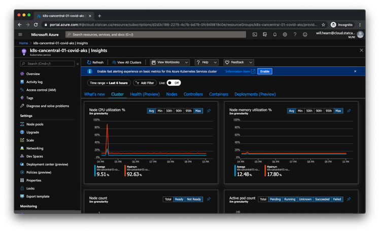
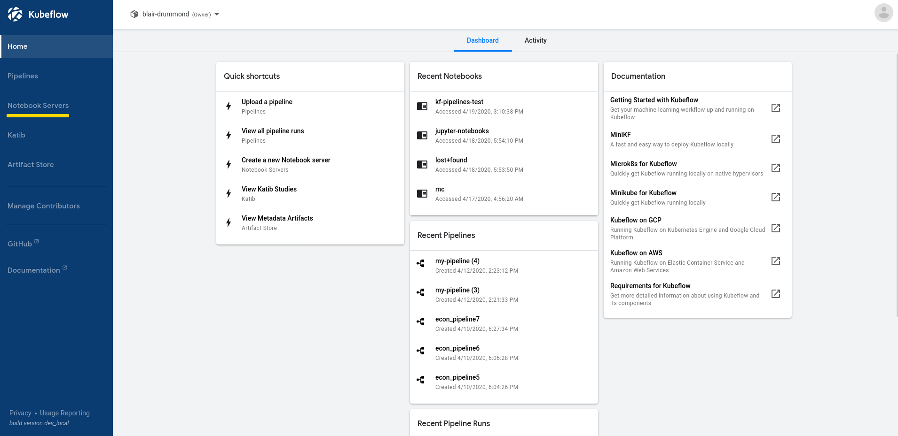
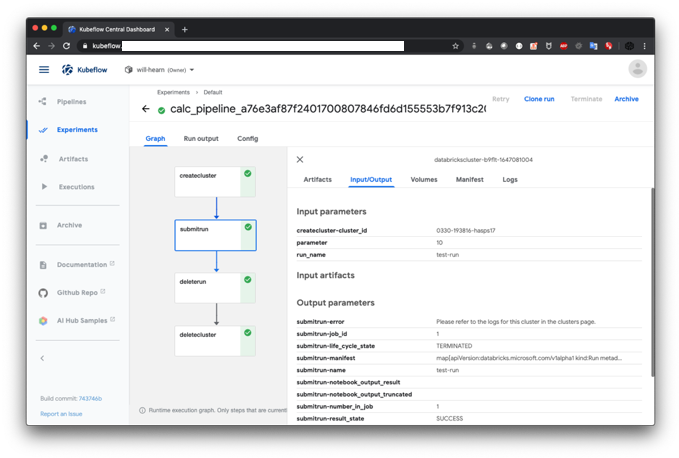
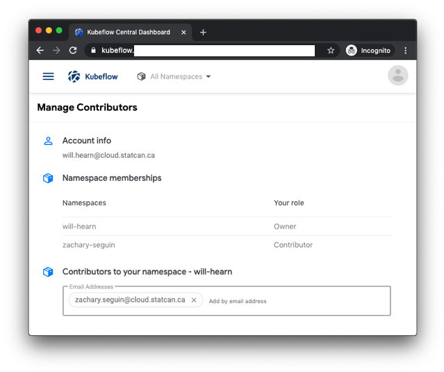

# DAaaS Proof of Concept

## Background

In order to help guide the general direction of DAaaS and what we think can help quickly on-board data scientists to a public cloud environment a proof of concept prototype has been created using primarily open source technologies.

Firstly, we're interested in leveraging the tools and experience that we have already obtained at Statistics Canada. This would mean utilizing Kubernetes (via Azure Kubernetes Service) to orchestrate all of the data science workloads. The Terraform configuration (Infrastructure as Code) already exists and we have launched a cluster within a day with all of our common platform tools and the various data analytics tools; KubeFlow, Jupyterhub, and the Databricks operator to name a few, as well as access to CPU and GPU machines that can autoscale on demand. The Databricks operator allows us to manage Databricks from a unified control plane, utilizing Desired State Configuration and showcases an example of how Kubernetes can control PAAS services. All these tools align with industry standards for data analytics.

> Note: To learn more about why Kubernetes is a good fit to manage Azure Databricks, we recommend quickly reading over the first half of the [Azure Data Bricks Operator](https://blog.openshift.com/wp-content/uploads/OpenShift-Commons-MSFT-Azure-Databricks-Operator.pdf) presentation by Microsoft which essentially describes vision. Then to see how Kubeflow can launch complex databricks operations as a pipeline which can be one of many potential outcomes; please see these [examples](https://github.com/kubeflow/pipelines/tree/0708cd723e088696ee86d523576c2daf08b5aa01/samples/contrib/azure-samples/kfp-azure-databricks). Additionally, in the links below we highlighted some reference architectures.

Statistics Canada has experience operating Kubernetes and data analytics/science pipelines on top of it. Since Kubernetes is a general computation orchestrator, we can run supporting services, applications, and more following a common deployment and management methodology. Additionally with the integration with Kubernetes Role-Based Access Control (RBAC) and the Open Policy Agent, we can have fine-grained control over the configuration of data analytics pipelines.

## Key Highlights

When you want to work with cloud native services in `Azure`, `AWS`, `GCP`, etc. you start to think about how you can nicely manage these services without having to have a whole second paradigm in your flows and actually deliver and bring disparate systems up.

### Pipelines

* When you break down pipelines into their semantic parts the reality is they are a highly cohesive system, but they're loosely coupled meaning some of the components might not know about each other. They typically use a common agreed upon interface, so they know what to expect
* With respect to pipelines **relationship is king** and should be a first-class consideration as part of software delivery
* In current DAaaS the pipeline system is being developed so that it can support:
  * Unknown component configuration and relationships at build time
  * High flexibility and reusable components reducing on-boarding and operational time
  * Has 1 to many custom transforms whether is a bunch of spark jobs, python scripts, or anything else that can be run as part of a pipeline
  * Support for forks in the data stream where some of the data could go off to modern data warehouses such as Azure Synapse, others can simply go to object or regular storage, and others through a path on the system we might not know at design-time
  * Support single point of configuration for a pipeline where all the components, relationships, and parameters are defined in the same place
  * Create a unified workflow for the 200 data scientists that can embrace both open source software but also work with external dependencies (Databricks, PaaS services)

### Kubernetes

* Kubernetes is an industry-standard, unified control plane using Desired State Configuration
  * Well-defined catalog of operations that can be performed
  * Kubernetes enabled centralized control of access policies
  * Desired State Configuration allows for configuration modularity and re-use, allowing for packaging and compartmentalization of complexity across clouds
  * The operator pattern enables the configuration of external resources using standard and familiar constructs (e.g. a simple YAML file to maintain an external resource)
  * Enables the integration with custom components such as Event Hubs (streaming), Databricks, and even Azure Synapse
  * Where possible we align with the TBS directive that says we should be using open-source technologies first
* Through the Databricks Operator created by Azure, we can:
  * Launch customizable Spark notebooks through Kubernetes objects, which call the Databricks API (and the operator also updates the status of the job in Kubernetes)
  * Interact with Kubernetes secrets backed by Azure Keyvault enabling secure storage

## Azure Kubernetes Service

Launched a secured Cloud Native Platform for Government based on the version we open sourced to the [GC Accelerators](https://github.com/canada-ca-terraform-modules?q=kubernetes). The platform is built using open source software projects, primarily from the Cloud Native Computing Foundation (CNCF).

What can you do it with / what have we done with it?

* Infrastructure and platform tools deployed using Infrastructure as Code (Terraform)
  * Cluster, monitoring, logging and deployment tools
* Public-available cluster and web endpoints
* Authentication against the Statistics Canada Cloud directory
* Base for all of the components discussed later
* Access to different machine types (CPU, GPU and high-memory) based on use-case

### Services

* https://istio-kiali.example.ca
* https://grafana.example.ca
* https://istio-grafana.example.ca (private)
* https://prometheus.example.ca (private)
* https://alertmanager.example.ca (private)

### Source Code

* https://github.com/StatCan/terraform-kubernetes-aks-daaas
* https://github.com/StatCan/terraform-kubernetes-aks-platform-daaas
* https://github.com/StatCan/charts
* https://govcloud.ca
* https://govcloud.blob.core.windows.net/docs/azure-aks-platform.pdf

## Kubeflow

Kubeflow is a suite of tools for running Machine Learning (ML) workflows on Kubernetes. It is an open-source tool used by large research institutions (like CERN) for machine learning workloads and backed by a large community (10k stars on GitHub). It has been deployed into our AKS cluster, and connected to the Statistics Canada Cloud user directory for authentication and will be expanded to others through integration with GitHub authentication.

What can you do it with / what have we done with it?

* Created and Open sourced GitHub Action for KubeFlow (upgrade API, and added support for X-Auth-Token)
* Pipeline created from GitHub Actions
* Pipelines controlled through code
* Pipelines calling PAAS services like DataBricks
* Shared and individual workspaces for Jupyter Notebooks
* Launched KubeFlow via Kustomize to AKS

The two images demonstrate a pipeline definition and an execution.

These pipelines were deployed through GitHub Actions, and the bottom one was executed in an Azure Databricks cluster.

The above picture demonstrates the GitHub Action deploying the pipeline.

The below picture demonstrates sharing a workspace with other contributors.

### Source Code

* https://github.com/StatCan/gpu-toleration-injector
* https://github.com/StatCan/kubeflow-containers
* https://github.com/StatCan/kubeflow-controller
* https://github.com/StatCan/kubeflow-github-action
* https://github.com/StatCan/kubeflow-manifest

## Shiny

Shiny is an application server for serving R-based visualization applications created by data scientists.

What can you do it with / what have we done with it?

* Launched Shiny Server to AKS via GitHub Actions
* Shiny Server extended behind Nginx proxy
* Integrated with Azure Files for application hosting

The above picture demonstrates the GitHub Actions workflow to build and deploy it to AKS.

The below picture demonstrates the file share containing all R applications served by Shiny.

#### Source Code

* https://github.com/StatCan/shiny
* https://github.com/StatCan/shiny/actions

## NodeJS (https://covid19.example.ca)

Covid-19 is an interactive, animated COVID-19 coronavirus map to track the outbreak over time by country and by region for selected countries (including China, Italy, Korea, Japan, France, Germany, United States). It was launched into our environment to demonstrate running web applications and we saw opportunity to improve it to better demonstrate the spread of COVID-19 across Canada.

What can you do it with / what have we done with it?

* Launched NodeJS react application to AKS via GitHub Actions
* Forked popular open source repo on GitHub and containerized
* Started to work on french interface and design improvements
* Looking at integrating with the Statistics Canada dataset
* Looking at feasibility of KubeFlow (Machine Learning) to add spread prediction

The above picture demonstrates the action which builds and deploys the COVID-19 application.

### Source Code

* https://github.com/StatCan/covid19
* https://github.com/StatCan/covid19/actions

## Important Links

### Resources

* Azure DataBricks and Kubernetes ([PDF](https://blog.openshift.com/wp-content/uploads/OpenShift-Commons-MSFT-Azure-Databricks-Operator.pdf)) ([YouTube](https://www.youtube.com/watch?v=gBgXI5WmcWg))
* KubeFlow pipeline supporting complex DataBricks operations ([Link](https://github.com/kubeflow/pipelines/tree/0708cd723e088696ee86d523576c2daf08b5aa01/samples/contrib/azure-samples/kfp-azure-databricks))
* Reference Architectures:
  * Train a recommendation model using Azure DataBricks and deploy as an API ([Link](https://github.com/MicrosoftDocs/architecture-center/blob/master/docs/reference-architectures/ai/real-time-recommendation.md))
  * Recommended ways to train and deploy machine learning models on Azure ([Link](https://github.com/microsoft/AIReferenceArchitectures))
  * ComCast case study using Azure DataBricks and AKS ([Link](https://www.topbots.com/ml-model-deployment-with-mlflow-kubernetes/))

#### Source Code

* https://github.com/StatCan?q=daaas
* https://github.com/StatCan/terraform-kubernetes-aks-daaas
* https://github.com/StatCan/terraform-kubernetes-aks-platform-daaas
* https://github.com/StatCan/charts
* https://github.com/StatCan/covid19
* https://github.com/StatCan/daaas
* https://github.com/StatCan/gpu-toleration-injector
* https://github.com/StatCan/kubeflow-containers
* https://github.com/StatCan/kubeflow-controller
* https://github.com/StatCan/kubeflow-github-action
* https://github.com/StatCan/kubeflow-manifest
* https://github.com/StatCan/shiny

#### GitHub Actions

* https://github.com/StatCan/charts/actions
* https://github.com/StatCan/covid19/actions
* https://github.com/StatCan/gpu-toleration-injector/actions
* https://github.com/StatCan/kubeflow-containers/actions
* https://github.com/StatCan/kubeflow-controller/actions
* https://github.com/StatCan/kubeflow-github-action/actions
* https://github.com/StatCan/shiny/actions

#### Public

* https://kubeflow.example.ca
* https://shiny.example.ca
* https://covid19.example.ca
* https://istio-kiali.example.ca
* https://grafana.example.ca
* https://istio-grafana.example.ca (private)
* https://prometheus.example.ca (private)
* https://alertmanager.example.ca (private)
