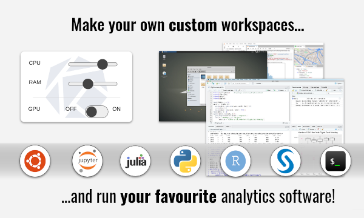

<h1 align="center">AAW: Advanced Analytics Workspace</h1>

<h2 align="center">

</h2>

<h3 align="center">by The Data Analytics as a Service Division at Statistics Canada</h3>

<h2 align="center">⭐ Star us on GitHub — it motivates us a lot! ⭐</h2>

<h4 align="center">A Kubeflow-based data science platform for professionals.</h4>

<p align="center">
<a href="https://statcan-aaw.slack.com/"></a>
<a href="https://github.com/StatCan/aaw-contrib-jupyter-notebooks"></a>
<a href="https://github.com/StatCan/aaw-contrib-r-notebooks"></a>
</p>

<p align="center">
  <a href="#key-features">Key Features</a> •
  <a href="#key-features">Access</a> •
  <a href="#presentations">Presentations</a> •
  <a href="#faq">FAQ</a> •
  <a href="#contribute">Contribute</a> •
  <a href="#security">Security</a> •
  <a href="#community">Community</a>
</p>

## Key Features

- Based on Kubernetes and is therefore cloud agnostic.
- Access all the best software.
- MLOps with Kubeflow.
- GitOps with Gitea.
- Data Analysis with Python and R in JupyterLab or R Studio.
- Support for Python, R, Julia and SAS.
- VSCode.

## Access / Usage

- Internal (Statistics Canada employees) users with statcan.gc.ca email addresses can use either the internal or the external portals.

  - [Internal Portal ](https://www.statcan.gc.ca/data-analytics-service)
  - [External Portal](https://analytics-platform.statcan.gc.ca/covid19)

- External users need to fill an Intake form to obtain a cloud account (cloud.statcan.ca). External users need to be sponsored, need approval from Opmic and need to be given either a Statistics Canada cloud email or guest account. External users have to use the external portal.

  - [External Portal](https://analytics-platform.statcan.gc.ca/covid19)

## Frequently Asked Questions

If you have any questions regarding the platform please consult our [English FAQ](https://statcan.github.io/daaas/en/6-FAQ/FAQ/) or our [French FAQ](https://statcan.github.io/daaas/fr/6-FAQ/FAQ/). If your question does not appear in the FAQ, please reach out to us on our [Slack Support Channel](https://statcan-aaw.slack.com/).

## Presentations on AAW

We highly encourage you to watch our YouTube presentation given at Stratosphere:

- [YouTube](https://www.youtube.com/watch?v=quYuuEAqNm0)
- [SlideDeck](https://govcloud.blob.core.windows.net/docs/daaas-cncf.pdf)
- [AAW Onboarding Presentation](https://docs.google.com/presentation/d/12yTDlbMCmbg0ccdea2h0vwhs5YTa_GHm_3DieG5A-k8/edit?usp=sharing)

## Security Best Practices

A discussion about some of the security best practices in use by this platform:

- [AAW Security Proposal](https://github.com/StatCan/aaw-security-proposal)

## How to Contribute

Below you will find our Github repositories. Peruse the repositories below and find the one pertaining to the component you are interested in contributing to.

1. Clone repo and create a new branch: `$ git checkout https://github.com/StatCan/repo_name -b name_for_new_branch`.
2. Make changes and test.
3. Submit Pull Request with comprehensive description of changes.

### AAW

The following is a list of all the `general` related repositories for the AAW project.

| Repository                                                                                                | Description                                                                                   | Visibility |
| --------------------------------------------------------------------------------------------------------- | --------------------------------------------------------------------------------------------- | ---------- |
| [aaw-argocd-applications](https://github.com/StatCan/aaw-argocd-applications)                             | ArgoCD Applications                                                                           | Private    |
| [aaw-argocd-manifests](https://github.com/StatCan/aaw-argocd-manifests)                                   | Manifests used for ArgoCD deployments                                                         | Public     |
| [aaw-argoflow-azure](https://github.com/StatCan/aaw-argoflow-azure)                                       | Kubeflow deployment powered by ArgoCD                                                         | Public     |
| [aaw-kubeflow-containers](https://github.com/StatCan/aaw-kubeflow-containers)                             | Containers to be used within Kubeflow                                                         | Public     |
| [aaw-contrib-containers](https://github.com/StatCan/aaw-contrib-containers)                               | Containers to be used for general purpose Data Science                                        | Public     |
| [aaw-contrib-jupyter-notebooks](https://github.com/StatCan/aaw-contrib-jupyter-notebooks)                 | Jupyter Notebooks to be used with the Advanced Analytics Workspace platform                   | Public     |
| [aaw-contrib-r-notebooks](https://github.com/StatCan/aaw-contrib-r-notebooks)                             | R Notebooks to be used with Advanced Analytics Workspace platform                             | Public     |
| [aaw-gatekeeper-constraints](https://github.com/StatCan/aaw-gatekeeper-constraints)                       | Gatekeeper constraints built specifically for AAW                                             | Private    |
| [aaw-goofys-injector](https://github.com/StatCan/aaw-goofys-injector)                                     | Mount an S3 bucket, Data Lake, Blob Storage as a file system in a Notebook                    | Public     |
| [aaw-inferenceservices-controller](https://github.com/StatCan/aaw-inferenceservices-controller)           | Kubernetes controller for managing inference services                                         | Public     |
| [aaw-kubeflow-manifests](https://github.com/StatCan/aaw-kubeflow-manifests)                               | Kustomize installation manifests for Kubeflow                                                 | Public     |
| [aaw-kubeflow-controller](https://github.com/StatCan/aaw-kubeflow-controller)                             | Kubeflow controller which sets PodDefaults + Vault policies for each Profile detected         | Public     |
| [aaw-kubeflow-mlops](https://github.com/StatCan/aaw-kubeflow-mlops)                                       | Kubeflow MLOps pipeline using GitHub Actions                                                  | Public     |
| [aaw-kubeflow-opa-sync](https://github.com/StatCan/aaw-kubeflow-opa-sync)                                 | Synchronize profile editors into the Open Policy Agent for use in MinIO Access Control        | Public     |
| [aaw-kubeflow-pipelines-secret-scanner](https://github.com/StatCan/aaw-kubeflow-pipelines-secret-scanner) | Scan all Kubeflow pipelines for exposed secrets                                               | Public     |
| [aaw-kubeflow-profiles](https://github.com/StatCan/aaw-kubeflow-profiles)                                 | Kubeflow profile manifests stored in YAML                                                     | Private    |
| [aaw-kubeflow-profiles-controller](https://github.com/StatCan/aaw-kubeflow-profiles-controller)           | Kubeflow profiles controller which allows for custom configuration for an individual profile  | Public     |
| [aaw-minio-credential-injector](https://github.com/StatCan/aaw-minio-credential-injector)                 | Mutating webhook which adds minio credential annotations to notebook pods                     | Public     |
| [aaw-network-policies](https://github.com/StatCan/aaw-network-policies)                                   | Kubernetes network policies for AAW                                                           | Private    |
| [aaw-prob-notebook-controller](https://github.com/StatCan/aaw-prob-notebook-controller)                   | Kubernetes controller for managing Authorization Policies associated to Protected-B Notebooks | Public     |
| [aaw-security-proposal](https://github.com/StatCan/aaw-security-proposal)                                 | Proposal for the implementation of Protected B workloads in AAW                               | Public     |
| [aaw-toleration-injector](https://github.com/StatCan/aaw-toleration-injector)                             | Kubernetes toleration injector with support for GPUs and Node Pools                           | Public     |

### Terraform Repositories

The following is a list of all the `terraform` related repositories for the Advanced Analytics Workspace project.

#### Install the AAW Platform and Infrastructure

```sh
## Installs AAW Platform and Infrastructure
##
## └─── https://github.com/statcan/terraform-advanced-analytics-workspaces-infrastructure
##      ├─── https://github.com/statcan/aaw-dev-cc-00
##      ├─── https://github.com/statcan/aaw-prod-cc-00
##      │    ├── https://github.com/statcan/terraform-azure-statcan-aaw-environment
##      │    │   ├── https://github.com/statcan/terraform-statcan-aaw-network
##      │    │   └── https://github.com/statcan/terraform-azure-statcan-cloud-native-environment-infrastructure
##      │    │       ├── https://github.com/canada-ca-terraform-modules/terraform-azurerm-kubernetes-cluster
##      │    │       └── https://github.com/canada-ca-terraform-modules/terraform-azurerm-kubernetes-cluster-nodepool
##      │    └─── https://github.com/statcan/terraform-statcan-aaw-platform (see below)
##      └─── https://github.com/statcan/terraform-azure-statcan-aaw-region-environment
```

| Component | Repository                                                                                                                                                    | Description                                                                                  |
| --------- | ------------------------------------------------------------------------------------------------------------------------------------------------------------- | -------------------------------------------------------------------------------------------- |
| AAW       | [terraform-advanced-analytics-workspaces-infrastructure](https://github.com/statcan/terraform-advanced-analytics-workspaces-infrastructure-example)           | Reference implementation for an Advanced Analytics Workspaces (AAW) infrastructure pipeline  |
| AAW       | [aaw-dev-cc-00](https://github.com/statcan/terraform-statcan-aaw-infrastructure-example)                                                                      | Reference implementation for an Advanced Analytics Workspaces (AAW) development environment  |
| AAW       | [aaw-prod-cc-00](https://github.com/statcan/terraform-statcan-aaw-infrastructure-example)                                                                     | Reference implementation for an Advanced Analytics Workspaces (AAW) production environment   |
| AAW       | [terraform-azure-statcan-aaw-environment](https://github.com/statcan/terraform-azure-statcan-aaw-environment)                                                 | Terraform module of Advanced Analytics Workspaces (AAW) per-environment Azure configuration  |
| AAW       | [terraform-azure-statcan-aaw-network](https://github.com/statcan/terraform-azure-statcan-aaw-network)                                                         | Terraform module of Advanced Analytics Workspaces (AAW) networking                           |
| AAW       | [terraform-azure-statcan-cloud-native-environment-infrastructure](https://github.com/statcan/terraform-azure-statcan-cloud-native-environment-infrastructure) | Terraform module for Statistics Canada's Cloud Native Environment Azure Cloud Infrastructure |
| AAW       | [terraform-azurerm-kubernetes-cluster](https://github.com/statcan/terraform-azurerm-kubernetes-cluster)                                                       | Terraform module for Azure Kubernetes Service (AKS) cluster                                  |
| AAW       | [terraform-azurerm-kubernetes-cluster-nodepool](https://github.com/statcan/terraform-azurerm-kubernetes-cluster-nodepool)                                     | Terraform module for Azure Kubernetes Service (AKS) nodepool                                 |
| AAW       | [terraform-azure-statcan-aaw-region-environment](https://github.com/statcan/terraform-azure-statcan-aaw-region-environment)                                   | Terraform module of Advanced Analytics Workspaces (AAW) per-region configuration of Azure    |
| AAW       | [terraform-statcan-aaw-platform](https://github.com/statcan/terraform-statcan-aaw-platform)                                                                   | Terraform module for the Advanced Analytics Workspaces (AAW) platform                        |

#### Install the Cloud Native Platform

```sh
## Statistics Canada's Cloud Native Platform (CNP)
##
## └─── https://github.com/statcan/terraform-statcan-aaw-platform
##      ├─── https://github.com/statcan/terraform-azure-statcan-cloud-native-platform-infrastructure
##      │    ├─── aad_pod_identity
##      │    ├─── cert_manager
##      │    ├─── vault
##      │    └─── velero
##      ├─── https://github.com/statcan/terraform-statcan-kubernetes-core-platform
##      │    ├─── aad_pod_identity
##      │    ├─── cert_manager
##      │    ├─── fluentd
##      │    ├─── gatekeeper
##      │    ├─── kubecost
##      │    ├─── prometheus
##      │    ├─── vault_agent
##      │    └─── velero
##      ├─── https://github.com/statcan/terraform-statcan-kubernetes-app-platform
##      │    ├─── istio operator
##      │    └─── istio gateway handling
##      └─── https://github.com/statcan/terraform-kubernetes-namespace
##           └─── daaas-system
```

| Component | Repository                                                                                                                                              | Description                                                                       |
| --------- | ------------------------------------------------------------------------------------------------------------------------------------------------------- | --------------------------------------------------------------------------------- |
| CNS       | [terraform-azure-statcan-cloud-native-platform-infrastructure](https://github.com/statcan/terraform-azure-statcan-cloud-native-platform-infrastructure) | Terraform module for Statistics Canada Azure Cloud Native Platform Infrastructure |
| CNS       | [terraform-statcan-kubernetes-core-platform](https://github.com/statcan/terraform-statcan-kubernetes-core-platform)                                     | Terraform module for Statistics Canada Core Kubernetes Platform                   |
| CNS       | [terraform-statcan-kubernetes-app-platform](https://github.com/statcan/terraform-statcan-kubernetes-app-platform)                                       | Terraform module for Statistics Canada Kubernetes Application Platform            |

#### Misc

| Repository                                                                                    | Description                                                | Visibility |
| --------------------------------------------------------------------------------------------- | ---------------------------------------------------------- | ---------- |
| [terraform-aaw-managed-databases](https://github.com/StatCan/terraform-aaw-managed-databases) | Terraform module for deployment of Azure Managed Databases | Private    |
| [terraform-aaw-vault](https://github.com/StatCan/terraform-aaw-vault)                         | Terraform module for configuring Hashicorp Vault           | Private    |

### Community Engagement

The following is a list of some of the `collaborative` work we made available to
improve upstream projects.

| Repository                                                                                  | Description                                                 | Visibility |
| ------------------------------------------------------------------------------------------- | ----------------------------------------------------------- | ---------- |
| [boathouse](https://github.com/StatCan/boathouse)                                           | Manage Kubernetes storage mounts with Goofys                | Public     |
| [jupyter-apis](https://github.com/StatCan/jupyter-apis)                                     | Golang replacement for the Kubeflow Jupyter Web APIs        | Public     |
| [jupyterlab-language-pack-fr_FR](https://github.com/StatCan/jupyterlab-language-pack-fr_FR) | JupyterLab fr-FR Language Pack                              | Public     |
| [vault-plugin-secrets-minio](https://github.com/StatCan/vault-plugin-secrets-minio)         | Vault plugin which will provision multi-user keys for Minio | Public     |

The following is a list of some of the `forked` projects where we have provided
multilingual support and other UX related enhancements.

| Repository                                                          | Description                                 | Visibility |
| ------------------------------------------------------------------- | ------------------------------------------- | ---------- |
| [kubeflow](https://github.com/StatCan/kubeflow)                     | Multilingual support for Kubeflow           | Public     |
| [kubeflow-pipelines](https://github.com/StatCan/kubeflow-pipelines) | Multilingual support for Kubeflow Pipelines | Public     |
| [minio](https://github.com/StatCan/minio)                           | Multilingual support for MinIO              | Public     |
| [minio-console](https://github.com/StatCan/minio-console)           | Multilingual support for MinIO Console      | Public     |
| [rstudio](https://github.com/StatCan/rstudio)                       | Multilingual support for RStudio            | Public     |
