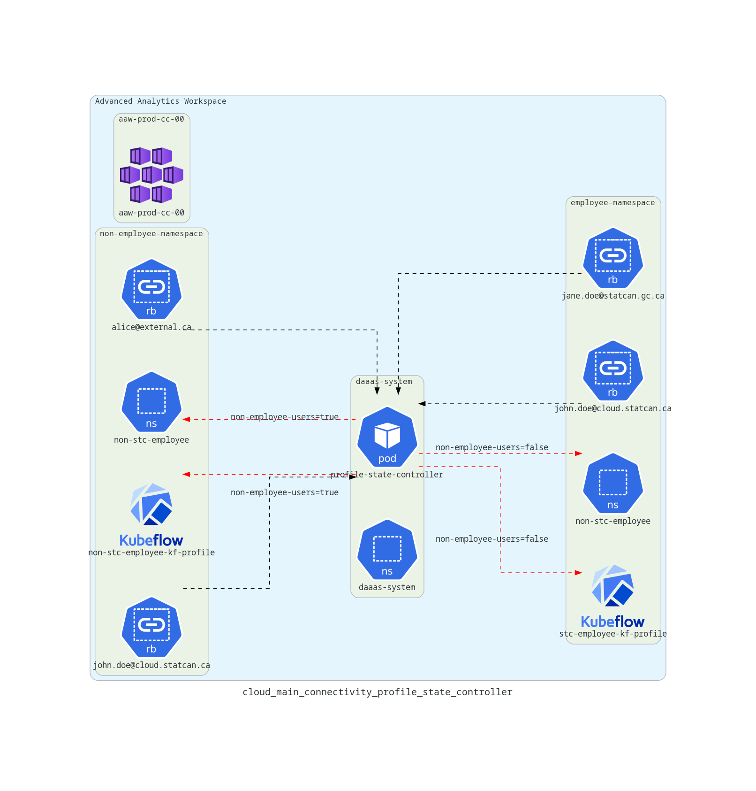
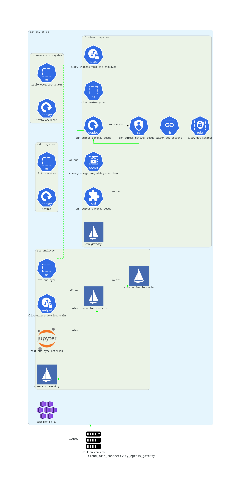
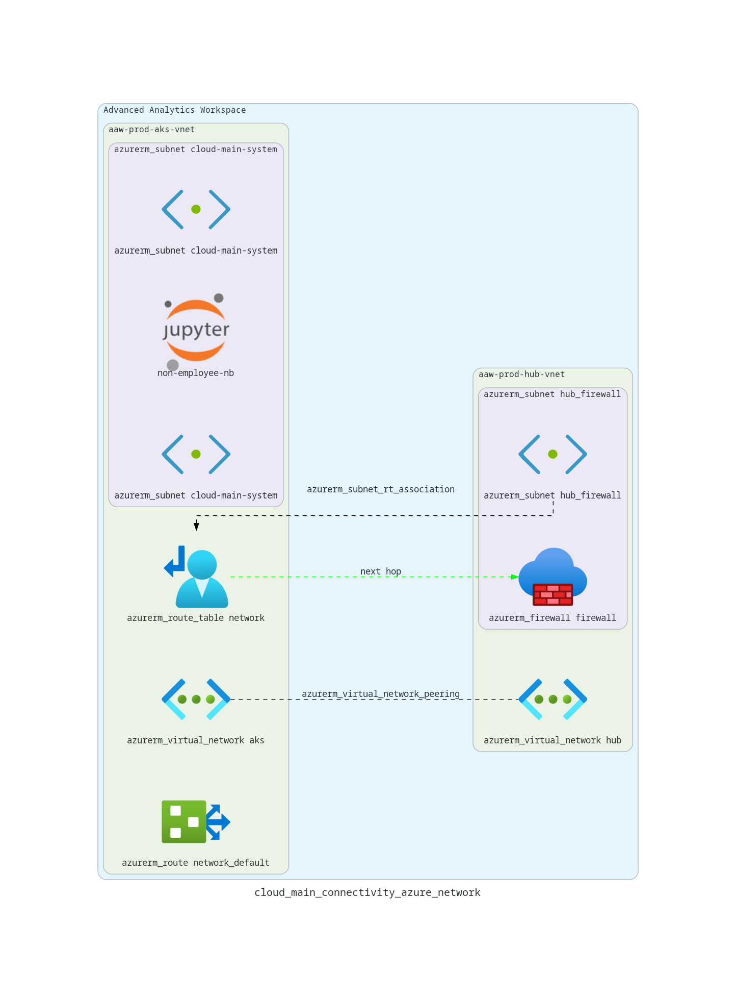

# Cloud Main Connectivity

Please see the [Cloud Main Connectivity Epic](https://github.com/StatCan/daaas/issues/1097) for more information on the various issues that comprise this feature.

# Architecture Overview

## Distinguishing Employees/Non-Employees

This section covers the component that distinguishes employee-only namespaces from namespaces that contain any non-employee users.[^1]

## Istio Routing High-Level

This section covers a high-level overview of how routing of outgoing traffic is handled differently for employee-only vs. non-employee namespaces.

## Istio Routing Detailed

This section covers the details of how outgoing traffic from employee-only namespaces are routed through the `cloud-main-system` egress gateway.[^2]

## Azure Networking

This section covers the Azure Networking component of the cloud main connectivity implementation.[^3]

# Associated Repositories

# Feature Deployment

This section covers the deployment details for the various components involved with the cloud-main connectivity feature.

## Egress Gateway Deployment

# References

[^1]: Kubeflow icon borrowed from [Kubeflow Github repo](https://github.com/kubeflow/marketing-materials/tree/master/logos/Raster)
[^2]: Istio icons provided by [Istio Media Resources](https://istio.io/latest/about/media-resources/)
[^3]: Jupyterlab icon from [wikimedia-commons](https://commons.wikimedia.org/wiki/File:Jupyter_logo.svg)
