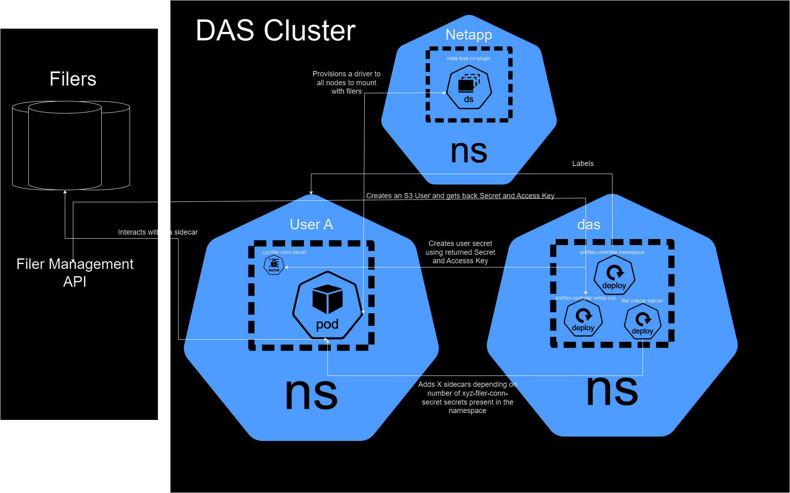

# Netapp or "Filer" Mounting

## What is NetApp in relation to our legacy filers?
Netapp CVO ONTAP is the solution on which our legacy filers moved to.

-----------------------

## Integration with NetApp
Our integration with the cloud volumes relies on the use of the [meta-fuse-csi-plugin](https://github.com/pfnet-research/meta-fuse-csi-plugin/tree/main) and is deployed and persisted in gitlab argocd manifests under `raw-manifests/netapp/metafuse-driver.yaml`

Everything is kept exactly the same, with the exception of needing to modify the [Goofys Dockerfile](https://github.com/pfnet-research/meta-fuse-csi-plugin/blob/437dbbbbf16e5b02f9a508e3403d044b0a9dff89/examples/proxy/goofys/Dockerfile#L28)

This is because we must have our own version of `goofys`, since we need to increase the point at which `multi-part` upload (multi-part upload is not a supported S3 call) is performed.
In `goofys` the line we need to make a change to is [here](https://github.com/kahing/goofys/blob/350ff312abaa1abcf21c5a06e143c7edffe9e2f4/internal/file.go#L202), where I just did [`size = 5000 * 1024 * 1024`](https://github.com/Jose-Matsuda/goofys/blob/a1fb9da08cf7fdeec2c72d7f83f3f1ed03e71106/internal/file.go#L244).

### Deployment Checklist
- [x] Changed the line in goofys to increase the [`partSize`](https://github.com/kahing/goofys/blob/350ff312abaa1abcf21c5a06e143c7edffe9e2f4/internal/file.go#L186), and created a release for the metafuse plugin to use
- [x] Changed the goofys dockerfile [to reference the modified goofys release](https://github.com/pfnet-research/meta-fuse-csi-plugin/blob/437dbbbbf16e5b02f9a508e3403d044b0a9dff89/examples/proxy/goofys/Dockerfile#L28)
- [x] Built the goofys dockerfile via the [makefile](https://github.com/pfnet-research/meta-fuse-csi-plugin/blob/main/Makefile)
- [x] Pushed the dockerfile to our ACR
- [x] Updated argocd's raw-manifests' meta-fuse-csi-plugin `daemonset` image to use the new image

-----------------------

## Controllers
There are **two** controllers that this feature requires. The first is to add `labels` to the namespace as that is what the `mutatingwebhook` uses in order to inject the filer sidecar spec into created notebook pods. The second is to automatically generate secrets based on values in a user configmap.

### [Namespace Controller](https://github.com/StatCan/aaw-kubeflow-profiles-controller/blob/profiles-controller-aaw2.0/cmd/namespace.go)
This controller is built off of the existing `aaw-kubeflow-profiles-controller` and is simple. It uses the same built image that the other controllers use, with the exception that the startup command is `namespace` to run this controller. The tracking issue for this controller is [BTIS-332](https://jirab.statcan.ca/browse/BTIS-332) with more details.
All this does is watch profiles, and  then for that profile's generated namespace, if it does not have the label listed in `newLabels`, then in adds it. In this case it adds `filer-sidecar-injection: enabled`.

### Deployment Checklist
- [x] Make changes to the aaw-kubeflow-profiles-controller repo on github and push and let the workflow push the image
- [x] Modify the `profiles-controller` branch in the `statcan/charts` gitlab repository, modifying any new permissions needed, updating the tag, or adding a new controller
- [x] Modify the `profiles-controller.yaml` tag in the argocd-manifests repo.
- [x] Sync the respective `root` application in argocd, for example for prod you need to sync the `das-prod-cc-00-root` application for everything to come up.

### [Ontap CVO controller](https://github.com/StatCan/aaw-kubeflow-profiles-controller/blob/profiles-controller-aaw2.0/cmd/ontap-cvo.go)
Thie is a **WIP**, with its current purpose being to generate a `filer-conn-secret` based on values in a configmap. This is a WIP as we currently do not have the ability to create an account with the permissions necessary to create the account.

This controller relies on the existence of a secret that has the following information;
- the User's username as it exists on AVD, this needs to match up exactly. For example for jose-matsuda it would be `matsujo`. This is due to how the permissions themselves are mapped.
- the bucket or share that the user needs access to. This is required so that when we create the secret, it has the information on what level, and the mounting solution requires the bucket name.
- The name of the filer that the bucket or share is on. This will be used to populate the secret, as the mounting solution requires the S3 url. 

This works like all the other profiles controllers, and steps can be taken from above as well. The controller watches profile resources and will generate a unique to bucket secret (for as many filers as a user has acccess to there should be a secret) following the naming convention of `*filer-conn-secret` for the profile that contains the following fields
- S3_ACCESS
- S3_BUCKET
- S3_SECRET
- S3_URL

[This is the API we are trying to call, but do not have permissions to](https://docs.netapp.com/us-en/ontap-restapi/ontap/protocols_s3_services_svm.uuid_users_endpoint_overview.html#creating-an-s3-user-configuration)

**Again, this is a work in progress.**
It will need to change based on work done in the Manage Filers page in Central dashboard when users select what filer (and level of) that they have access to.
Additionally the contents of the secret will also need additions, as when I was creating this controller I was not aware of the `BUCKET` itself needing to be a part of the secret (you could retrieve it from what populates the Manage Filers page but that is more complicated and another hoop to jump through).

**Until the above works, you must manually create secrets**

## Manually Creating Secrets
To do this, you need the following information; `namespace`, `S3_ACCESS`, `S3_BUCKET`, `S3_SECRET`, and `S3_URL`. The actual entries of the secret (S3) can be retrieved from the Netapp team, as when users are onboarded someone will send you their ACCESS and SECRET keys. The bucket name would match what the share name is in the request, for example in [this issue](https://jirab.statcan.ca/browse/ZPS-24?focusedId=3011155&page=com.atlassian.jira.plugin.system.issuetabpanels%3Acomment-tabpanel#comment-3011155) the value for `S3_BUCKET` would be `istdim`, as the bucket names must be lowercased (another one to look out for is `_`'s get converted to `-`'s, if unsure ask Roham for the bucket name. 
For the `S3_URL` this is constant and can view the respective URL from existing secrets
Do not forget to do encode them when creating the secret, I have a utility that just does `echo -n $1 | base64` that I call so I can copy paste it easily.

The naming convention of the secret is **VERY IMPORTANT** it must end in `filer-conn-secret` for everything to work.
In general, it should look like `{filerName}-{bucketName}-filer-conn-secret` where `filerName` is the name of the filer, for example if you are creating something in the field 9 filer it should be `fld9`. `bucketName` is the same value from above, this is needed in the event that a field filer has multiple buckets needed so we can distinguish and unique the secrets (for example s3bucket).

So a full example secret name could be `fld9-s3bucket-filer-conn-secret`

-----------------------

## [Mutating Webhook](https://github.com/StatCan/filer-sidecar-injector)
The filer-sidecar-injector repo is a mutatingwebhook that injects sidecar configuration for notebook pods.
For more in-depth information of how the mutating webhook works, its best to reference the [upstream repo](https://github.com/morvencao/kube-sidecar-injector) with more details in the [medium article](https://medium.com/ibm-cloud/diving-into-kubernetes-mutatingadmissionwebhook-6ef3c5695f74)

The main modifications were made to the `createPatch` function as instead of just having a single sidecar container, we had to loop as there is a possibility of a user having access to more than one filer. A configmap is used as a template, and then deep copied so that we can use it repeatedly when generating the spec to be `patch`ed to the pod resource that is being created.

### Deployment Checklist
- [x] Build the image in `filer-sidecar-injector` and push to our acr.
- [x] Update the image tag in the deployment in the argocd manifests repo.

-----------------------

## Behaviour of the Ecosystem
User logs in and creates their profile, the [Namespace Controller](#namespace-controller) then adds the label for the [mutatingwebhook](#mutating-webhook).
At this point, users can create notebooks, but since they do not have filer secrets created, there will be no mounting of filers.
The User must navigate to a page to manage their filers, after that has been done the [ontap-cvo controller](#ontap-cvo-controller) will act and create the secrets necessary for the [mutating webhook](#mutating-webhook) to work its magic.

## Diagram of the Ecosystem

