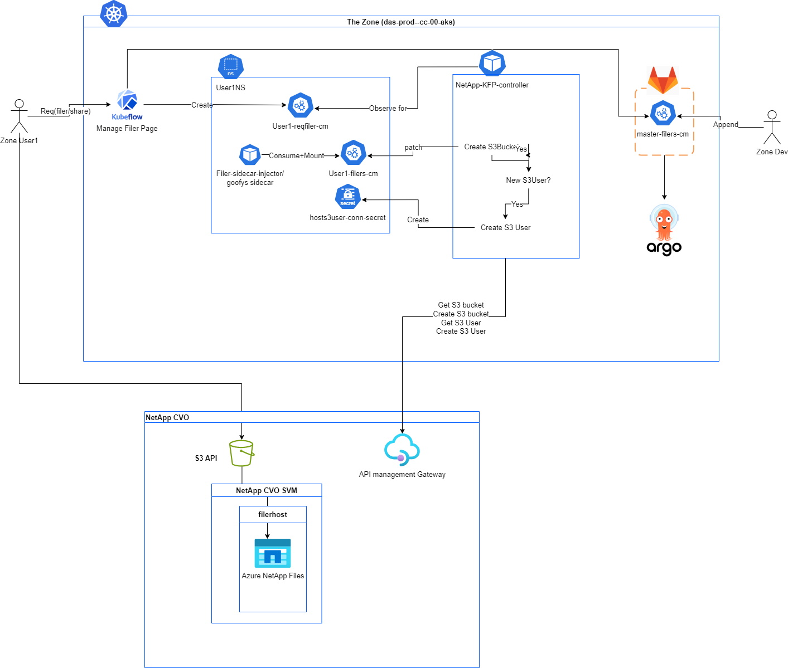

# Netapp or "Filer" Mounting

## What is NetApp in relation to our legacy filers?
Netapp CVO ONTAP is the solution on which our legacy filers moved to.

-----------------------

## Integration with NetApp
Our integration with the cloud volumes relies on the use of the [meta-fuse-csi-plugin](https://github.com/pfnet-research/meta-fuse-csi-plugin/tree/main) and is deployed and persisted in gitlab argocd manifests under `raw-manifests/netapp/metafuse-driver.yaml`. We keep a copy of the meta-fuse-csi-plugin in our [goofys fork](https://github.com/StatCan/goofys/tree/master/meta-fuse-csi-plugin) as we must modify the underlying `goofys` image and having it in one repository greatly simplifies deployment.

### Why do we need to modify goofys?
We need to increase the data threshold at which `multi-part` upload (multi-part upload is not a supported S3 call by our netapp solution) is performed.
In `goofys` the line we need to make a change to is [here](https://github.com/kahing/goofys/blob/350ff312abaa1abcf21c5a06e143c7edffe9e2f4/internal/file.go#L202), where I just did [`size = 5000 * 1024 * 1024`](https://github.com/Jose-Matsuda/goofys/blob/a1fb9da08cf7fdeec2c72d7f83f3f1ed03e71106/internal/file.go#L244).

### Deployment Checklist
For deploying our modified goofys image we just need to make changes to the `filer-sidecar-injector` configmap, since that determines which metafuse goofys image we use. You can find it in the [raw-manifests/netapp/configmap.yaml](https://gitlab.k8s.cloud.statcan.ca/business-transformation/aaw/aaw-argocd-manifests/-/blob/das-dev-cc-00/raw-manifests/netapp/configmap.yaml?ref_type=heads#L15) in the argocd-manifests gitlab repo.
After updating this you will need to synch up argo to load this new configmap into the cluster, and then restart the filer-sidecar-injector to pick up the new configuration.

### The metafuse daemonset and driver
We need to use a custom plugin as noted [in the documentation here](https://github.com/pfnet-research/meta-fuse-csi-plugin?tab=readme-ov-file#deploy-plugin). For this, we'd need to build [this dockerfile](https://github.com/pfnet-research/meta-fuse-csi-plugin/blob/main/cmd/csi_driver/Dockerfile) and then deployed with this [yaml](https://github.com/pfnet-research/meta-fuse-csi-plugin/tree/main/deploy)

### Deployment checklist
This is deployed in the gitlab argocd manifests under [raw-manifests/netapp/metafuse-driver.yaml](https://gitlab.k8s.cloud.statcan.ca/business-transformation/aaw/aaw-argocd-manifests/-/blob/das-prod-cc-00/raw-manifests/netapp/metafuse-driver.yaml?ref_type=heads)

-----------------------

## Controllers
There are **two** controllers that this feature requires. The first is to add `labels` to the namespace as that is what the `mutatingwebhook` uses in order to inject the filer sidecar spec into created notebook pods. The second is to automatically generate secrets based on values in a user configmap.

### [Namespace Controller](https://github.com/StatCan/aaw-kubeflow-profiles-controller/blob/profiles-controller-aaw2.0/cmd/namespace.go)
This controller is built off of the existing `aaw-kubeflow-profiles-controller` and is simple. It uses the same built image that the other controllers use, with the exception that the startup command is `namespace` to run this controller. The tracking issue for this controller is [BTIS-332](https://jirab.statcan.ca/browse/BTIS-332) with more details.
All this does is watch profiles, and  then for that profile's generated namespace, if it does not have the label listed in `newLabels`, then in adds it. In this case it adds `filer-sidecar-injection: enabled`.

### Deployment Checklist
- [x] Make changes to the [aaw-kubeflow-profiles-controller](https://github.com/StatCan/aaw-kubeflow-profiles-controller/tree/profiles-controller-aaw2.0) repo on github and push and let the workflow push the image
- [x] Modify the `profiles-controller` branch in the `statcan/charts` gitlab repository, modifying any new permissions needed, updating the tag, or adding a new controller
- [x] Modify the `profiles-controller.yaml` tag in the argocd-manifests repo.
- [x] Sync the respective `root` application in argocd, for example for prod you need to sync the `das-prod-cc-00-root` application for everything to come up.

### [Ontap CVO controller](https://github.com/StatCan/aaw-kubeflow-profiles-controller/blob/profiles-controller-aaw2.0/cmd/ontap-cvo.go)

This controller is responsible for managing what buckets that a user has access to, as well as creating the secrets associated with a user and all that comes with it. The bucket that is created uses a _hashed_ version of the inputted request path in order to comply with naming conventions and to avoid collision. This controller uses a configmap that the user generates from the UI that requests certain paths in an SVM (in this case an SVM is equivalent to a filer ex fld9filer). Using that configmap, API calls are sent off to the following; current Kubernetes cluster, Microsoft Graph, Ontap.

The current kubernetes cluster is used for the following
- Determine whether or not a user secret exists for an svm, and submit a create if needed.
- Create and modify the end `existing-shares` configmap, which is used by the filer-sidecar-injector.
- Creating and modifying the `shares-errors` configmap, which shows errors to the user.
- Grabbing data from the `filers-list` configmap and the secrets needed to interact with the Microsoft Graph Api and Ontap.

The Microsoft Graph API is used to get the onpremises name, as the username that the user has in the Netapp system matters as that is how the mapping of permissions is done. 

The Ontap API is the main driver here we query it to;
- Determine if a user exists S3 side, if not we will create it.
- Check if a user group exists, if yes add the current user, if not create it and add the user. 
- Retrieve the actual `nas_path`. This is because the user inputted path will be different from what is actually on the Netapp system and we need that `path` else our request to create the bucket will error out.
- Determine if a bucket at the user requested path exists, if not create it

A TLDR;

User selects and inputs a path in a filer they want access to via the UI which then creates a configmap. This controller picks up that configmap and checks if a user for that filer exists using the onpremname from the graph api, if not creates and assigns it the correct policy to interact with it. The controller then hashes the user inputted filer path to a bucket name and then we check if that bucket exists, if it does not create it.
The controller then cleans up and creates or modifies the `existing-shares` configmap which is used by the filer-sidecar-injector.

For more details on how this controller works, please refer to the [README](https://github.com/StatCan/aaw-kubeflow-profiles-controller/blob/profiles-controller-aaw2.0/ontap-cvo.md)

### Deployment Checklist
This is currently built off of the `profiles-controller` so the deployment here is the same as the namespace controller above. Just make sure that you are on the [profiles-controller-aaw2.0 branch](https://github.com/StatCan/aaw-kubeflow-profiles-controller/tree/profiles-controller-aaw2.0)

-----------------------

## [Mutating Webhook](https://github.com/StatCan/filer-sidecar-injector)
The filer-sidecar-injector repo is a mutatingwebhook that injects sidecar configuration for notebook pods.
For more in-depth information of how the mutating webhook works, its best to reference the [upstream repo](https://github.com/morvencao/kube-sidecar-injector) with more details in the [medium article](https://medium.com/ibm-cloud/diving-into-kubernetes-mutatingadmissionwebhook-6ef3c5695f74)

The main modifications were made to the `createPatch` function as instead of just having a single sidecar container, we had to loop as there is a possibility of a user having access to more than one filer. A configmap is used as a template, and then deep copied so that we can use it repeatedly when generating the spec to be `patch`ed to the pod resource that is being created.

The `sidecar` that we are inserting is the custom goofys metafuse image that comes from [our statcan repo](https://github.com/StatCan/goofys/blob/a4aa306ca63e4dd0d4bf4c903c270efc75f0ae1e/Dockerfile#L1). This sidecar image drives the connection to the filers and as part of the patch we also update the working volume mounts for the user image (jupyterlab notebook) so that they can interact with their filers.

For more details refer to the [README](https://github.com/StatCan/filer-sidecar-injector/blob/master/README.md)
### Deployment Checklist
- [x] Build the image in `filer-sidecar-injector` and push to our acr.
- [x] Update the image tag in the deployment in the argocd manifests repo.

-----------------------

## Behaviour of the Ecosystem
User logs in and creates their profile, the [Namespace Controller](#namespace-controller) then adds the label for the [mutatingwebhook](#mutating-webhook).
The user then manages their filers in the UI which creates a configmap that the [ontap-cvo controller](#ontap-cvo-controller) consumes to create the secrets and configmaps necessary for the [mutating webhook](#mutating-webhook) to mount user requested filer paths to running notebook pods.

## Diagram of the Ecosystem

