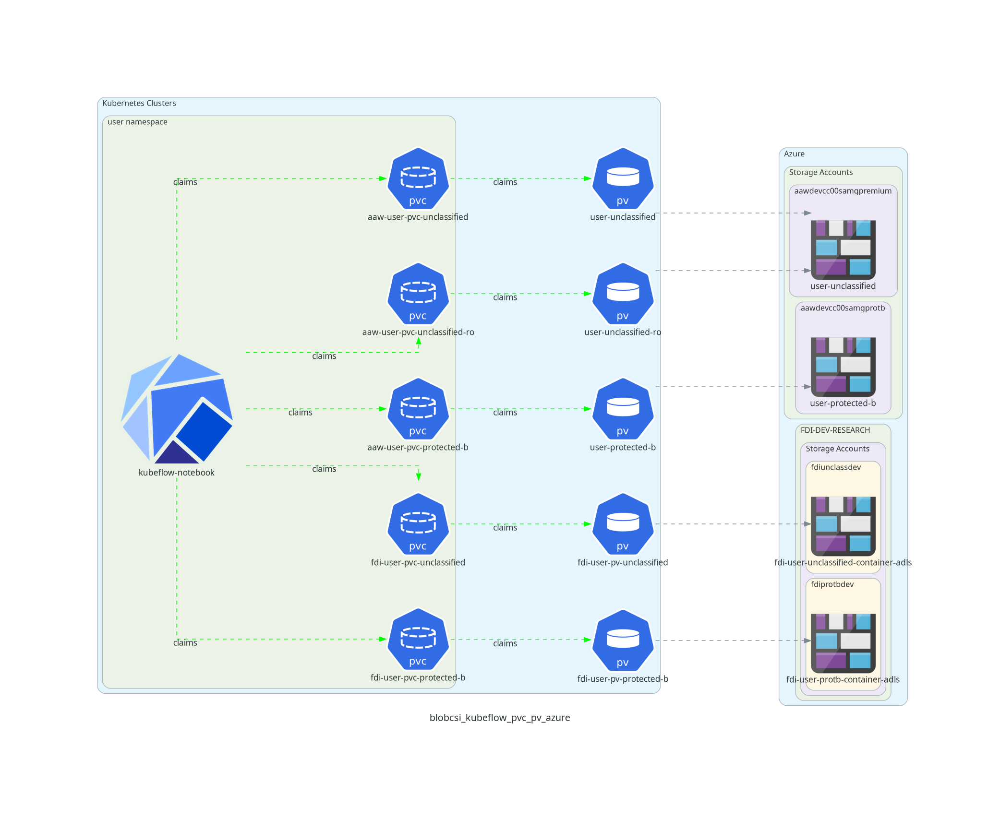

# Overview
The blob-csi system is the replacement system for the [minio storage solution in AAW](https://github.com/StatCan/aaw-argocd-manifests/tree/aaw-dev-cc-00/storage-system/kustomize-gateway#minio-gateway).

In order to provide AAW users with access to Azure storage containers, we deploy a storage solution consisting of the following components:

- [azure blob-csi-driver](https://github.com/kubernetes-sigs/blob-csi-driver): responsible for mounting `PersistentVolume` resources
to azure storage containers via [blob-fuse](https://github.com/Azure/azure-storage-fuse)
  - [deployed by argocd into AAW here](https://github.com/StatCan/aaw-argocd-manifests/blob/aaw-dev-cc-00/daaas-system/blob-csi-driver/application.yaml)
- [blob-csi-injector](https://github.com/StatCan/aaw-blob-csi-injector): `MutatingWebhook` which is responsible for adding `Volumes` and
`VolumeMounts` to pods containing the `data.statcan.gc.ca/inject-blob-volumes` label.
  - [deployed by argocd into AAW here](https://github.com/StatCan/aaw-argocd-manifests/blob/aaw-dev-cc-00/daaas-system/blob-csi-injector/manifest.yaml)
- [blob-csi.go kubernetes controller](https://github.com/StatCan/aaw-kubeflow-profiles-controller/blob/main/cmd/blob-csi.go):
Responsible for the provisioning of Azure storage containers, `PersistentVolume`s and `PersistentVolumeClaim`s per namespace for AAW users.
  - [deployed by argocd into AAW here](https://github.com/StatCan/aaw-argocd-manifests/blob/aaw-dev-cc-00/daaas-system/profile-controllers/profiles-controller/application.jsonnet)


# Feature Implementation
The blob-csi system allows users to gain access to Azure container storage at unclassified and protected-b classification levels.
Currently, users can mount volumes manually as data-volumes in AAW's Kubeflow notebook creation workflow, but eventually
auto-mounting of volumes will be supported.

Note that the figures depicted below are representative of the AAW development Kubernetes cluster. However; the implementation in
production is near identical, with the only difference being the use of the word `dev` being replaced with `prod` throughout the resources.

The data flow for how a kubeflow notebook will connect to backing storage at a high level is provided below.



In short, users request a data volume for use within their kubeflow notebook, the `blob-csi-driver` runs a `csi-controller pod` on each
node in the cluster, and each `csi-controller pod` mounts any volumes requested.

## The blob-csi.go Kubernetes Controller
The [blob-csi.go kubernetes controller](https://github.com/StatCan/aaw-kubeflow-profiles-controller/blob/main/cmd/blob-csi.go) is responsible
for the creation of `PersistentVolume`, `PersistentVolumeClaim` and azure storage containers per user namespace in AAW. The permissions lists are managed by `Fair Data Infrastructure team (FDI)`.

AAW default volumes are configured [here](https://github.com/StatCan/aaw-argocd-manifests/blob/aaw-dev-cc-00/daaas-system/profile-controllers/profiles-controller/application.jsonnet#L62-L64)
and any change to the `name` field will result in the deletion and re-creation of `PersistentVolume` and `PersistentVolumeClaim` resources
to reconcile the change. There are two possible classifications for volumes: `unclassified` and `protected-b`. Notice that the
`unclassified-ro` classification is `protected-b`. This is so that users can view `unclassified` data within a `protected-b` pod (volume classifications are enforced by `Gatekeeper` upon creation of a notebook).

In order for the controller to determine which `PersistentVolume`s and `PersistentVolumeClaim`s to create for `FDI` containers,
the controller queries `unclassified` and `protected-b` via a K8s ConfigMap in `azure-blob-csi-system.tf`, recieving a `.json` formatted response.
An example of the expected `.json` formatted response:

```json
fdi-unclassified-internal.json: |
      [
        {
                "bucketName": "aaw-pv-internal-un-testing",
                "pvName":     "test-iunc",
                "subfolder":  "",
                "readers":    ["alice, bob"],
                "writers":    ["alice, bob"],
                "spn":        "pv-internal-unclassified-dev-sp"
        }
      ]
fdi-protected-b-internal.json: |
      [
        {
                "bucketName": "aaw-pv-internal-pb-testing",
                "pvName":     "test-iprotb",
                "subfolder":  "",
                "readers":    ["alice, bob"],
                "writers":    ["alice, bob"],
                "spn": "pv-internal-protected-b-dev-sp"
          }
      ]
fdi-protected-b-external.json: |
      [
        {
                "bucketName": "aaw-pv-external-pb-testing",
                "pvName":     "test-eprotb",
                "subfolder":  "",
                "readers":    ["alice, bob"],
                "writers":    ["alice, bob"],
                "spn": "pv-external-protected-b-dev-sp"
          }
      ]
fdi-unclassified-external.json: |
      [
        {
                "bucketName": "aaw-pv-external-un-testing",
                "pvName":     "test-eunc",
                "subfolder":  "",
                "readers":    ["alice, bob"],
                "writers":    ["alice, bob"],
                "spn":        "pv-external-unclassified-dev-sp"
        }
      ]
```
In the above example, the controller would provision a `PersistentVolume` and `PersistentVolumeClaim` for both `alice` and `bob`, however
`alice` would have `ReadOnlyMany` permissions, and bob would have `ReadWriteMany` permissions. There is also an option to mount subfolders
to a user's container. `bucketName` is the name of the container created in the storage account. `pvName` is the pre-fix of the volume in the format of projectName-internal/external-unclassified/protected

For every FDI project container request there needs to be a Service Principal created. AAW will create
an App Registration via Cloud Jira (Operational Support). AAW will also create the client secret in the `azure-blob-csi-system` ns via Terraform in `azure-blob-csi-system.tf` using appropriate naming convention `SPN + "-secret"`

FDI Common Storage has 4 storage accounts:
DEV
- stndmfdidpb01sa (external protected-b)
- stndmfdidun01sa (external unclassified)
- stndmfdiipb01sa (internal protected-b)
- stndmfdiiun01sa (internal unclassified)

PROD
- stpdmfdidpb01sa (external protected-b)
- stpdmfdidun01sa (external unclassified)
- stpdmfdiipb01sa (internal protected-b)
- stpdmfdiiun01sa (internal unclassified)
External users should not have access to mount/view internal volumes to their notebooks.

# How to create a new FDI container?

1. AAW submits a Cloud JIRA (Cloud Operations) to create a new App Registration with the appropriate naming convention (aaw-PROJECTACRONYM-prod-sp)
A new Service Principal is only required if this is for a new project. If an existing project requires an additional volume, the existing Service Prinicpal
can be used.
2. Request FDI to create the container in the appropriate Azure Storage account (internal/external - unclassified/protected-b). FDI will add the SP to the container's
ACL.
3. AAW must create the client id and client secret for the Service Prinicpal and persist it as a Kubernetes Secret in the `azure-blob-csi-system.tf`. It creates the client id as a secret in the `daaas-system` namespace and the client secret in the `azure-blob-csi-system` namespace.
4. AAW will then update the `fdi-aaw-configuration` config map in `azure-blob-csi-system.tf`.
`BucketName` is the name of the container created in the storage account.
`pvName` is the name of the persistentVolume. Following naming convention of: `ProjectName-iunc` (internal unclassified), `ProjectName-eprotb` (external protected-b)
`readers/writers` namespaces who require access to the volumes
`spn` name of the Service Principal that was created through the Cloud JIRA
`subfolder` if a project requires sub-folder mounting then this folder must be created before provisioning the volumes. If sub-folder is not required, leave the name as empty string
5. AAW will add the SP to the appropriate AD Group. Depending on the container created and environment the SP will be added to either: `AAW-PROD-External-Unclassified-SPs`, `AAW-PROD-Internal-Unclassified-SPs`, `AAW-PROD-External-Protected-B-SPs`, `AAW-PROD-Internal-Unclassified-SPs`
Note: For debugging there are test containers created in all Prod and Dev storage accounts for future development and testing.
# Architecture Design

For more context on the blob-csi system as a whole (from deployment of infrastructure to azure containers), see the attached diagram below.
In addition, refer to the below legend for line types and colours.

- Line types:
  - Solid lines follow the paths of the deployment or provisioning of resources.
  - Dashed lines outline the paths for connectivity.
- Line Colours:
  - Navy blue lines are used for edges connecting nodes within the kubernetes cluster.
  - Light green lines are assiciated with kubeflow from a users perspective.
  - Yellow lines are associated with argocd.
  - Purple lines are associated with terraform.
  - Light blue lines are associated with edges that connect from nodes anywhere in the diagram to an azure resource.


