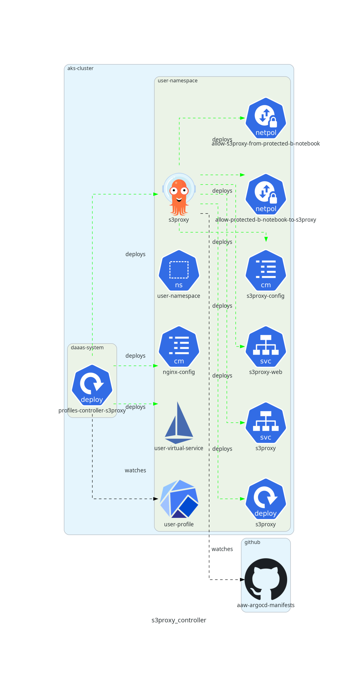
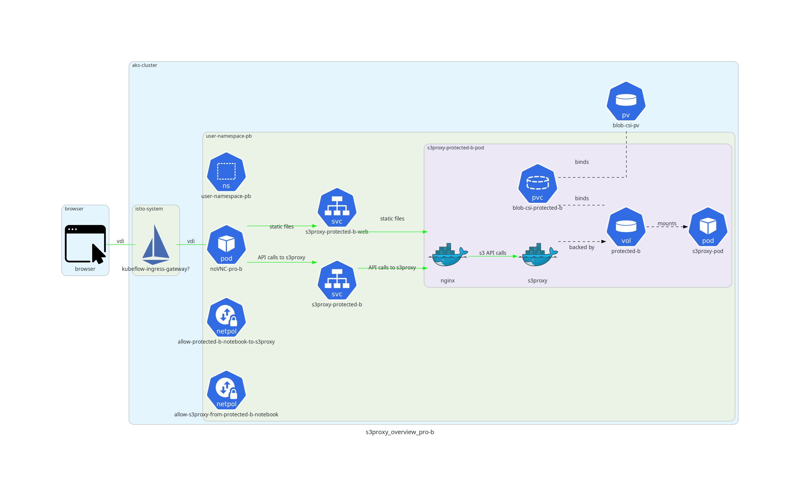

# Overview

In order to provide users of the platform with an S3 interface, we use a fork of [aws-js-s3-explorer](https://github.com/StatCan/aws-js-s3-explorer) in combination with [s3proxy](https://github.com/gaul/s3proxy). s3Proxy runs in "filesystem" mode, where the filesystem volumes provided by the [blob fuse CSI driver](blob-csi.md) serve as a data back-end, while the aws-js-s3-explorer provides a client-side web application for users to explore the contents of their S3 buckets.

## Relevant Repositories

- [aws-js-s3-explorer](https://github.com/StatCan/aws-js-s3-explorer)
- [aaw-kubeflow-profiles-controller](https://github.com/StatCan/aaw-kubeflow-profiles-controller/)
- [aaw-argocd-manifests](https://github.com/StatCan/aaw-argocd-manifests)
- [charts](https://github.com/StatCan/charts/)

# Feature Deployment

The S3Proxy application is deployed on an opt-in basis to reduce resource consumption in the cluster. The majority of users only require filesystem access to Azure blob storage, which is already provided by the [blob fuse CSI driver](blob-csi.md); it is only necessary to deploy this s3proxy application if users explicitly require an s3 interface to Azure blob storage.

To enable s3proxy in a namespace, go to the [aaw-kubeflow-profiles](https://github.com/statcan/aaw-kubeflow-profiles) repository, go to the specific  `*.jsonnet` file that contains the profile definition, then wrap the profile definition in the `addS3` function. See [this example](https://github.com/StatCan/aaw-kubeflow-profiles/blob/main/profile-aaw-fc.jsonnet#L7) for a profile where both s3proxy and Gitea were added to the namespace.

If the user profile has the label `s3.statcan.gc.ca/enabled: true`, then the s3proxy profiles controller will install an ArgoCD application, an nginx configmap, and an Istio virtual service into the user's namespace. The ArgoCD application deploys a number of resources to the user's namespace via jsonnet. The ArgoCD location watches the [/profiles-argocd-system/template/s3proxy location of the aaw-argocd-manifests repo](https://github.com/StatCan/aaw-argocd-manifests/tree/aaw-dev-cc-00/profiles-argocd-system/template/s3proxy) for changes to the `aaw-dev-cc-00` or `aaw-prod-cc-00` branches for the dev and prod deployments, respectively.

**Note**: there are two network policies deployed by the per-namespace ArgoCD application (manifests can be found in the `application.jsonnet` file at the repo location linked above). These network policies are required in order to allow users to connect to the protected-b s3proxy instance from a noVNC protected-b notebook.

# Feature Implementation

The way users connect to the s3 explorer depends on whether they are working in an unclassified environment or a protected-b environment. In an unclassified environment, the architecture is as shown in the figure below.

Users connect to s3proxy through the Kubeflow user interface, and the s3proxy web application renders inside of an iframe in the Kubeflow User interface.

All outgoing requests from the page are intercepted by a [service worker](https://developer.mozilla.org/en-US/docs/Web/API/Service_Worker_API) - a client-side middleware that can intercept and modify outgoing requests before they are sent to the server.

An Istio virtual service applies routing logic to incoming requests based on uri prefix patterns and request headers. Requests are directed towards the `s3proxy-web` service, which routes requests to `s3proxy` pods.

Inside of `s3proxy` pods, there is an `nginx` container that hosts the static files associated with the aws-js-s3-explorer, and also proxies requests for `s3proxy`.

The `s3proxy` application runs in "filesystem" mode, so all s3 API calls made against `s3proxy` are translated into the appropriate system call to perform operations against the filesystem. In particular, each bucket provided by `s3proxy` is a volume that is mounted to the `s3proxy` container filesystem by the blob fuse CSI driver.

In a protected B environment, user access is slightly different as shown in the diagram below.

Unlike the unclassified setup, users cannot access the aws-js-s3-explorer user interface through the Kubeflow interface. Rather, users can only access the aws-js-s3-explorer application through a browser in a noVNC notebook.

Under this setup, users have a VDI connection to their noVNC notebook, so neither the service worker nor the virtual service configuration are applicable; rather, the noVNC pod makes requests directly against the `s3proxy-web` service in the same namespace.

## Service Worker Explanation

As far as we can tell, the AWS client used by aws-js-s3-explorer does not allow for unauthenticated requests. In other words, the client requires an access key/secret key pair. The AWS javascript client automatically generates a corresponding `authorization` request header for all AJAX calls made by the application.

Since each namespace has its own private s3proxy instance, and users accessing Kubeflow have already authenticated, it would be redundant to have an additional authentication layer in front of s3proxy.

To get around this upstream requirement, a fake access key/secret key are created on the client side so that the aws javascript client can successfully make requests, and each user's private s3proxy instance runs with no authentication required.

The workaround described above is sufficient for users accessing s3-proxy through the noVNC pod since the request is made in the cluster. However, users accessing the aws-s3-js-explorer through the Kubeflow interface pass through an authenticated ingress gateway. When requests enter through this gateway, they are rejected due to the erroneous `authorization` header. To avoid significantly refactoring the aws-js-s3-explorer code, a service worker intercepts requests and removes the erroneous `authorization` header.

There are 4 cases that occur in the `fetch` listener of the `sw_modify_header.js` service worker.

**Case 1: do not modify requests that are not directed to `s3proxy`**

Endpoints with prefixes other than `/unclassified` are not AJAX calls made by the AWS s3 client, and do not have the erroneous `authorization` header. All such requests are simply forwarded by the service worker without any modification.

**Case 2: remove auth header in requests with methods other than `PUT` and `POST`**

AJAX calls that are not `PUT` or `POST` only need the erroneous `authorization` header removed (e.g. `GET` requests to list objects in a bucket, `DELETE` request to remove an object, etc.). No further action is required, so the modified request is forwarded to `s3proxy`.

**Case 3: remove auth header and create `.empty` file if a new folder is being created**

Any `PUT` requests with a URI that ends with `/` are requests to create a new folder. As the concept of folder doesn't exist in s3, requests of this type are intercepted and an empty file called `.empty` is attached to the request so that the prefix pattern is preserved. For example, a request to create a folder called `new-folder` in the `unclassified` bucket would have a request with the prefix `/unclassified/new-folder/`, so the service worker would intercept this request and send the request `/unclassified/new-folder/.empty` so that the user can add files to the new location.

**Case 4: remove auth header and forward request body to `s3proxy`**

In the final case, there is a `PUT` or `POST` request to upload a file to `s3proxy`. In this case, the service worker creates an [ArrayBuffer](https://developer.mozilla.org/en-US/docs/Web/JavaScript/Reference/Global_Objects/ArrayBuffer) object for the request body data and passes the request onto `s3proxy`. This last case is required because the body of `PUT` and `POST` requests is not included in the `event.request` object that the service worker receives, so the request body must be loaded into a [transferrable object](https://developer.mozilla.org/en-US/docs/Glossary/Transferable_objects) before being sent to `s3proxy`.

## Request Routing

An istio virtual service and nginx configuration are used to ensure that requests from the Kubeflow user interface arrive correctly at the Nginx/s3proxy servers. This section details how the virtual service / nginx configuration modify requests.

**(1) Getting the `index.html` page**

A request is sent from the page `https://kubeflow.aaw.cloud.statcan.ca/s3/?ns=<user namespace>` (i.e. the [referer](https://developer.mozilla.org/en-US/docs/Web/HTTP/Headers/Referer) header is `https://kubeflow.aaw.cloud.statcan.ca/s3/?ns=<user namespace>`). The istio virtual service in the user's namespace has a routing rule for requests with this referer header, and redirects the request to the uri `/s3/aaw-fc/index.html`. Another route rule catches requests with the URI prefix `/s3/aaw-fc/` and routes them to `s3proxy-web.<user namespace>.svc.cluster.local`. The `index.html` file is returned and the base URL of the page is `https://kubeflow.aaw.cloud.statcan.ca/s3/<user namespace>/` (i.e. all requests initiated from the `index.html` page will be addressed to `https://kubeflow.aaw.cloud.statcan.ca/s3/<user namespace>/` followed by the path to the static file being requested).

**(2) Getting the static files (application and vendor)**

Since the static files need to be accessible from a protected-b noVNC notebook without internet access, all static files are served from the Nginx static file server. The `Dockerfile` in the [aws-js-s3-explorer](https://github.com/StatCan/aws-js-s3-explorer) repository copies all of the static files (application and vendor) to a location on the container filesystem. The `s3proxy` pod contains an init job that copies the static files from the `s3proxy` image to a known location on the Nginx container file system so they can be served from the Nginx container. All static files contain the prefix `/s3/aaw-fc/` (see explanation in (1)), so the same virtual service route that routes the request for `index.html` to `s3proxy-web.<user namespace>.svc.cluster.local` routes the requests for all static files to this service.

**(3) AJAX requests initiated from AWS client**

The AWS javascript client is unaware of the `/s3/aaw-fc/` prefix that was added to the requests for static files. As such, it initiates requests of the form `https://kubeflow.aaw.cloud.statcan.ca/<bucket name>/<object prefix>`, which does not have enough information on its own to route the request to a specific user's namespace. However, since all outgoing requests are caught by the service worker, the referer for outgoing AJAX calls is `https://kubeflow.aaw.cloud.statcan.ca/s3/<user namespace>/sw_modify_header.js`, which can be used to route the AJAX requests to the correct user's `s3proxy.<user namespace>.svc.cluster.local` service.

**(4) Downloading files from aws-js-s3-explorer**

If a user tries to download a file by clicking one of the links in the aws-js-s3-explorer, the referer url is `https://kubeflow.aaw-dev.cloud.statcan.ca/s3/aaw-fc/index.html` instead of `https://kubeflow.aaw.cloud.statcan.ca/s3/<user namespace>/sw_modify_header.js` since we *forward the existing request instead of initiating a new request from the service worker*. In this case, the request is also directed to the user's `s3proxy.<user namespace>.svc.cluster.local` service, and the file will be downloaded to the user's browser.