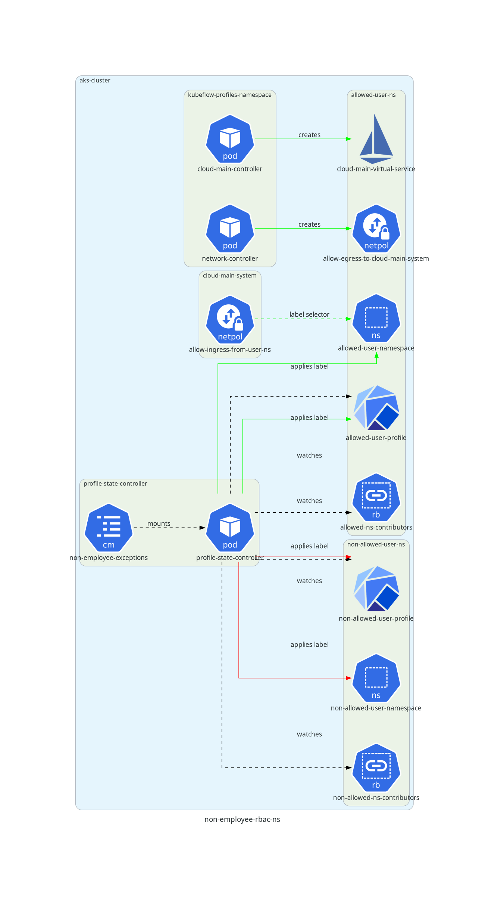

# Overview

Some non-employee users of the AAW platform are authorized to perform some (but not all) of the capabilities that Statcan employees can perform. The platform components detailed on this page allow administrators to extend certain capabilities to certain non-employee users who are authorized to perform those capabilities.

The two main capabilities that are relevant are (1) the ability to create pods with certain base images (e.g. SAS), or (2) the ability to access certain cloud main resources (e.g. gitlab.k8s). The documentation below focuses on these two types of capabilities; additional controls may be required for capabilities that don't fall under the abovementioned types.

## How to Add/Remove External Users
1. Update the  [exception-list configmap](https://github.com/StatCan/aaw-kubeflow-profiles/blob/main/non-employee-exceptions-config.jsonnet)
2. Update the [external users gatekeeper constraint](https://github.com/StatCan/aaw-gatekeeper-constraints/blob/main/deny-external-users/constraint.yaml)
3. Sync exception-list configmap on ArgoCD
4. Restart profiles state controller deployment on ArgoCD (this is needed because we need a pod restart on the profile state controller to re-mount the updated configmap)

## Relevant Issues

- [Refactor Non-Employee RBAC Model](https://github.com/StatCan/daaas/issues/1335)

## Relevant Repositories

- [aaw-profile-state-controller](https://github.com/StatCan/aaw-profile-state-controller)
- [aaw-kubeflow-profiles-controller](https://github.com/StatCan/aaw-kubeflow-profiles-controller)
- [gatekeeper-policies](https://github.com/StatCan/gatekeeper-policies)
- [aaw-gatekeeper-constraints](https://github.com/StatCan/aaw-gatekeeper-constraints)
- [jupyter-apis](https://github.com/StatCan/jupyter-apis)
- [aaw-kubeflow-profiles](https://github.com/StatCan/aaw-kubeflow-profiles)
- [aaw-network-policies](https://github.com/StatCan/aaw-network-policies)

## How to Add/Remove Users from Capabilities

Go to the [exception-list configmap](https://github.com/StatCan/aaw-kubeflow-profiles/blob/%40cbrown/1335-non-employee-rbac/non-employee-exceptions-config.jsonnet) and add/remove users from the desired exception list category. In general, the format of the exception list is as follows:

```yaml
# ...
exceptionKind:
- exceptionUser1@email.com
- exceptionUser2@email.com
# ...
```

## How to Add a New Capability

1. Create a new exception kind in the [exception-list configmap](https://github.com/StatCan/aaw-kubeflow-profiles/blob/%40cbrown/1335-non-employee-rbac/non-employee-exceptions-config.jsonnet).
2. Make the appropriate changes to the [aaw-profile-state-controller](https://github.com/StatCan/aaw-profile-state-controller) repository.
3. Add any unit tests to the changes in [aaw-profile-state-controller](https://github.com/StatCan/aaw-profile-state-controller) to ensure correct behaviour.

Depending on whether the exception kind is a pod/notebook capability or a namespace capability (described later on this page), the next steps differ.

If the feature is a namespace capability, whatever controllers are involved with rolling out components for the capability should respond accordingly to changes in labels applied by [aaw-profile-state-controller](https://github.com/StatCan/aaw-profile-state-controller). For example, the [cloud-main controller](https://github.com/StatCan/aaw-kubeflow-profiles-controller/blob/main/cmd/cloud-main.go) that permits authorized namespaces to connect to certain cloud-main services operates by creating certain Istio and Kubernetes resources in those namespaces to ensure that traffic from those namespaces is routed through the cloud main egress gateway. If a namespace adds an unauthorized user, the [aaw-profile-state-controller](https://github.com/StatCan/aaw-profile-state-controller) applies the label `state.aaw.statcan.gc.ca/exists-non-cloud-main-user: true`, and the cloud-main controller and [per-namespace network policy controller](https://github.com/StatCan/aaw-kubeflow-profiles-controller/blob/main/cmd/network.go) remove the necessary Istio and Kubernetes components from that namespace. As long as the unauthorized user is in the namespace, traffic from that namespace does not get routed through the cloud-main egress gateway, and is subsequently blocked at the AAW Hub firewall level if an attempt is made to communicate with cloud main services.

If the feature is a pod/notebook capability, there are often two cases that need to be handled explicitly by a Gatekeeper policy:

1. A namespace **already contains a pod with feature X** and an unauthorized user is added to the namespace.
2. A namespace **already contains an unauthorized user** and a pod/notebook with feature X is created in the namespace.

A Gatekeeper policy/constraint must be created for both cases so that the above scenarios are blocked at validating admission control (i.e. before the pod/notebook/rolebinding is posed to etcd).

In addition, it may also be necessary to make changes to the [jupyter-apis](https://github.com/StatCan/jupyter-apis) front-end to indicate on the UI that users are not allowed to perform certain actions. For example, for the SAS Notebook feature of the platform, the option to select a SAS notebook through the jupyter-apis UI is disabled if there exists a user without the SAS Notebook capability in the namespace.

# Feature Deployment

The aaw-profile-state-controller is deployed in the `daaas-system` ArgoCD application. The manifests for the aaw-profile-state-controller deployment can be found in the [daaas-system folder in the aaw-argocd-manifests](https://github.com/StatCan/aaw-argocd-manifests/tree/aaw-dev-cc-00/daaas-system/profile-state-controller) repository.

The [aaw-profile-state-controller] repository has a github action that builds and pushes the image for the profile-state-controller application to our AAW artifactory instance. The container image is tagged with the SHA of the commit on the master branch that triggered the github action.

To update the image, go to the [aaw-argocd-manifests/daaas-system/profile-state-controller/deployment.yaml](https://github.com/StatCan/aaw-argocd-manifests/tree/aaw-dev-cc-00/daaas-system/profile-state-controller/deployment.yaml) and update the image tag to contain the SHA of the most recent commit in the `aaw-profile-state-controller` repo.

## Relevant Pull Requests

This section shows the relevant pull requests that were involved with rolling out this feature into the AAW dev environment. Future updates to this feature will likely require similar pull requests to those shown below.


# Feature Implementation

This implementation proposes two kinds of feature capabilities: (1) Pod/Notebook features and (2) Namespace features.

For example, the SAS notebook feature is a **Pod/notebook feature** because it requires deploying a specific kind of notebook into a namespace, whereas cloud-main-connectivity is a **namespace feature** because routing pod traffic through the egress gateway is determined by rules that are applied at the level of the namespace.

The semantics for labels behind each feature work as follows.

## Pod/Notebook Feature


The profile state controller applies a label of the form `has-X-feature` if **any** pod/notebook in the namespace has that feature (e.g. a pod with the sas image). Additionally, the profile state controller applies a label of the form `exists-non-X-user` if **any** subject in **any** rolebinding in the namespace is not an employee or not in the list of exceptions for that capability. The profiles state controller will apply the following labels to the profile and namespace:

- `has-X-feature: true` if **any** pod in the namespace has that feature
- `exists-non-X-user: true` if **any** subject in **any** role binding is not an employee or is not in the exception list for that capability.

If a non-employee without an exception is added to a rolebinding in a namespace where the label `has-X-feature: true` is present, a gatekeeper policy blocks this request.

If a pod with `X-feature` is added to a namespace where the label `exists-non-X-user` is present, a gatekeeper policy blocks this request.

## Namespace Feature



A namespace feature only requires the logic surrounding the `exists-non-X-user` label described above. In the case of cloud-main connectivity, the `cloud-main` and `network` controllers in `aaw-kubeflow-profiles-controller` should automatically reconcile the network policies / virtual services involved if a namespace does not have the cloud main connectivity capability. No gatekeeper policy should be required.
