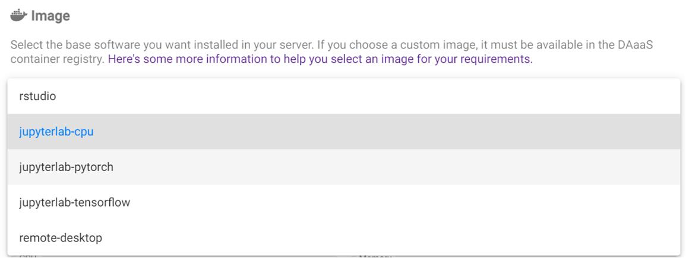
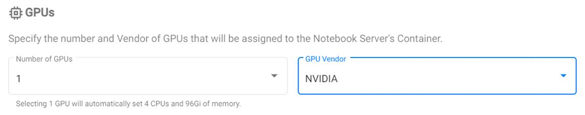

# Overview

## What does Kubeflow do?

Kubeflow runs your **workspaces**. You can have notebook servers (called Jupyter
Servers), and in them you can create analyses in R and Python with interactive
visuals. You can save and upload data, download it, and create shared workspaces
for your team.

**Let's get started!**

# Video Tutorial

<!-- prettier-ignore -->
!!! note ""
    This video is not up to date, some things have changed since.

# Setup

## Log into Kubeflow

<!-- prettier-ignore -->
??? warning "Log into the Azure Portal using your Cloud Credentials"
    You have to login to the Azure Portal **using your StatCan credentials**.
    `first.lastname@cloud.statcan.ca` or **StatCan credentials**
    `first.lastname@statcan.gc.ca`. You can do that using
    [the Azure Portal](https://portal.azure.com).
    

- Log into [Kubeflow](https://kubeflow.aaw.cloud.statcan.ca)

- Navigate to the Notebook Servers tab

- Then click **+ New Server**

## Configuring your server

- You will get a template to create your notebook server. **Note:** the name of
  your server must be lowercase letters with hyphens. **No spaces, and no
  underscores.**

- You'll need to choose an image. Check the name of the images and choose one
  that matches what you want to do. (Don't know which one to choose? Check out
  your options [here](./Selecting-an-Image.md).)

- You will also need to specify a namespace. By default you will have a default
namespace for your account, but for projects you may need to select the
namespace created specifically for that project. Otherwise the notebook server
you create may not have access rights to resources required for the project.

## CPU and Memory

- At the time of writing (December 23, 2021) there are two types of computers in
  the cluster

  - **CPU:** `D16s v3` (16 CPU cores, 64 GiB memory; for user use 15 CPU cores
    and 48 GiB memory are available; 1 CPU core and 16 GiB memory reserved for
    system use).
  - **GPU:** `NC6s_v3` (6 CPU cores, 112 GiB memory, 1 GPU; for user use 96 GiB
    memory are available; 16 GiB memory reserved for system use). The available
    GPU is the NVIDIA Tesla V100 GPU with specs 
    [here](https://images.nvidia.com/content/technologies/volta/pdf/volta-v100-datasheet-update-us-1165301-r5.pdf).

  When creating a notebook server, the system will limit you to the maximum
  specifications above. For CPU notebook servers, you can specify the exact
  amount of CPU and memory that you require. This allows you to meet your
  compute needs while minimising cost. For a GPU notebook server, you will
  always get the full server (6 CPU cores, 96 GiB accessible memory, and 1 GPU).
  See below section on GPUs for information on how to select a GPU server.

  In the future there may be larger machines available, so you may have looser
  restrictions.

<!-- prettier-ignore -->
!!! note "Use GPU machines responsibly"
    GPU machines are significantly more expensive than CPU machines,
    so use them responsibly.

## Storing your data

- You'll want to create a data volume! You'll be able to save your work here,
  and if you shut down your server, you'll be able to just remount your old data
  by entering the name of your old disk. **It is important that you remember the
  volume's name.**

<!-- prettier-ignore -->
!!! tip "Check for old volumes by looking at the Existing option"
    When you create your server you have the option of reusing an old volume
    or creating a new one. You probably want to reuse your old volume.

## Configurations

There are currently two checkbox options available here:

- **Run a Protected B notebook**: Enable this if the server you create needs
access to any Protected B resources. Protected B notebook servers run with many
security restrictions and have access to separate MinIO instances specifically
designed for Protected B data.
- **Mount MinIO storage into the minio/ folder**: This should make MinIO
repositories accessible as subfolders / files of the `minio/` folder.
Unfortunately this is not working currently, when this is fixed the
documentation will be updated.

## GPUs

If you want a GPU server, select `1` as the number of GPUs and `NVIDIA` as the GPU
vendor (the create button will be greyed out until the GPU vendor is selected if
you have a GPU specified). Multi-GPU servers are not currently supported on the
AAW system.

As mentioned before, if you select a GPU server you will automatically get 6 CPU
cores and 112 GiB of memory.

## Advanced Settings

There are two things that can be customized here:

- **Enable Shared Memory**: This is required if you use PyTorch with multiple data
loaders, which otherwise will generate an error. If using PyTorch make sure this
is enabled, otherwise it does not matter unless you have another application
that requires shared memory.
- **System language**: You can select either English or French as the system
language.

## And... Create!!!

- If you're satisfied with the settings, you can now create the server! It may
  take a few minutes to spin up depending on the resources you asked for. GPUs
  take longer.

<!-- prettier-ignore -->
!!! note "Slow node creation bug."
    Due to a bug with the firewall, creating a new node may be very
    slow in some cases (up to a few hours). A fix for this issue is in the works.

<!-- prettier-ignore -->
!!! success "Your server is running"
    If all goes well, your server should be running!!! You will now have the
    option to connect, and [try out Jupyter!](/daaas/en/1-Experiments/Jupyter)

# Once you've got the basics ...

## Share your workspace

In Kubeflow every user has a **namespace** that contains their work (their
notebook servers, pipelines, disks, etc.). Your namespace belongs to you, but
can be shared if you want to collaborate with others. **For more details on
collaboration on the platform, see
[Collaboration](../4-Collaboration/Overview.md).**
