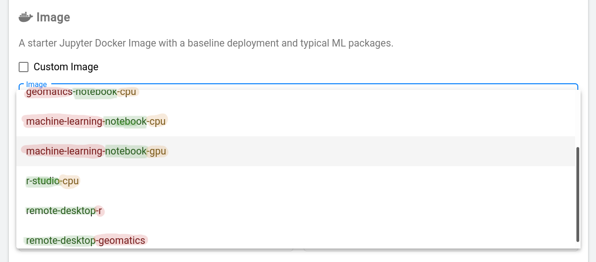
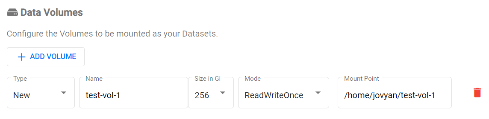

# Getting started with Kubeflow

## What does Kubeflow do?

Kubeflow runs your **workspaces**. You can have notebook servers (called Jupyter
Servers), and in them you can create analyses in R and Python with interactive
visuals. You can save and upload data, download it, and create shared workspaces
for your team.

**Let's get started!**

# Create a Server

## Log into Kubeflow

- Log into [the azure portal](https://portal.azure.com) **using your
  cloud.statcan credentials**.

<!-- prettier-ignore -->
??? warning "Log into the Azure Portal using your Cloud Credentials"
    You have to login to the azure portal **using your statcan credentials**.
    `first.lastname@cloud.statcan.ca`. You can do that using
    [the azure portal](https://portal.azure.com).
    

- After logging into Azure, log into
  [kubeflow](https://kubeflow.covid.cloud.statcan.ca)

<!-- prettier-ignore -->
??? failure "Why am I getting "Missing url parameter: code"?"
    If you try to log into kubeflow and you get the message:

    > Missing url parameter: code

    It is because you are signed in with the wrong Azure account. You must sign
    in with your cloud credentials.

    

- Navigate to the Jupyter Servers tab

- Then click **+ New Server**

## Configuring your server

- You will get a template to create your notebook server. **Note:** the name
  must be lowercase letters with hypens. **No spaces, and no underscores.**

- **You'll need to choose an image** You will probably want one of

  - **Machine Learning**
  - **Geomatics**
  - **Minimal**

- If you want to use a gpu, check if the image says **cpu** or **gpu**.

## CPU and Memory

- At the time of writing (April 21, 2020) there are two types of computers in
  the cluster

  - **CPU:** D16s v3 `(16 vcpus, 64 GiB memory)`
  - **GPU:** NC6s_v3 `(6 vcpus, 112 GiB memory, ? GPUs)`

  Because of this, if you request too much RAM or too many CPUs, it may be hard
  or impossible to satisfy your request.

  In the future (possibly when you read this) there may be larger machines made
  available, so you may have looser restrictions.

<!-- prettier-ignore -->
!!! note "Use GPU machines responsibly"
    There are fewer GPU machines than CPU machines, so use them responsibly.

## Storing your data

- You'll want to create a data volume! You'll be able to save your work here,
  and if you shut down your server, you'll be able to just remount your old data
  by entering the name of your old disk. **It is important that you remember the
  volume's name.**

<!-- prettier-ignore -->
!!! tip "Check for old volumes by looking at the Existing option"
    When you create your server you have the option of reusing an old volume
    or creating a new one. You probably want to reuse your old volume.

## And... Create!!!

- If you're satisfied with the settings, you can now create the server! It may
  take a few minutes to spin up depending on the resources you asked for. (GPUs
  take longer.)

<!-- prettier-ignore -->
!!! success "Your server is running"
    If all goes well, your server should be running!!! You will now have the
    option to connect, and [try out Jupyter!](/daaas/en/1-Experiments/Jupyter)

# Share your workspace

In kubeflow every user has a **namespace**. Your namespace belongs to you, and
it's where all your resources live. If you want to collaborate with someone you
need to share a namespace. So you can do that either by sharing your own
namespace, or more preferably, **by creating a team namespace**.

The link to create a new namespace is in the **&#8942;** menu on
[the kubeflow section of the portal](https://portal.covid.cloud.statcan.ca/#kubeflow).

## Manage contributors

You can add or remove people from a namespace you already own through the
**Manage Contributors** menu in kubeflow.

<!-- prettier-ignore -->
!!! success "Now you and your colleagues can share access to a server!"
    Now you can share a server with colleagues! Try it out!

**For more details on collaboration on the platform, see
[Collaboration](/Collaboration).**
