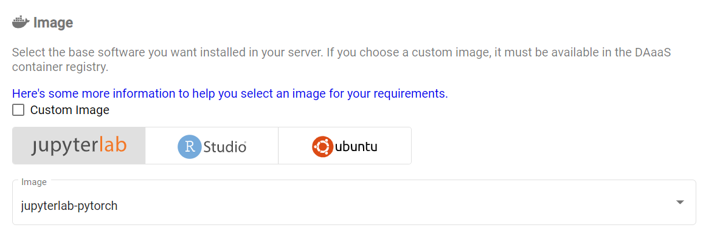
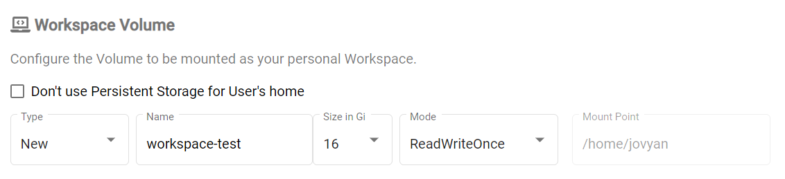

# Overview

## What does Kubeflow do?

Kubeflow runs your **workspaces**. You can have notebook servers (called Jupyter
Servers), and in them you can create analyses in R and Python with interactive
visuals. You can save and upload data, download it, and create shared workspaces
for your team.

**Let's get started!**

# Video Tutorial

<!-- prettier-ignore -->
!!! note ""
    This video is not up to date, some things have changed since.

# Setup

## Log into Kubeflow

<!-- prettier-ignore -->
??? warning "Log into the Azure Portal using your Cloud Credentials"
    You have to login to the Azure Portal **using your StatCan cloud credentials**.
    `first.lastname@cloud.statcan.ca` or **StatCan credentials**
    `first.lastname@statcan.gc.ca`. You can do that using
    [the Azure Portal](https://portal.azure.com).
    

- Log into [Kubeflow](https://kubeflow.aaw.cloud.statcan.ca)

- Navigate to the Notebook Servers tab

- Then click **+ New Server**

## Server Name and Namespace

- You will get a template to create your notebook server. **Note:** the name of
  your server can consist of only lower-case letters, numbers, and hyphens. **No spaces, and no
  underscores.**

- You will need to specify a namespace. By default you will have a default
  namespace for your account, but for projects you may need to select the
  namespace created specifically for that project. Otherwise the notebook server
  you create may not have access rights to resources required for the project.

## Image

You will need to choose an image. There are JupyterLab, RStudio, Ubuntu remote
desktop, and SAS images available. The SAS image is only available for StatCan
employees (due to license limitations), the others are available for everyone.
Select the drop down menu to select additional options within these (for
instance, CPU, PyTorch, and TensorFlow images for JupyterLab).

Check the name of the images and choose one that matches what you want to do. Don't know
which one to choose? Check out your options [here](./Selecting-an-Image.md).

## CPU and Memory

At the time of writing (December 23, 2021) there are two types of computers in
the cluster

 - **CPU:** `D16s v3` (16 CPU cores, 64 GiB memory; for user use 15 CPU cores
   and 48 GiB memory are available; 1 CPU core and 16 GiB memory reserved for
   system use).
 - **GPU:** `NC6s_v3` (6 CPU cores, 112 GiB memory, 1 GPU; for user use 96 GiB
   memory are available; 16 GiB memory reserved for system use). The available
   GPU is the NVIDIA Tesla V100 GPU with specifications
   [here](https://images.nvidia.com/content/technologies/volta/pdf/volta-v100-datasheet-update-us-1165301-r5.pdf).

When creating a notebook server, the system will limit you to the maximum
specifications above. For CPU notebook servers, you can specify the exact
amount of CPU and memory that you require. This allows you to meet your
compute needs while minimising cost. For a GPU notebook server, you will
always get the full server (6 CPU cores, 96 GiB accessible memory, and 1 GPU).
See below section on GPUs for information on how to select a GPU server.

In the advanced options, you can select a higher limit than the number of CPU cores and
RAM requested. The amount requested is the amount guaranteed to be available for your
notebook server and you will always pay for at least this much. If the limit is higher
than the amount requested, if additional RAM and CPU cores are available on that shared
server in the cluster your notebook server can use them as needed. One use case for this
is jobs that usually need only one CPU core but can benefit from multithreading to speed
up certain operations. By requesting one CPU core but a higher limit, you can pay much
less for the notebook server while allowing it to use spare unused CPU cores as needed
to speed up computations.

## GPUs

If you want a GPU server, select `1` as the number of GPUs and `NVIDIA` as the GPU
vendor (the create button will be greyed out until the GPU vendor is selected if
you have a GPU specified). Multi-GPU servers are currently supported on the AAW
system only on a special on-request basis, please contact the AAW maintainers if
you would like a multi-GPU server.

As mentioned before, if you select a GPU server you will automatically get 6 CPU
cores and 112 GiB of memory.

<!-- prettier-ignore -->
!!! note "Use GPU machines responsibly"
    GPU machines are significantly more expensive than CPU machines,
    so use them responsibly.

## Workspace Volume

You will need a workspace volume, which is where the home folder will be mounted. There
are various configuration options available:

- You can either reuse an existing workspace volume from before, or create a new one.

- You can specify the size of the workspace volume, from 4 GiB to 32 GiB.

<!-- prettier-ignore -->
!!! tip "Check for old volumes by looking at the Existing option"
    When you create your server you have the option of reusing an old volume
    or creating a new one. You probably want to reuse your old volume.

## Data Volumes

You can also create data volumes that can be used to store additional data. Multiple
data volumes can be created. Click the add new volume button to create a new volume and
specify its configuration. Click the attach existing volume button to mount an existing
data volume to the notebook server. There are the following configuration parameters for
data volumes:

- **Name**: Name of the volume.

- **Size in GiB**: From 4 GiB to 512 GiB.

- **Mount path**: Path where the data volume can be accessed on the notebook server, by
  default `/home/jovyan/vol-1`, `/home/jovyan/vol-2`, etc. (incrementing counter per data
  volume mounted).

When mounting an existing data volume, the name option becomes a drop-down list of the
existing data volumes. Only a volume not currently mounted to an existing notebook server
can be used. The mount path option remains user-configurable with the same defaults as
creating a new volume.

The garbage can icon on the right can be used to delete an existing or accidentally created
data volume.

## Configurations

There are currently three checkbox options available here:

- **Mount MinIO storage to ~/minio (experimental)**: This should make MinIO
  repositories accessible as subfolders / files of the `minio/` folder. This is
  still experimental and may not work properly currently.
- **Run a Protected B notebook**: Enable this if the server you create needs
  access to any Protected B resources. Protected B notebook servers run with many
  security restrictions and have access to separate MinIO instances specifically
  designed for Protected B data.

## Miscellaneous Settings

The following can be customized here:

- **Enable Shared Memory**: This is required if you use PyTorch with multiple data
  loaders, which otherwise will generate an error. If using PyTorch make sure this
  is enabled, otherwise it does not matter unless you have another application
  that requires shared memory.
- **System Language**: Can specify English or French here.

## And... Create!!!

- If you're satisfied with the settings, you can now create the server! It may
  take a few minutes to spin up depending on the resources you asked for. GPUs
  take longer.

<!-- prettier-ignore -->
!!! success "Your server is running"
    If all goes well, your server should be running!!! You will now have the
    option to connect, and [try out Jupyter!](/daaas/en/1-Experiments/Jupyter)

# Once you've got the basics ...

## Share your workspace

In Kubeflow every user has a **namespace** that contains their work (their
notebook servers, pipelines, disks, etc.). Your namespace belongs to you, but
can be shared if you want to collaborate with others. **For more details on
collaboration on the platform, see
[Collaboration](../4-Collaboration/Overview.md).**
