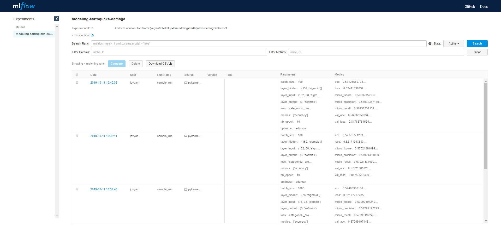

# Overview

<!-- prettier-ignore -->
!!! danger "MLFlow has been removed from the AAW.  
    If you need it, contact the development team"

MLflow is an open source platform for managing the Machine Learning lifecycle.
It is a "Model Registry" for storing your machine learning models and associated
metrics. You can use the
[web interface](https://daaas-tenant1-mlflow.covid.cloud.statcan.ca/#/) to
examine your models, and you can use its REST API to register your models from
Python, using the [mlflow pip package](https://pypi.org/project/mlflow/).

