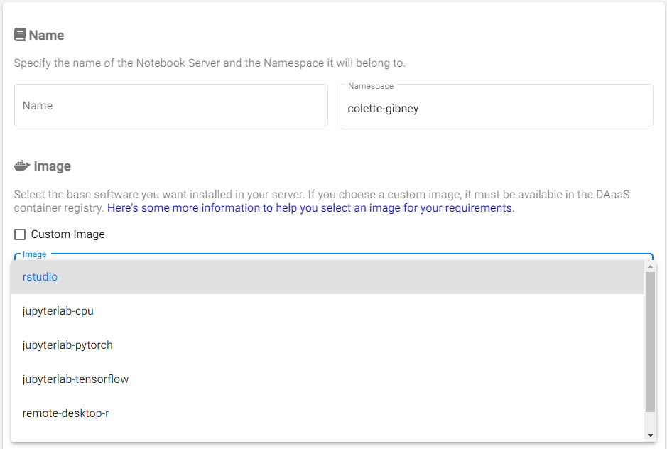

# Overview
RStudio is an integrated development environment (IDE) for R. It includes a console, editor, and tools for plotting, history, debugging and workspace management.

# Video Tutorial

# Setup 
You can use the `rstudio` image to get an RStudio environment! When you create your notebook, choose RStudio from the list of available images.

You can install `R` or `python` packages with `conda` or `install.packages()`.

# Once you've got the basics ...
## R-Shiny

You can use `Shiny`, too! Shiny is an open source R package that provides a web framework for building web applications using R. Shiny helps you turn your analyses into interactive web applications. 

