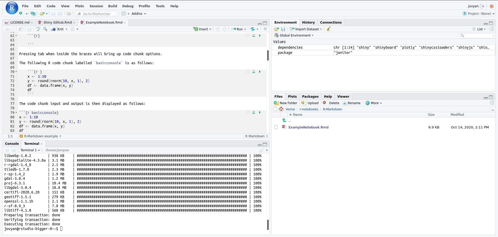

# R-Studio

You can use the `r-studio-cpu` image to get an RStudio environment!

You can install `R` or `python` packages with `conda` or `install.packages()`.

# R-Shiny

You can use `Shiny`, too! And the dashboard appears as a pop-up window.

