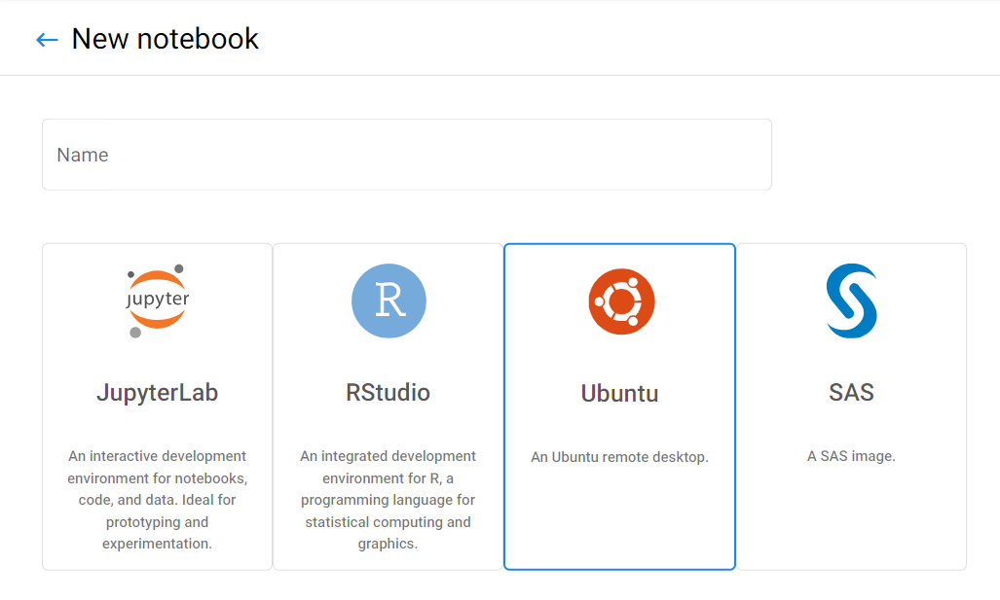

# Overview

### Ubuntu Virtual Desktop

_You can run a full [**Ubuntu Desktop**](https://ubuntu.com/desktop), with typical applications, right inside your browser, using [**Kubeflow!**](https://kubeflow.aaw.cloud.statcan.ca/)_

The Ubuntu Virtual Desktop is a powerful tool for data scientists and machine learning engineers who need to run resource-intensive workloads in the cloud. Ubuntu is a popular Linux distribution that is widely used in the data science and machine learning communities due to its strong support for open source tools such as R and Python. With the Ubuntu Virtual Desktop, you can quickly spin up a virtual machine with Ubuntu pre-installed and access it from anywhere with an internet connection. This means you can perform data analysis and machine learning tasks from your laptop, tablet, or phone without having to worry about hardware limitations.

## What is Remote Desktop?

Remote Desktop provides an in-browser GUI Ubuntu desktop experience as well as
quick access to supporting tools. The operating system is
[**Ubuntu**](https://ubuntu.com/about) **18.04** with the
[**XFCE**](https://www.xfce.org/about) desktop environment.

## Geomatics

Our version of Remote Desktop is built on an R Geospatial image.

## Customization

_pip_, _conda_, _npm_ and _yarn_ are available to install various packages.

# Setup

## Accessing the Remote Desktop

To launch the Remote Desktop or any of its supporting tools, create a Notebook
Server in [Kubeflow](./Kubeflow.md) and select the remote desktop option.

Once it has been created, click `Connect` to be redirected to the Remote
Desktop.

_Remote Desktop_ brings you to the Desktop GUI through a noVNC session. Click on
the > on the left side of the screen to expand a panel with options such as
fullscreen and clipboard access.

## Accessing the Clipboard

This is done via the second button from the top of the panel on the left.
It brings up a text box which we can modify to change the contents of the clipboard
or copy stuff from the clipboard of the remote desktop.

For example, suppose we want to execute the command `head -c 20 /dev/urandom | md5sum`
and copy-paste the result into a text file on our computer used to connect to the
remote desktop.

We first open the clipboard from the panel on the left and paste in that command into
the text box:

To close the clipboard window over the remote desktop, simply click the clipboard
button again.

We then right click on a terminal window to paste in that command and press enter to
execute the command. At that point we select the MD5 result, right click, and click
copy:

If we open the clipboard from the panel on the left again, it will now have the new
contents:

The clipboard window will even update in-place if we leave it open the whole time
and we simply select new material on the remote desktop and press copy again. We can
simply copy what we have in that text box and paste it into any other software running
on the computer used to connect.

## In-browser Tools

### VS Code

Visual Studio Code is a lightweight but powerful source code editor. It comes
with built-in support for JavaScript, TypeScript and Node.js and has a rich
ecosystem of extensions for several languages (such as C++, C#, Java, Python,
PHP, Go).

## Footnotes

Remote Desktop is based on
[ml-tooling/ml-workspace](https://github.com/ml-tooling/ml-workspace).
