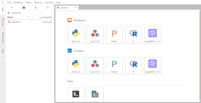

# Selecting an Image for you Notebook Server

Depending on your project or use case of the Notebook Server, some images may be
more suitable then others. The following will go through the main features of
each to help you pick the most appropriate image for you.

When selecting an image, you have 3 main options:

- Jupyter Notebook (CPU, TensorFlow, PyTorch)
- RStudio
- Remote Desktop (r, geomatics)

## Jupyter Notebooks

Use [Jupyter Notebooks](https://jupyter.org/) to create and share interactive
documents that contain a mix of live code, visualizations, and text. These can
be written in `Python`, `Julia`, or `R`.

Each one comes pre-loaded with VS Code in the browser if you prefer a full IDE
experience.

Common uses include: data transformation, numerical simulation, statistical
modelling, machine learning and more.

TensorFlow and PyTorch are open source libraries that are great for numerical
computation and large-scale machine learning. If you're looking to develop and
train models, consider the `jupyterlab-pytorch` or the `jupyterlab-tensroflow`
flavour of this image. Otherwise, use the `jupyterlab-cpu` one.

#### PyTorch vs TensorFlow

### RStudio for `R` and `Shiny`

**[RStudio](RStudio/)** gives you an integrated development environment
specifically for R. If you're coding in R, this is typically the Notebook Server
to use. Use the `rstudio` image to get an RStudio environment.

### Remote-Desktop

For a full Ubuntu desktop experience, two versions of Remote Desktop are
available. These come pre-loaded with Python and R, but are delivered in a
typical desktop experience that also comes with Firefox, VS Code, and open
office tools. The operating system is **[Ubuntu](https://ubuntu.com/about)**
18.04 with the **[XFCE](https://www.xfce.org/about)** desktop environment.

`remote-desktop-r` includes R and RStudio but If you need Geomatics tooling for
R, choose the `remote-desktop-geomatics` flavour of this image.

