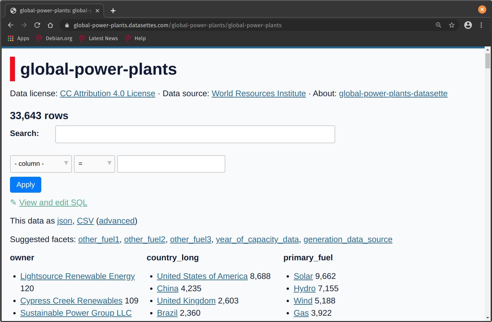

# Overview

Datasette is an instant JSON API for your SQLite databases allowing you to
explore the DB and run SQL queries in a more interactive way.

You can find a list of example datasettes
[here](https://github.com/simonw/datasette/wiki/Datasettes).

<!-- prettier-ignore -->
!!! faq "The Datasette Ecosystem"
    There are all sorts of tools for converting data to and from sqlite 
    [here](https://docs.datasette.io/en/stable/ecosystem.html). For example,
    you can load shapefiles into sqlite, or create [Vega](https://vega.github.io/vega/)
    plots from a sqlite database. SQLite works well with `R`, `Python`, and many other tools.

## Example Datasette

Below are some screenshots from the
[global-power-plants](https://global-power-plants.datasettes.com) Datasette, you
can preview and explore the data in the browser, either with clicks or SQL
queries.


You can even explore maps within the tool!



# Video Tutorial

[](https://youtu.be/OPVfBKouBT8?t=214 "Advanced Analytics Workspace Kubeflow collaboration demo + tips and tricks")

# Getting Started

## Installing Datasette

In your Jupyter Notebook, open a terminal window and run the command
`pip3 install datasette`. 

## Starting Datasette

To view your own database in your Jupyter Notebook, create a file called
start.sh in your project directory and copy the below code into it. Make the
file executable using `chmod +x start.sh`. Run the file with `./start.sh`.
Access the web server using the **base URL** with the port number you are using
in the below file.

**start.sh**

```bash
#!/bin/bash

# This script just starts Datasette with the correct URL, so
# that you can use it within kubeflow.

# Get an example database
wget https://github.com/StatCan/R-notebooks/raw/master/database-connections/latin_phrases.db

# If you have your own database, you can change this line!
DATABASE=latin_phrases.db

export BASE_URL="https://kubeflow.covid.cloud.statcan.ca${JUPYTER_SERVER_URL:19}proxy/8001/"
echo "Base url: ${BASE_URL}"
datasette $DATABASE --cors --config max_returned_rows:100000 --config sql_time_limit_ms:5500 --config base_url:${BASE_URL}
```

<!-- prettier-ignore -->
!!! example "Check out this video tutorial"
    One user of the platform used Datasette along with a javascript dashboard. See this [video](https://www.youtube.com/watch?v=OPVfBKouBT8&feature=emb_logo) for a demo.

<!-- prettier-ignore -->
!!! danger "Running your Notebook Server and accessing the port"
    When running any tool from your Jupyter Notebook that posts a website to a port,
    you will not be able to simply access it from `http://localhost:5000/` as
    normally suggested in the output upon running the web-app.

    To access the web server you will need to use the base URL. In your notebook
    terminal, run:

    ```python
    echo https://kubeflow.covid.cloud.statcan.ca${JUPYTER_SERVER_URL:19}proxy/5000/
    ```
