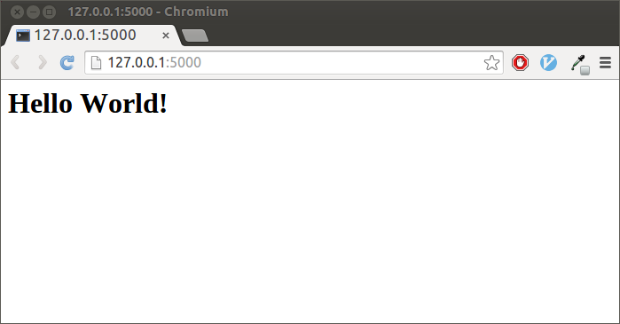
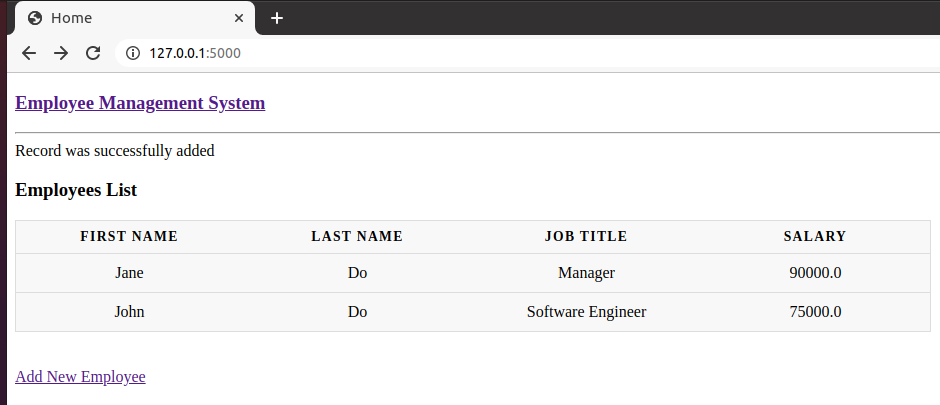

# Getting Started with Flask!

Flask is a lightweight WSGI micro web application framework that can be very
useful in building data visualizations or interactive data tools.

For data visualization tools, we will be using Dash, a Python library that uses
Flask as the web framework. Dash is a great tool used by many for data analysis,
data exploration, visualization, modelling, instrument control, and reporting.

The following example demonstrates a highly reactive and customised Dash app
with little code.

## Data Visualization with Dash

Dash makes it simple to build an interactive GUI around your data analysis code.
This is an example of a Layout With Figure and Slider from
[Dash](https://dash.plotly.com/basic-callbacks).


```python
# required installations if not already installed
pip3 install dash==1.16.3
pip3 install pandas
```

```python
# app.py

#!/usr/bin/env python3

import dash
import dash_core_components as dcc
import dash_html_components as html
from dash.dependencies import Input, Output
import plotly.express as px

import pandas as pd

df = pd.read_csv('https://raw.githubusercontent.com/plotly/datasets/master/gapminderDataFiveYear.csv')

external_stylesheets = ['https://codepen.io/chriddyp/pen/bWLwgP.css']

app = dash.Dash(__name__, external_stylesheets=external_stylesheets)

app.layout = html.Div([
    dcc.Graph(id='graph-with-slider'),
    dcc.Slider(
        id='year-slider',
        min=df['year'].min(),
        max=df['year'].max(),
        value=df['year'].min(),
        marks={str(year): str(year) for year in df['year'].unique()},
        step=None
    )
])

@app.callback(
    Output('graph-with-slider', 'figure'),
    [Input('year-slider', 'value')])
def update_figure(selected_year):
    filtered_df = df[df.year == selected_year]

    fig = px.scatter(filtered_df, x="gdpPercap", y="lifeExp",
                     size="pop", color="continent", hover_name="country",
                     log_x=True, size_max=55)

    fig.update_layout(transition_duration=500)

    return fig

if __name__ == '__main__':
    app.run_server(debug=True)
```

### Run your app

```python
python app.py

# or you can use:

export FLASK_APP=app.py
flask run
```

## Datasette tool

Datasette is an instant JSON API for your SQLite databases allowing you to
explore the DB and run SQL queries in a more interactive way.

Some examples can be found
[here](https://github.com/simonw/datasette/wiki/Datasettes).

To view your own database in your Jupyter Notebook, create the following bash
file in your project directory and run with `./start.sh`. Access the web server
using the [base URL](#running-your-Notebook-server-and-accessing-the-port) with
the port number you are using in the below file.

**start.sh**

```bash
if [ -z ${JUPYTER_SERVER_URL} ];
then
     datasette latin_phrases.db --cors --config max_returned_rows:100000 --config sql_time_limit_ms:5500 &
else
     export BASE_URL="https://kubeflow.covid.cloud.statcan.ca${JUPYTER_SERVER_URL:19}proxy/8001/"
     echo "Base url: ${BASE_URL}"
     datasette latin_phrases.db --cors --config max_returned_rows:100000 --config sql_time_limit_ms:5500 --config base_url:${BASE_URL} &
fi

PIDS[0]=$!
./app.py &
PIDS[1]=$!

trap "kill ${PIDS[*]}" SIGINT
wait
```

For more, checkout this
[video](https://www.youtube.com/watch?v=OPVfBKouBT8&feature=emb_logo) for a
visual implementation of Datasette within Flask.

## A Simple Hello World Example

Let's get started with a very simple example.

```python
# app.py

from flask import Flask

app = Flask(__name__)

@app.route("/")
def hello():
    return "Hello World!"

if __name__ == '__main__':
    app.run(debug=True)
```

To view the result in your web browser, follow these steps -
[Running your Notebook Server and accessing the port](#running-your-Notebook-server-and-accessing-the-port).
It should look something like this:



## Flask-SQLAlchemy Example

Flask can also be used to perform CRUD operations on a database through a python
toolkit, SQLAlchemy. Flask-SQLAlchemy is the Flask extension that adds support
for SQLAlchemy to your application.

<!-- prettier-ignore -->
??? info "Alternatively, there are other tools than can be used besides SQLAlchemy for exploring data"
    - [datasette](https://docs.datasette.io/en/stable/)
    - [SQLite3 database](https://pythonbasics.org/flask-sqlite/)
    - Read data directly from a CSV file (see [Data Visualization with Dash](#data-visualization-with-dash))

Here's a simple example of a dataset representation with SQLAlchemy.



```python
# app.py

from flask import Flask, request, flash, url_for, redirect, render_template
from flask_sqlalchemy import SQLAlchemy

# Flask: Initialize
app = Flask(__name__)

# setting URI to the databse 'Employees'
app.config['SQLALCHEMY_DATABASE_URI'] = 'sqlite:///employees.sqlite3'
app.config['SECRET_KEY'] = "secret key"

# Create the databse table
db = SQLAlchemy(app)

class Employees(db.Model):
   id = db.Column('employee_id', db.Integer, primary_key = True)
   first_name = db.Column(db.String(100))
   last_name = db.Column(db.String(100))
   job_title = db.Column(db.String(200))
   salary = db.Column(db.Float(50))

   def __init__(self, first_name, last_name, job_title, salary):
      self.first_name = first_name
      self.last_name = last_name
      self.job_title = job_title
      self.salary = salary

# Use the route() decorator to bind a function to a URL and render a template
@app.route('/')
def list_employees():
   return render_template('list_employees.html', Employees = Employees.query.all() )

# a second route to serve the data
@app.route('/add', methods = ['GET', 'POST'])
def addEmployee():
   if request.method == 'POST':
      if not request.form['first_name'] or not request.form['last_name'] or not request.form['job_title'] or not request.form['salary']:
         flash('Please enter all the fields', 'error')
      else:
         employee = Employees(request.form['first_name'], request.form['last_name'],
            request.form['job_title'], request.form['salary'])

         db.session.add(employee)
         db.session.commit()
         flash('Record was successfully added')
         return redirect(url_for('list_employees'))
   return render_template('add.html')

if __name__ == '__main__':
   db.create_all()
   app.run(debug = True)
```

<!-- prettier-ignore -->
!!! example "Flask will look for Flask templates in a **'templates'** folder so your project structure should look something like this:"
    &ensp;/Project Folder  
    &ensp;&ensp;&ensp;/app.py  
    &ensp;&ensp;&ensp;/templates  
    &ensp;&ensp;&ensp;&ensp;&ensp;&ensp;/list_employees.html  
    &ensp;&ensp;&ensp;&ensp;&ensp;&ensp;/add.html

## Running your Notebook Server and accessing the port

When running any tool from your Jupyter Notebook that posts a website to a port,
you will not be able to simply access it from `http://localhost:5000/` as
normally suggested in the output upon running the web-app.

To access the web server you will need to use the base URL. In your notebook
terminal run:

```python
echo https://kubeflow.covid.cloud.statcan.ca${JUPYTER_SERVER_URL:19}proxy/5000/
```

Copy and paste that link to your browser and there it is!

<!-- prettier-ignore -->
??? info "use the correct port"
    replace 5000/ with the correct port number shown in the terminal output
