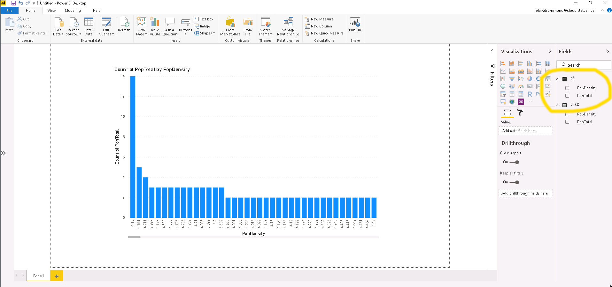
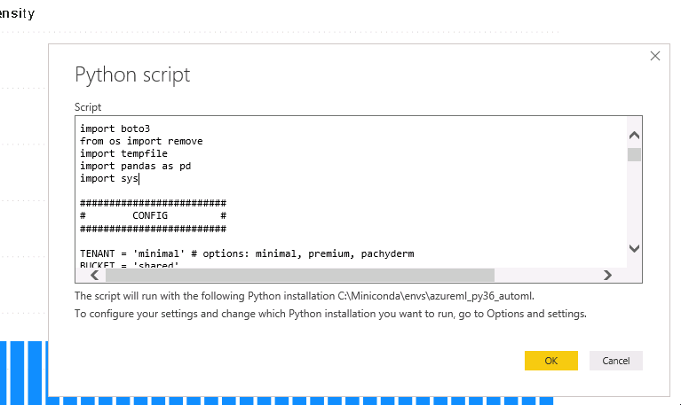

# Loading data into PowerBI

We do not offer a PowerBI server, but you can pull your data into PowerBI from
our Storage system, and use the data as a `pandas` dataframe.

## What you'll need

1. A computer with PowerBI, and Python3.6
2. Your Minio `ACCESS_KEY` and `SECRET_KEY` on hand. (See
   [Storage](/daaas/en/Storage))

## Get connected

### Set up PowerBI

Open up your PowerBI system, and open up this
[PowerBI quickstart](https://raw.githubusercontent.com/StatCan/jupyter-notebooks/master/querySQL/power_bi_quickstart.py)
in your favorite text editor.

You'll have to make sure that `pandas`, `boto3`, and `numpy` are installed, and
that you're using the right Conda Virtual Env (if applicable)

You'll then need to make sure that PowerBI is using the correct Python
environment. This is modified from the options menu, and the exact path is
specified in the quickstart guide.

### Edit your python script

Then, edit your Python script to use your Minio `ACCESS_KEY` and `SECRET_KEY`,
and then click "Get Data" and copy it in as a Python Script.

