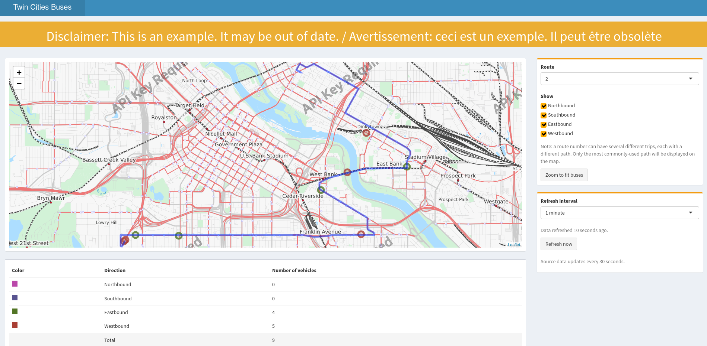

# Deploying your R-Shiny dashboard!

We handle the R-Shiny server, and it's super easy to get your dashboard onto the
platform.

## Just send a pull request!

All you have to do is send a pull request to
[our R-Dashboards repository](https://github.com/StatCan/R-dashboards). Include
your repository in a folder with the name you want (for example,
"air-quality-dashboard"). Then we will approve it and it will come online.

If you need extra R libraries to be installed, send your list to
[the R-Shiny repository](https://github.com/StatCan/shiny) by creating a GitHub
Issue and we will add the dependencies.

<!-- prettier-ignore -->
!!! example "See the above dashboard here"
    The above dashboard is in GitHub. Take a look at
    [the source](https://github.com/StatCan/R-dashboards/tree/master/bus-dashboard),
    and [see the dashboard live](https://shiny.covid.cloud.statcan.ca/bus-dashboard).

# Embedding dashboards into your websites

<!-- prettier-ignore -->
!!! failure "Embedding dashboards in other sites"
    We have not had a chance to look at this or prototype it yet, but if you
    have a use-case, feel free to reach out to engineering. We will work with
    you to figure something out.
