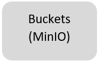

## Cloud Storage

_Cloud storage offers several advantages for data science and machine learning, particularly in terms of scalability, accessibility, and cost-effectiveness._

Firstly, cloud storage enables data scientists to store and process large amounts of data without having to worry about the limitations of local storage. This is particularly important in the context of machine learning, where large datasets are required for training and testing models. Cloud storage allows data scientists to scale up their storage capacity as needed, without having to invest in expensive hardware.

Secondly, cloud storage allows data scientists to access data from anywhere, using any device with an internet connection. This enables collaboration across geographically distributed teams and allows data scientists to work remotely. Additionally, cloud storage makes it easier to share data with other stakeholders, such as business partners or customers. Finally, cloud storage is typically more cost-effective than on-premises storage, particularly for smaller organizations or those with limited IT resources.

Overall, cloud storage is a reliable and convenient solution for storing and managing your data. Whether you need to store large amounts of data or just a few files, cloud storage makes it easy to manage your storage needs without the hassle of traditional storage solutions.

The AAW platform provides several types of storage:

- Disks (also called Volumes on the Kubeflow Notebook Server creation screen)
- Buckets ("Blob" or S3 storage, provided through MinIO)
- Data Lakes (coming soon)

Depending on your use case, either disk or bucket may be most suitable. Our [storage overview](../5-Storage/Overview.md) will help you compare them.

### Disks

**[Disks](../5-Storage/Disks.md)** are added to your notebook server by adding Data Volumes.

### Buckets

MinIO is an S3-API compatible object storage system that provides an open source alternative to proprietary cloud storage services. While we currently use MinIO as our cloud storage solution, we plan on replacing it with s3-proxy in the near future. S3-proxy is a lightweight, open source reverse proxy server that allows you to access Amazon S3-compatible storage services with your existing applications. By switching to s3-proxy, we will be able to improve our cloud storage performance, security, and scalability, while maintaining compatibility with the S3 API.

**[MinIO](../5-Storage/MinIO.md)** is a cloud-native scalable object store. We use it for buckets (blob or S3 storage).

### Data Lakes (Coming Soon)

A data lake is a central repository that allows you to store all your structured and unstructured data at any scale. It's a cost-effective way to store and manage all types of data, from raw data to processed data, and it's an essential tool for data scientists.

One of the primary advantages of a data lake is its flexibility. It allows you to store all types of data without the need to define a schema in advance, which is especially useful when dealing with unstructured data. This flexibility allows data scientists to easily explore, experiment, and extract insights from their data without being constrained by the limitations of a traditional relational database.

Data lakes also enable data scientists to centralize their data, making it easier to manage and analyze large volumes of data from various sources. With a data lake, data scientists can easily ingest and store data from a variety of sources, such as databases, cloud storage, and third-party APIs. Additionally, data lakes often provide features for data governance, metadata management, and access control, which helps ensure the data is of high quality and compliant with relevant regulations.

Furthermore, cloud-based data lakes provide scalable, cost-effective storage solutions that can be easily expanded at the click of a button. As a data scientist's data storage needs grow, they can add additional storage capacity to their data lake with minimal effort, without worrying about the underlying infrastructure or maintenance.

Overall, data lakes are a critical tool for data scientists, as they provide the flexibility, scalability, and ease of use needed to store and manage large volumes of data, enabling data scientists to focus on extracting insights and value from the data.

### Statcan Protected B Data

_The AAW is certified for hosting Protected B data!_

In order to upload Protected B data to the AAW, users will need to request access through the Customer Success Unit (CSU). AAW users will also need to provide a namespace, get a sponsor and get approval from OPMIC. Once the process has been approved, our Fair Data Infrastructure (FDI) team will then create a folder on Net A which in turn will give access to user(s) through the active directory. The data will then be able to transfer from Net A to AAW Cloud

Storing machine learning models in a protected cloud storage environment is essential for ensuring the security and privacy of sensitive data. The Advanced Analytics Workspace (AAW) provides a secure and robust cloud storage environment that can be used to store machine learning models and other data assets.

The AAW platform provides a protected cloud storage environment that is designed to meet the most stringent data security and privacy requirements. The storage environment is protected by industry-standard encryption and access controls, which ensures that only authorized personnel can access sensitive data. This protects against unauthorized access, data breaches, and other security threats.

In addition to its robust security features, the AAW cloud storage environment is also highly scalable and flexible. This means that data scientists and machine learning engineers can easily scale their storage needs as their datasets and model sizes grow. This enables them to store and manage large volumes of data and models without having to worry about storage limitations or performance bottlenecks.

Storing machine learning models in a protected cloud storage environment on the Advanced Analytics Workspace provides a secure, scalable, and flexible solution for managing and protecting sensitive data. By leveraging the cloud storage capabilities provided by the AAW platform, data scientists and machine learning engineers can focus on building and deploying their models with confidence, knowing that their data is protected and secure.