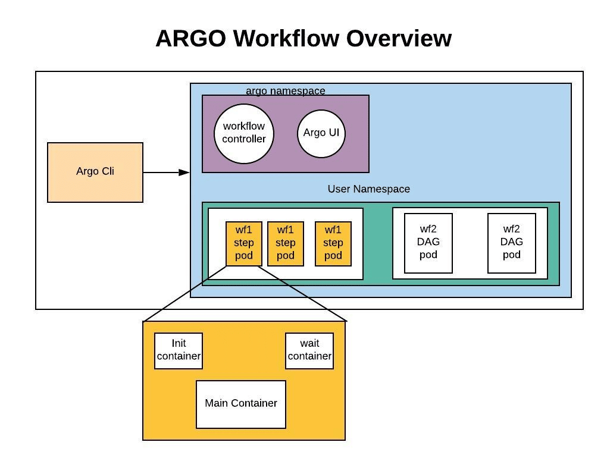

# Training Machine Learning Models on the AAW

<center>

</center>


!!! info
    Training machine learning models involves using algorithms to learn patterns and relationships in data. This process involves identifying features or variables that are relevant to the problem at hand and using these features to make predictions or classifications. 

## Why train with us?

_Training machine learning models on the Advanced Analytics Workspace (AAW) has several advantages._

1. **Open Source:** The AAW is an open source data platform hosted by Statistics Canada that provides secure (Protected B) access to a variety of data sources, including census data, surveys, and administrative records. This data can be used to train machine learning models and generate insights that can inform policy decisions and improve business processes.

2. **Versatile:** The AAW is designed to handle large and complex datasets. It provides access to a range of advanced analytics tools, including Python, R, and SAS, which can be used to preprocess data, train machine learning models, and generate visualizations. The AAW also provides access to cloud computing resources, allowing users to scale up their computing power as needed.

3. **Secure:** The AAW is a secure platform (Protected B) that adheres to the highest standards of data privacy and security. Data can be stored and processed on the platform without risk of unauthorized access or data breaches.

## MLOps and Data Pipelines

_MLOps and data pipelines are important tools used in the field of data science to manage and optimize data workflows._

MLOps refers to the set of practices and tools used to manage the entire lifecycle of a machine learning model. This includes everything from developing and training the model to deploying it in production and maintaining it over time. MLOps ensures that machine learning models are reliable, accurate, and scalable, and that they can be updated and improved as needed.

Data pipelines are a series of steps that help move data from one system or application to another. This includes collecting, cleaning, transforming, and storing data, as well as retrieving it when needed. Data pipelines are important for ensuring that data is accurate, reliable, and accessible to those who need it. 

Together, MLOps and data pipelines help organizations manage the complex process of working with large amounts of data and developing machine learning models. By automating these processes and ensuring that data is accurate and reliable, organizations can save time and resources while making better decisions based on data-driven insights.

## Why Containerized MLOps?

The advantages of using a containerized approach for training machine learning models with Argo Workflows include:

1. **Reproducibility:** Containerizing the machine learning model and its dependencies ensures that the environment remains consistent across different runs, making it easy to reproduce results.

2. **Scalability:** Argo Workflows can orchestrate parallel jobs and complex workflows, making it easy to scale up the training process as needed.

3. **Portability:** Containers can be run on any platform that supports containerization, making it easy to move the training process to different environments or cloud providers.

4. **Collaboration:** By pushing the container to a container registry, other users can easily download and use the container for their own purposes, making it easy to collaborate on machine learning projects.

Argo Workflows and containerization provide a powerful and flexible approach for training machine learning models. By leveraging these tools, data scientists and machine learning engineers can build, deploy, and manage machine learning workflows with ease and reproducibility.

## How to Train Models

### Create a Notebook Server on the AAW

First, you need to create and spin up a new notebook server. [Follow the instructions found here to get started.](https://docs.google.com/presentation/d/12yTDlbMCmbg0ccdea2h0vwhs5YTa_GHm_3DieG5A-k8/edit?usp=sharing) Regardless of whether you plan on doing work in JupyterLab, R Studio or something more advanced with Argo Workflows, you'll need the appropriate notebook server.

### Using JupyterLab


_Training machine learning models with JupyterLab is a popular approach among data scientists and machine learning engineers._

Here are the steps to train a machine learning model with JupyterLab on the AAW:

#### 1. Import the required libraries

Once you a JupyterLab session running, you need to import the required libraries for your machine learning model. This could include libraries such as NumPy, Pandas, Scikit-learn, Tensorflow, or PyTorch.

=== "Python"
    ``` py title="libraries.py" linenums="1"
    #!/usr/bin/env python

    # tensorflow and keras for building and training deep learning models  
    import tensorflow as tf
    from tensorflow import keras

    # numpy for numerical computations  
    import numpy as np

    # pandas for data manipulation and analysis  
    import pandas as pd

    # matplotlib for data visualization  
    import matplotlib.pyplot as plt
    ```
=== "R"
    ``` r title="libraries.R" linenums="1"
    #!/usr/bin/env Rscript

    # tidyverse for awesome data analysis and munging tools
    library(tidyverse)

    # janitor to clean your data
    library(janitor)

    # caret for easy machine learning
    library(caret)
    ```
=== "SASPy"
    ``` py  title="libraries.py" linenums="1"
    #!/usr/bin/env python

    # the only library you'll need to access SAS from Python
    import saspy
    ```
=== "SAS"
    ``` sas title="libraries.sas" linenums="1"

    ```

!!! note
    This is just an example, and depending on the specific task or project, other libraries such as `PyTorch` may also be used.

#### 2. Load and preprocess the data

Next, you need to load and preprocess the data you'll be using to train your machine learning model. This could include data cleaning, feature extraction, and normalization. The exact preprocessing steps you'll need to perform will depend on the specific data you're working with and the requirements of your machine learning model.

=== "Python"
    ``` py title="load_data.py" linenums="1"
    #!/usr/bin/env python

    # Import necessary packages
    import pandas as pd
    from sklearn.preprocessing import StandardScaler

    # Load data from a CSV file
    data = pd.read_csv('data.csv')

    # Data cleaning! A lot more can be done, this is basic
    data = data.dropna()  # Drop rows with missing values
    data = data.drop_duplicates()  # Drop duplicate rows

    # Feature extraction
    X = data[['feature1', 'feature2', 'feature3']]  # Select relevant features

    # Normalization
    scaler = StandardScaler()  # Create a scaler object
    X_norm = scaler.fit_transform(X)  # Normalize the feature values
    ```
=== "R"
    ``` r title="load_data.R" linenums="1"
    #!/usr/bin/env Rscript

    # Import necessary packages
    library(tidyverse)
    library(janitor)
    
    # Load data from a CSV file
    data <- read_csv("data.csv")

    # Clean data using janitor
    data_cleaned <- data %>%
    # Remove leading/trailing whitespace in column names
    clean_names() %>%
    # Remove rows with missing values
    remove_empty() %>%
    # Convert date column to Date format
    mutate(date = as.Date(date, format = "%m/%d/%Y")) %>%
    # Remove duplicate rows
    distinct() %>%
    # Reorder columns
    select(date, column2, column1, column3)
    ```
=== "SASPy"
    ``` py title="load_data.py" linenums="1"
    #!/usr/bin/env python

    # Import necessary packages
    import saspy

    # Start a SAS session and check configuration information
    sas = saspy.SASsession(cfgname='default')

    # Load data from a CSV file
    data = sas.read_csv("./data.csv")
    ```
=== "SAS"
    ``` sas title="load_data.sas" linenums="1"
    /* Reading a comma delimited file with a .csv extension                       */
    /*                                                                            */
    /* Since the DBMS= value is CSV, you do not have to use the DELIMITER=        */
    /* statement.  By default, it is assumed the variable names are on the first  */
    /* row, so the GETNAMES= statement is not required.                           */
    /*                                                                            */
    /* Create comma delimited test file to read using PROC IMPORT below.          */

    /* Load data from a CSV file */
    proc import
        datafile='data.csv'
        out=data
        dbms=csv
        replace; 
    run;

    /* Display data */
    proc print;
    run;
    ```

#### 3. Split the data into training and testing sets

 Once the data is preprocessed, you need to split it into training and testing sets. The training set will be used to train the machine learning model, while the testing set will be used to evaluate its performance.

=== "Python"
    ``` py title="train_test.py" linenums="1"
    #!/usr/bin/env python

    # Import necessary packages
    import pandas as pd
    from sklearn.model_selection import train_test_split

    # Split the data into training and testing sets
    X_train, X_test, y_train, y_test = train_test_split(X_norm,
    data['target'], test_size=0.2, random_state=42)
    ```
=== "R"
    ``` r title="train_test.R" linenums="1"
    #!/usr/bin/env Rscript

    # Import necessary packages
    library(caret)

    # Load the dataset
    data <- read.csv("my-dataset.csv")

    # Set the seed for reproducibility
    set.seed(123)

    # Split the dataset into train and test using caret's createDataPartition function
    train_index <- createDataPartition(data$target_variable, p = 0.7, list = FALSE)
    train_data <- data[train_index, ]
    test_data <- data[-train_index, ]
    ```
=== "SASPy"
    ``` py title="train_test.py" linenums="1"
    #!/usr/bin/env python

    ```
=== "SAS"
    ``` sas title="train_test.sas" linenums="1"

    ```

!!! note
    We split the data into training and testing sets using the `train_test_split` function from scikit-learn, which randomly splits the data into two sets based on the specified test size and random seed.

#### 4. Define and train the machine learning model

With the data split, you can now define and train your machine learning model using the training set. This could involve selecting the appropriate algorithm, hyperparameter tuning, and cross-validation.

=== "Python"
    ``` py title="train.py" linenums="1"
    #!/usr/bin/env python

    # Import necessary packages
    from sklearn.ensemble import RandomForestClassifier
    from sklearn.model_selection import train_test_split

    # Load the dataset
    data = pd.read_csv("my-dataset.csv")

    # Split the dataset into train and test
    X_train, X_test, y_train, y_test = train_test_split(data.iloc[:, :-1], data.iloc[:, -1], test_size=0.3, random_state=123)

    # Train the model
    model = RandomForestClassifier(n_estimators=100, random_state=123)
    model.fit(X_train, y_train)

    # Print the accuracy score on the test data
    print("Accuracy on test set: {:.3f}".format(model.score(X_test, y_test)))
    ```
=== "R"
    ``` r title="train.R" linenums="1"
    #!/usr/bin/env Rscript

    # Import necessary packages
    library(caret)

    # Load the dataset
    data <- read.csv("my-dataset.csv")

    # Set the seed for reproducibility
    set.seed(123)

    # Split the dataset into train and test using caret's createDataPartition function
    train_index <- createDataPartition(data$target_variable, p = 0.7, list = FALSE)
    train_data <- data[train_index, ]
    test_data <- data[-train_index, ]

    # Define the training control
    train_control <- trainControl(method = "cv", number = 5)

    # Train the model using caret's train function, (method = "rf" is for random forest)
    model <- train(target_variable ~ ., data = train_data, method = "rf", trControl = train_control)

    # Print the model object to view the results
    print(model)
    ```
=== "SASPy"
    ``` py title="train.py" linenums="1"
    #!/usr/bin/env python

    # Import necessary packages
    import saspy
    import pandas as pd

    # Establish a connection to a SAS session
    sas = saspy.SASsession()

    # Load the dataset
    data = pd.read_csv("my-dataset.csv")

    # Upload the dataset to SAS
    sas_df = sas.df2sd(data, "mydata")

    # Split the dataset into train and test
    train, test = sas.surveyselect(data=sas_df,
                                method="SRS",
                                seed=123,
                                samprate=0.7,
                                outall=True,
                                strata="target_variable",
                                partind=True)

    # Train the model using the HPFOREST procedure
    model = sas.hpforest(data=train,
                        target="target_variable",
                        input="input_variable_1-input_variable_n",
                        partition="rolevar",
                        rolevars={"test": "0", "train": "1"},
                        nominals=["input_variable_1-input_variable_n"],
                        forestopts={"ntree": 100, "seed": 123})

    # Score the model on the test data
    predictions = model.predict(newdata=test, out=pred_out)

    # Compute the accuracy score on the test data
    accuracy = sas.freq(data=predictions, tables="target_variable*p_target_variable", nocum=True, nocol=True)

    # Print the accuracy score
    print("Accuracy on test set: {:.3f}".format(accuracy.Frequency.iloc[0, 1] / accuracy.Frequency.iloc[:, 1].sum()))

    # Disconnect from the SAS session
    sas.disconnect()
    ```
=== "SAS"
    ``` sas title="train.sas" linenums="1"
    /* Load the dataset */
    proc import datafile="my-dataset.csv" out=mydata dbms=csv replace;
    run;

    /* Split the dataset into train and test */
    proc surveyselect data=mydata method=srs seed=123 out=selected outall
    samprate=0.7;
    strata target_variable;
    run;

    /* Train the model */
    proc hpforest data=selected;
    class _all_;
    target target_variable / level=nominal;
    partition rolevar=target_variable(test="0" train="1");
    input _all_;
    forest ntree=100 seed=123;
    run;

    /* Score the model on the test data */
    proc hpforest predict testdata=selected out=testout;
    run;

    /* Print the accuracy score on the test data */
    proc freq data=testout;
    tables target_variable*p_target_variable / nocum nocol;
    run;
    ```

#### 5. Evaluate the model

After training the model, you need to evaluate its performance on the testing set. This will give you an idea of how well the model will perform on new, unseen data.

=== "Python"
    ``` py title="evaluate.py" linenums="1"

    ```
=== "R"
    ``` r title="evaluate.R" linenums="1"

    ```
=== "SASPy"
    ``` py title="evaluate.py" linenums="1"

    ```
=== "SAS"
    ``` sas title="evaluate.sas" linenums="1"

    ```

#### 6. Deploy the model

=== "Python"
    ``` py title="deploy.py" linenums="1"

    ```
=== "R"
    ``` r title="deploy.R" linenums="1"

    ```
=== "SASPy"
    ``` py title="deploy.py" linenums="1"

    ```
=== "SAS"
    ``` sas title="deploy.sas" linenums="1"

    ```

Finally, you can deploy the trained machine learning model in a production environment. This could involve packaging the model as a REST API, deploying it as a container, or integrating it with other applications or systems.

JupyterLab provides a powerful and flexible environment for training machine learning models. By following these steps, you can leverage JupyterLab's capabilities to build and train machine learning models that meet your specific needs and requirements.

### Using Argo Workflows


_An excellent tool for anyone looking to implement MLOps practices and streamline the process of deploying machine learning models in production._

**[Argo Workflows](https://argoproj.github.io/argo-workflows/)** is an open source tool for running and managing workflows on Kubernetes. It provides an easy way to create, run, and manage complex workflows, and it is particularly well-suited for use in machine learning and data science workflows.

Argo Workflows allows you to define, execute, and monitor multi-step workflows, making it easy to manage the entire end-to-end machine learning pipeline. With Argo Workflows, you can easily build workflows that incorporate tasks such as data preprocessing, model training, and model deployment, all within a Kubernetes environment.

!!! info ""
    <center>
    [](https://argoproj.github.io/argo-workflows/)
    <h3>Argo Workflows</h3>
    </center>

Argo Workflows is an open source container-native workflow engine designed for orchestrating parallel jobs and complex workflows on Kubernetes. It allows you to build, deploy, and manage machine learning workflows using containerized applications, making it an ideal tool for training machine learning models. Here are the steps to train a machine learning model using Argo Workflows:

#### 1. Define the machine learning model and its dependencies

First, you need to create a Docker image that includes all the necessary dependencies for your machine learning model. This could include packages like `scikit-learn`, `TensorFlow`, or `PyTorch`, as well as any custom libraries or scripts you've written. You should also include your machine learning model code in this image. Here's an example script (in both R and Python) that trains a logistic regression model on the iris dataset:

=== "Python"

    ``` python title="train.py" linenums="1"
    #!/usr/bin/env python

    # Import necessary libraries
    import argparse
    import pandas as pd
    from sklearn.datasets import load_iris
    from sklearn.linear_model import LogisticRegression
    from sklearn.model_selection import train_test_split
    from sklearn.metrics import accuracy_score
    import joblib

    # Parse input arguments
    parser = argparse.ArgumentParser(description="Train logistic regression model on iris dataset.")
    parser.add_argument("--input", default="iris.csv", help="Path to input dataset file.")
    parser.add_argument("--output", default="model.pkl", help="Path to output model file.")
    args = parser.parse_args()

    # Load iris dataset
    data = load_iris()
    X, y = data.data, data.target

    # Split data into train and test sets
    X_train, X_test, y_train, y_test = train_test_split(X, y, test_size=0.2, random_state=42)

    # Train logistic regression model
    clf = LogisticRegression(random_state=42)
    clf.fit(X_train, y_train)

    # Evaluate model on test set
    y_pred = clf.predict(X_test)
    accuracy = accuracy_score(y_test, y_pred)
    print("Accuracy:", accuracy)

    # Save model to file
    joblib.dump(clf, args.output)
    ```

=== "R"

    ``` r title="train.R" linenums="1"
    #!/usr/bin/env Rscript

    # Import necessary libraries
    library(caret)

    # Parse input arguments
    args <- commandArgs(trailingOnly = TRUE)
    input_file <- ifelse(length(args) > 0, args[1], "iris.csv")
    output_file <- ifelse(length(args) > 1, args[2], "model.RData")

    # Load iris dataset
    data(iris)
    X <- iris[, 1:4]
    y <- iris[, 5]

    # Split data into train and test sets
    set.seed(42)
    train_index <- createDataPartition(y, p = 0.8, list = FALSE)
    X_train <- X[train_index, ]
    y_train <- y[train_index]
    X_test <- X[-train_index, ]
    y_test <- y[-train_index]

    # Train logistic regression model
    clf <- train(x = X_train, y = y_train, method = "glm")

    # Evaluate model on test set
    y_pred <- predict(clf, newdata = X_test)
    accuracy <- confusionMatrix(y_pred, y_test)$overall["Accuracy"]
    print(paste0("Accuracy: ", accuracy))

    # Save model to file
    saveRDS(clf, output_file)
    ```
#### 2. Write a Dockerfile

You'll need to write a `Dockerfile` for your workflow. It doesn't have to be anything fancy, use the following as a starting point for your `R` and `Python` projects.

=== "Python"

    ``` docker title="Dockerfile" linenums="1"
    FROM python:3.8-slim-buster

    # Install any necessary dependencies
    RUN pip install --no-cache-dir scikit-learn pandas numpy

    # Set working directory
    WORKDIR /app

    # Copy code into container
    COPY train.py .

    # Set entrypoint
    ENTRYPOINT ["python", "train.py"]
    ```

=== "R"
    ``` docker title="Dockerfile" linenums="1"
    FROM rocker/r-base:latest

    RUN apt-get update && apt-get install -y --no-install-recommends \
        libssl-dev \
        libcurl4-openssl-dev \
        libxml2-dev \
        && apt-get clean \
        && rm -rf /var/lib/apt/lists/*

    RUN R -e 'install.packages(c("caret", "dplyr"))'

    COPY train.R /app/train.R

    WORKDIR /app

    ENTRYPOINT ["Rscript", "train.R"]
    ```

#### 2. Write a workflow definition

Next, you need to define the steps of your machine learning pipeline in an Argo Workflows YAML file. This file should include the Docker image you created in step 1, as well as any input data and output data you'll be working with.

Here are two example YAML files (one for Python users and one for R users) for a simple machine learning pipeline that trains a logistic regression model on the iris dataset:

=== "Python"
    ``` yaml title="workflow.yaml" linenums="1"
    apiVersion: argoproj.io/v1alpha1
    kind: Workflow
    metadata:
    generateName: ml-pipeline-
    spec:
    entrypoint: train
    templates:
    - name: train
        container:
        image: my-ml-image:v1
        command: ["python", "train.py"]
        args: ["--input", "{{inputs.parameters.dataset}}", "--output", "{{outputs.artifacts.model}}"]
        inputs:
        parameters:
        - name: dataset
            default: "iris.csv"
        outputs:
        artifacts:
        - name: model
            path: /output/model.pkl
    ```
=== "R"
    ``` yaml title="workflow.yaml" linenums="1"
    apiVersion: argoproj.io/v1alpha1
    kind: Workflow
    metadata:
    generateName: ml-pipeline-
    spec:
    entrypoint: train
    templates:
    - name: train
        container:
        image: my-ml-image:v1
        command: ["Rscript", "train.R"]
        args: ["--input", "{{inputs.parameters.dataset}}", "--output", "{{outputs.artifacts.model}}"]
        inputs:
        parameters:
        - name: dataset
            default: "iris.csv"
        outputs:
        artifacts:
        - name: model
            path: /output/model.pkl
    ```

In this example, the YAML file defines a single step called `train` that runs a Python script called `train.py` in the Docker image `my-ml-image:v1`. The script takes an input dataset file, specified by a parameter called `dataset`, and outputs a trained model file to an output artifact called `model`.

#### 3. Submit the workflow for execution: 

To run this workflow, you would need to build and push the Docker image to our container registry, and then submit the YAML file using the `argo submit` command. Once the pipeline has completed, you can retrieve the trained model file by downloading the output artifact from the `argo logs` command.

``` bash title="argo submit"
    $ argo submit workflow.yaml
```

#### 4. Monitor the pipeline

As the pipeline runs, you can monitor its progress using the Argo Workflows UI or command line interface. This will show you which steps have completed successfully and which are still running.

#### 5. Retrieve the output

Once the pipeline has completed, you can retrieve the output data using the argo logs command or by viewing the output artifacts in the Argo Workflows UI.

#### Examples using SDKs

We have a couple of example scripts to get you started. Please take a look!

=== "Couler"
    ``` py title="couler.py" linenums="1"

    # Prepare your system
    !pip config --user set global.index-url https://jfrog.aaw.cloud.statcan.ca/artifactory/api/pypi/pypi-remote/simple
    !python3 -m pip install git+https://github.com/couler-proj/couler --ignore-installed

    # Define global variable for convenience
    NAMESPACE = "<your-namespace>"

    # Import necessary packages
    import json
    import random

    import couler.argo as couler
    from couler.argo_submitter import ArgoSubmitter


    # Define the steps (functions) used in the workflow
    def random_code():
        import random
        res = "heads" if random.randint(0, 1) == 0 else "tails"
        print(res)


    def flip_coin():
        return couler.run_script(
            image="k8scc01covidacr.azurecr.io/ubuntu",
            source=random_code
        )


    def heads():
        return couler.run_container(
            image="k8scc01covidacr.azurecr.io/ubuntu",
            command=["sh", "-c", 'echo "it was heads"']
        )


    def tails():
        return couler.run_container(
            image="k8scc01covidacr.azurecr.io/ubuntu",
            command=["sh", "-c", 'echo "it was tails"']
        )


    result = flip_coin()

    couler.when(couler.equal(result, "heads"), lambda: heads())
    couler.when(couler.equal(result, "tails"), lambda: tails())

    submitter = ArgoSubmitter(namespace="NAMESPACE")
    result = couler.run(submitter=submitter)

    print(json.dumps(result, indent=2))
    ```
=== "Hera"
    ``` py title="hera.py" linenums="1"
    # Prepare your system
    !pip config --user set global.index-url https://jfrog.aaw.cloud.statcan.ca/artifactory/api/pypi/pypi-remote/simple
    !pip install hera-workflows
    
    # Import necessary packages
    import hera
    from hera import Task, Workflow

    # Configure Hera
    hera.global_config.GlobalConfig.token = "<your-token>"
    hera.global_config.GlobalConfig.host = "https://argo-workflows.aaw-dev.cloud.statcan.ca:443"
    hera.global_config.GlobalConfig.namespace = "<your-namespace>"
    hera.global_config.GlobalConfig.service_account_name = "<your-account-name>"


    # Define the steps (functions) used in the workflow
    def random_code():
        res = "heads" if random.randint(0, 1) == 0 else "tails"
        print(res)


    def heads():
        print("it was heads")


    def tails():
        print("it was tails")

    # Define the workflow
    with Workflow("coin-flip") as w:
        r = Task("r", random_code)
        h = Task("h", heads)
        t = Task("t", tails)

        h.on_other_result(r, "heads")
        t.on_other_result(r, "tails")

    # Run the workflow
    w.create()
    ```
=== "YAML"
    ``` py title="workflow.yaml" linenums="1"

    ```
=== "Seldon?"
    ``` py

    ```

### Additional Resources for Argo Workflows

Example Argo Workflows workflows can be found in the following Github repositories:

- [Example of using Argo for CI/CD](https://github.com/bryanpaget/argo-examples)