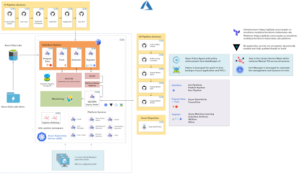

# Overview

_One of the main advantages of the AAW platform is its ability to integrate with popular machine learning platforms such as Databricks and AzureML._

The Advanced Analytics Workspace (AAW) is an open source data analytics platform that is designed to be highly integrable. This means that it can be easily integrated with other platforms and tools to extend its capabilities and streamline workflows.

An example diagram depicting a possible PaaS connection strategy:

 

**Setup:** If you need help integrating with a platform as a service offering, we're happy
to help!

## Databricks

- [Databricks from Microsoft](https://azure.microsoft.com/en-ca/services/databricks/)

Databricks is a cloud-based platform that provides a unified analytics platform for big data processing and machine learning. With its powerful distributed computing engine and streamlined workflow tools, Databricks is a popular choice for building and deploying machine learning models. By integrating with Databricks, the AAW platform can leverage its distributed computing capabilities to train and deploy machine learning models at scale.

## AzureML

- [Azure ML from Microsoft](https://azure.microsoft.com/en-us/services/machine-learning/)

AzureML is another popular machine learning platform that provides a wide range of tools for building, training, and deploying machine learning models. By integrating with AzureML, the AAW platform can leverage its powerful tools for building and training models, as well as its ability to deploy models to the cloud.

### Examples

_Examples of how to integrate the AAW platform with these and other platforms can be found on the MLOps Github repository._

- [MLOps Github Repository](https://github.com/StatCan/aaw-kubeflow-mlops)

This repository contains a range of examples and tutorials for using the AAW platform in various machine learning workflows, including data preparation, model training, and model deployment.

## Conclusion

By integrating with popular machine learning platforms like Databricks and AzureML, the AAW platform provides a powerful and flexible solution for building, deploying, and managing machine learning workflows at scale.

By leveraging the integrations and tools provided by these platforms, data scientists and machine learning engineers can accelerate their workflows and achieve better results with less effort.