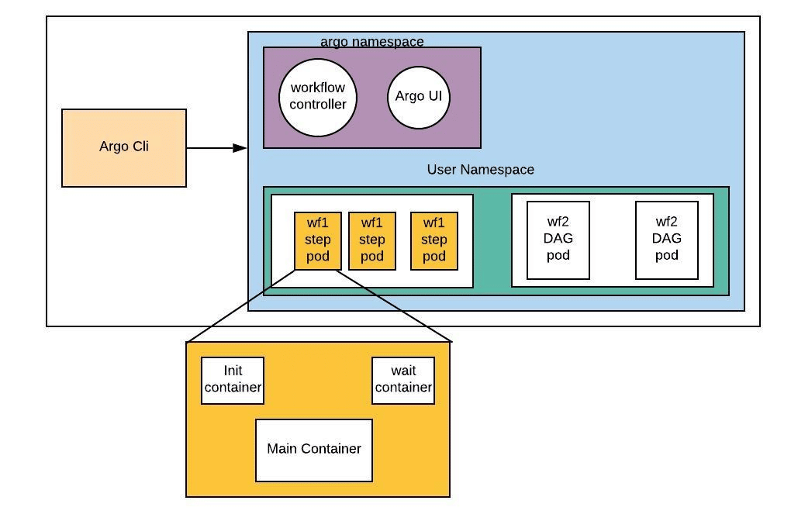

## Argo Workflows


**[Argo Workflows](https://argoproj.github.io/argo-workflows/)**  is an open source container-native workflow engine for orchestrating parallel jobs on Kubernetes. Argo Workflows is implemented as a Kubernetes CRD (Custom Resource Definition). It is particularly well-suited for use in data science workflows and machine learning workflows.

Full documentation can be found [here](https://argoproj.github.io/argo-workflows/walk-through/). 

Argo Workflows allows you to

- Workflow tasks can be defined as scripts (ex. python) or be containerized (ex. docker).
- Complex workflows can be modeled using Directed Acyclic graphs (DAGs) to capture dependency chains.
- Independent tasks can be run in parallel with granularity to the level of implementation, reducing time intensive task loads.
- Kubernetes platform agnositic, which means that your work is very portable.

With Argo Workflows, you can easily build workflows that incorporate tasks such as automated builds and deployments, data preprocessing, model training, and model deployment, all within a Cloud Native Kubernetes environment.

<!-- prettier-ignore -->
!!! info ""
    <center>
    [](https://argoproj.github.io/argo-workflows/)
    <h3>Argo Workflows</h3>
    </center>

Below is an example use-case of Argo Workflows, where we train a machine learning model using Argo Workflows on the AAW.

#### 1. Write a script to train your model

Here's an example script that trains a logistic regression model on the iris dataset. Don't forget to view the code from each language below.

=== "Python"

    ``` python title="train.py" linenums="1"
    #!/usr/bin/env python

    # Import necessary libraries
    import argparse
    import pandas as pd
    from sklearn.datasets import load_iris
    from sklearn.linear_model import LogisticRegression
    from sklearn.model_selection import train_test_split
    from sklearn.metrics import accuracy_score
    import joblib

    # Parse input arguments
    parser = argparse.ArgumentParser(description="Train logistic regression model on iris dataset.")
    parser.add_argument("--input", default="iris.csv", help="Path to input dataset file.")
    parser.add_argument("--output", default="model.pkl", help="Path to output model file.")
    args = parser.parse_args()

    # Load iris dataset
    data = load_iris()
    X, y = data.data, data.target

    # Split data into train and test sets
    X_train, X_test, y_train, y_test = train_test_split(X, y, test_size=0.2, random_state=42)

    # Train logistic regression model
    clf = LogisticRegression(random_state=42)
    clf.fit(X_train, y_train)

    # Evaluate model on test set
    y_pred = clf.predict(X_test)
    accuracy = accuracy_score(y_test, y_pred)
    print("Accuracy:", accuracy)

    # Save model to file
    joblib.dump(clf, args.output)
    ```

=== "R"

    ``` r title="train.R" linenums="1"
    #!/usr/bin/env Rscript

    # Import necessary libraries
    library(caret)

    # Parse input arguments
    args <- commandArgs(trailingOnly = TRUE)
    input_file <- ifelse(length(args) > 0, args[1], "iris.csv")
    output_file <- ifelse(length(args) > 1, args[2], "model.rds")

    # Load iris dataset
    data(iris)
    X <- iris[, 1:4]
    y <- iris[, 5]

    # Split data into train and test sets
    set.seed(42)
    train_index <- createDataPartition(y, p = 0.8, list = FALSE)
    X_train <- X[train_index, ]
    y_train <- y[train_index]
    X_test <- X[-train_index, ]
    y_test <- y[-train_index]

    # Train logistic regression model
    clf <- train(x = X_train, y = y_train, method = "glm")

    # Evaluate model on test set
    y_pred <- predict(clf, newdata = X_test)
    accuracy <- confusionMatrix(y_pred, y_test)$overall["Accuracy"]
    print(paste0("Accuracy: ", accuracy))

    # Save model to file
    saveRDS(clf, output_file)
    ```
#### 2. Write a Dockerfile to run your code

You'll need a Dockerfile that includes all necessary dependencies for training your machine learning model. This could include

- packages like
  - `scikit-learn`, `pandas` or `numpy` if you are using `Python`
  - `caret`, `janitor` and `tidyverse` if you are using `R` 
- your own custom libraries or scripts
- your machine learning model code in the form of a script [as in the above example](#1-write-a-script-to-train-your-model).

Use the following `Dockerfile` as a starting point for your `R` and `Python` projects.

=== "Python"

    ``` docker title="Dockerfile" linenums="1"
    FROM python:3.8-slim-buster

    # Install any necessary dependencies
    RUN pip install --no-cache-dir scikit-learn pandas numpy

    # Set working directory
    WORKDIR /app

    # Copy code into container
    COPY train.py .

    # Set entrypoint
    ENTRYPOINT ["python", "train.py"]
    ```

=== "R"
    ``` docker title="Dockerfile" linenums="1"
    FROM rocker/r-base:latest

    RUN apt-get update && apt-get install -y --no-install-recommends \
        libssl-dev \
        libcurl4-openssl-dev \
        libxml2-dev \
        && apt-get clean \
        && rm -rf /var/lib/apt/lists/*

    RUN R -e 'install.packages(c("caret", "janitor", "tidyverse"))'

    COPY train.R /app/train.R

    WORKDIR /app

    ENTRYPOINT ["Rscript", "train.R"]
    ```

#### 3. Write your workflow in YAML

YAML is Yet Another Markup Language and you'll need to write down the steps of your training pipeline in an Argo Workflows YAML file. This file should include reference to the Dockerfile you created in [Step 1](#2-write-a-dockerfile-to-run-your-code), as well as any input data and output data you'll be working with.

Here is an example YAML file for a simple machine learning pipeline that trains a logistic regression model on the iris dataset. The only real difference between the `Python` and `R` versions is the command `command: ["python", "train.py"]` vs `command: ["Rscript", "train.R"]` and the models are stored in different formats, `pkl` for `python` and `rds` for `R`.

The YAML file defines a single step called `train` that runs a script called `train.py` or `train.R` in the Docker image `machine-learning:v1`. The script takes an input dataset file, specified by a parameter called `dataset`, and outputs a trained model file to an output artifact called `model.pkl` or `model.rds` depending on the language used.

=== "Python"
    ``` yaml title="workflow.yaml" linenums="1"
    apiVersion: argoproj.io/v1alpha1
    kind: Workflow
    metadata:
    generateName: ml-pipeline-
    spec:
    entrypoint: train
    templates:
    - name: train
        container:
        image: machine-learning:v1
        command: ["python", "train.py"]
        args: ["--input", "{{inputs.parameters.dataset}}", "--output", "{{outputs.artifacts.model}}"]
        inputs:
        parameters:
        - name: dataset
            default: "iris.csv"
        outputs:
        artifacts:
        - name: model
            path: /output/model.pkl
    ```
=== "R"
    ``` yaml title="workflow.yaml" linenums="1"
    apiVersion: argoproj.io/v1alpha1
    kind: Workflow
    metadata:
    generateName: ml-pipeline-
    spec:
    entrypoint: train
    templates:
    - name: train
        container:
        image: machine-learning:v1
        command: ["Rscript", "train.R"]
        args: ["--input", "{{inputs.parameters.dataset}}", "--output", "{{outputs.artifacts.model}}"]
        inputs:
        parameters:
        - name: dataset
            default: "iris.csv"
        outputs:
        artifacts:
        - name: model
            path: /output/model.rds
    ```

#### 4. Submit the workflow using the Argo Workflows CLI

To run the above workflow, you will first need to push the Dockerfile to our container registry and then submit the YAML file using the `argo submit` command. Once the pipeline has completed, you can retrieve the trained model file by downloading the output artifact from the `argo logs` command.

``` bash title="Terminal"
$ argo submit workflow.yaml       # submit a workflow spec to Kubernetes
```

It's also possible to submit argo workflows from within workflows using SDKs and API calls (it's just another web-service!). See this [section](#examples-using-argo-workflows-based-sdks).

#### 5. Monitor the pipeline using the Argo Workflows CLI

As the pipeline runs, you can monitor its progress using the Argo Workflows CLI. This will show you which steps have completed successfully and which are still running. Below are some useful commands, for more information about the Argo Workflows CLI, please check out [the official Argo Workflows CLI documentation](https://argoproj.github.io/argo-workflows/walk-through/argo-cli/).

``` bash title="Terminal"
$ argo list                       # list current workflows
$ argo get workflow-xxx           # get info about a specific workflow
$ argo logs workflow-xxx          # print the logs from a workflow
$ argo delete workflow-xxx        # delete workflow

```

#### 6. Retrieve the trained model

Once the pipeline has completed, you can retrieve the output data using the argo logs command or by viewing the output artifacts using the CLI, i.e. navigate to the directory you specified in your script and locate the file `model.pkl` or `model.rds`. The following code snippet, taken from [the above training script](#1-Write-a-script-to-train-your-model), tells the respective programming language where to save the trained model.

=== "Python"

    ``` python title="Saving Output Data" linenums="1"
    #!/usr/bin/env python
    
    parser.add_argument("--output", default="model.pkl", help="Path to output model file.")
    
    # Save model to file
    joblib.dump(clf, args.output)
    ```

=== "R"

    ``` r title="Saving Output Data" linenums="1"
    #!/usr/bin/env Rscript
    
    output_file <- ifelse(length(args) > 1, args[2], "model.rds")
    
    # Save model to file
    saveRDS(clf, output_file)
    ```

### Examples using Argo Workflows-based SDKs

Argo supports both auto-generated and community maintained [client libraries](https://argoproj.github.io/argo-workflows/client-libraries/), which includes Java and Python SDKs.

If you prefer to use a higher level framework, then `Couler` and `Hera` are well-suited alternatives. These frameworks make the creation and management of complex workflows more accessible to a wider audience.

#### Hera

Hera aims to simplify the process of building and submitting workflows by abstracting away many of the technical details through a simple application programming interface. It also uses a consistent set of terminology and concepts that align with Argo Workflows, making it easier for users to learn and use both tools together.

#### Couler

Couler provides a simple, unified application programming interface for defining workflows using an imperative programming style. It also automatically constructs directed acyclic graphs (DAGs) for the workflows, which can help to simplify the process of creating and managing them.

=== "Couler"
    ``` py title="couler.py" linenums="1"
    #!/usr/bin/env python

    # Prepare your system
    !pip config --user set global.index-url https://jfrog.aaw.cloud.statcan.ca/artifactory/api/pypi/pypi-remote/simple
    !python3 -m pip install git+https://github.com/couler-proj/couler --ignore-installed

    # Define global variable for convenience
    NAMESPACE = "<your-namespace>"

    # Import necessary packages
    import json
    import random

    import couler.argo as couler
    from couler.argo_submitter import ArgoSubmitter


    # Define the steps (functions) used in the workflow
    def random_code():
        import random
        res = "heads" if random.randint(0, 1) == 0 else "tails"
        print(res)


    def flip_coin():
        return couler.run_script(
            image="k8scc01covidacr.azurecr.io/ubuntu",
            source=random_code
        )


    def heads():
        return couler.run_container(
            image="k8scc01covidacr.azurecr.io/ubuntu",
            command=["sh", "-c", 'echo "it was heads"']
        )


    def tails():
        return couler.run_container(
            image="k8scc01covidacr.azurecr.io/ubuntu",
            command=["sh", "-c", 'echo "it was tails"']
        )


    result = flip_coin()

    couler.when(couler.equal(result, "heads"), lambda: heads())
    couler.when(couler.equal(result, "tails"), lambda: tails())

    submitter = ArgoSubmitter(namespace="NAMESPACE")
    result = couler.run(submitter=submitter)

    print(json.dumps(result, indent=2))
    ```
=== "Hera"
    ``` py title="hera.py" linenums="1"
    #!/usr/bin/env python

    # Prepare your system
    !pip config --user set global.index-url https://jfrog.aaw.cloud.statcan.ca/artifactory/api/pypi/pypi-remote/simple
    !pip install hera-workflows
    
    # Import necessary packages
    import hera
    from hera import Task, Workflow

    # Configure Hera
    hera.global_config.GlobalConfig.token = "<your-token>"
    hera.global_config.GlobalConfig.host = "https://argo-workflows.aaw-dev.cloud.statcan.ca:443"
    hera.global_config.GlobalConfig.namespace = "<your-namespace>"
    hera.global_config.GlobalConfig.service_account_name = "<your-account-name>"


    # Define the steps (functions) used in the workflow
    def random_code():
        res = "heads" if random.randint(0, 1) == 0 else "tails"
        print(res)


    def heads():
        print("it was heads")


    def tails():
        print("it was tails")

    # Define the workflow
    with Workflow("coin-flip") as w:
        r = Task("r", random_code)
        h = Task("h", heads)
        t = Task("t", tails)

        h.on_other_result(r, "heads")
        t.on_other_result(r, "tails")

    # Run the workflow
    w.create()
    ```

### Additional Resources for Argo Workflows

Example Argo Workflows workflows can be found in the following Github repositories:

- [Argo Workflows Documentation](https://argoproj.github.io/argo-workflows/)
- [Argo CLI Reference](https://argoproj.github.io/argo-workflows/walk-through/argo-cli/)
