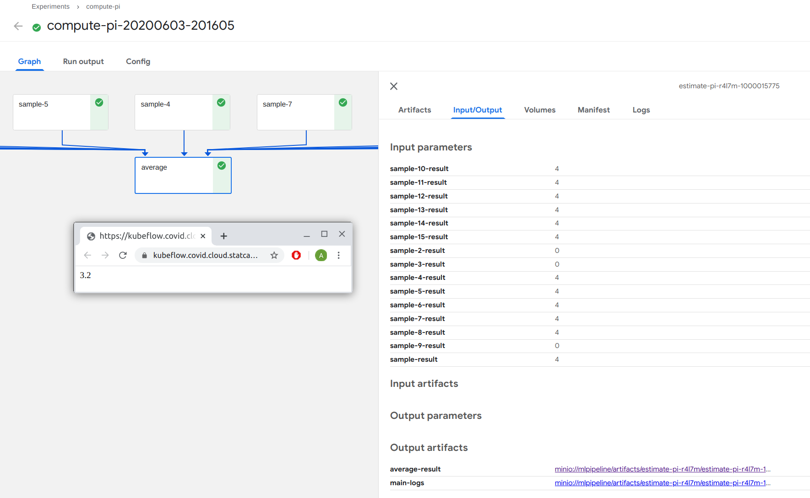
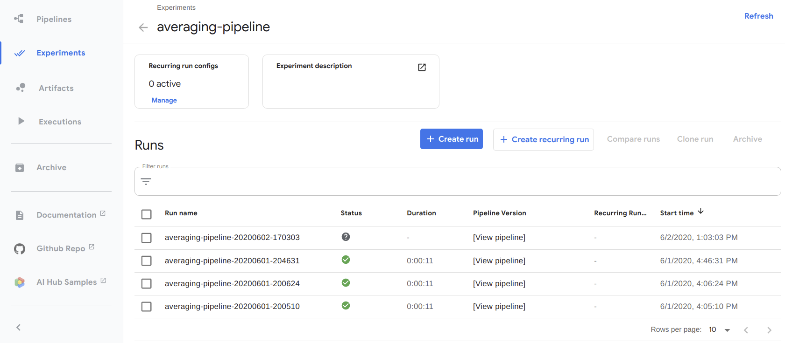

# Overview

[Kubeflow Pipelines](https://www.kubeflow.org/docs/pipelines/overview/pipelines-overview/)
is a platform for building machine learning workflows for deployment in a
Kubernetes environment. It enables authoring _pipelines_ that encapsulate
analytical workflows (transforming data, training models, building visuals,
etc.). These _pipelines_ can be shared, reused, and scheduled, and are built to
run on compute provided via Kubernetes. Here is an example of a pipeline with
many `sample` steps feeding into a single `average` step. This image comes from
the [Kubeflow Pipelines UI](../1-Experiments/Kubeflow.md)



In the context of the Advanced Analytics Workspace, Kubeflow Pipelines are
interacted with through:

- The [Kubeflow UI](../1-Experiments/Kubeflow.md), where from the Pipelines menu
  you can upload pipelines, view the pipelines you have and their results, etc.
- The Kubeflow Pipelines python
  [SDK](https://www.kubeflow.org/docs/pipelines/sdk/sdk-overview/), accessible
  through the
  [Jupyter Notebook Servers](../1-Experiments/Kubeflow.md#create-a-server),
  where you can define your components and pipelines, submit them to run now, or
  even save them for later.

<!-- prettier-ignore -->
??? example "More examples in the notebooks"
    More comprehensive pipeline examples specifically made for this platform are
    available on [GitHub](https://github.com/StatCan/jupyter-notebooks) (and in
    every Notebook Server at `/jupyter-notebooks`). You can also check out
    [public sources](https://github.com/kubeflow/pipelines/tree/master/samples).

See
[the official Kubeflow docs](https://www.kubeflow.org/docs/pipelines/overview/pipelines-overview/)
for a more detailed explanation of Kubeflow Pipelines.

# What are pipelines and how do they work?

A
[_pipeline_](https://www.kubeflow.org/docs/pipelines/overview/concepts/pipeline/)
in Kubeflow Pipelines consists of one or more
[_pipeline components_](https://www.kubeflow.org/docs/pipelines/overview/concepts/component/)
chained together to form a workflow. The _components_ are like functions,
describing the individual steps in your workflow (such as pulling columns from a
data store, transforming data, or training a model). The _pipeline_ is the logic
that glues _components_ together, such as:

1. Run Component-A
2. Pass the output from Component-A to Component-B and Component-C
3. ...

In the above image, the logic would be running many `sample` steps followed by a
single `average` step.

At their core, each _component_ has:

- A standalone application, packaged as a
  [Docker image](https://docs.docker.com/get-started/), for doing the actual
  work. The code in the Docker image could be a shell script, Python script, or
  anything else you can run from a Linux terminal, and generally will have a
  command line interface for data exchange (accessible through `docker run`)
- A YAML file that describes how Kubeflow Pipelines runs this code (what Docker
  image should be run, what command line arguments does it accept, what output
  does it generate)

Each _component_ should be **single purpose**, **modular**, and **reusable**.

# Define and run your first pipeline using the Python SDK

While _pipelines_ and _components_ are defined in Kubeflow Pipelines by YAML
files that use Docker images, that does not mean we have to work directly with
either YAML files or Docker images. The
[Kubeflow Pipelines SDK](https://www.kubeflow.org/docs/pipelines/sdk/sdk-overview/)
provides a way for us to define our _pipeline_ and _components_ directly in
Python code, where the SDK then translates our Python code to YAML files for us.

For our first example, let's define a
[simple pipeline](https://github.com/StatCan/jupyter-notebooks/blob/master/kfp-basics/average_with_docker_components.ipynb)
using only the Python SDK. The purpose of this section is to give a high level
view of _component_ and _pipeline_ authoring, not a deep dive. More detailed
looks into defining your own _components_, passing data between _components_,
and returning data from your _pipeline_ are explained in more detail in further
sections.

The demo pipeline we define will do the following:

1.  Accept five numbers as arguments
2.  Average of the first three numbers
3.  Average of the last two numbers
4.  Average of the results of (2) and (3)

To do this, we will first define our _component_. Our `average` _component_ will
call a Docker image that does the following:

- Accepts one or more numbers as command line arguments
- Returns the average of these numbers by writing them to an output file in the
  container (by default, to `out.txt`)

This Docker image is already built for us and stored in our container registry
here: `k8scc01covidacr.azurecr.io/kfp-components/average:v1`. Don't worry if you
don't know Docker - since the image is built already, we only have to tell
Kubeflow Pipelines where it is.

<!-- prettier-ignore -->
??? info "Full details of the `average` component's Docker image are in 
    [GitHub](https://github.com/StatCan/jupyter-notebooks/tree/master/kfp-basics/containers/average)"
    This image effectively runs the following code (slightly cleaned up for 
    brevity).  By making `average.py` accept an arbitrary set of numbers as 
    inputs, we can use the same `average` _component_ for all steps in our 
    _pipeline_:
    
        import argparse
    
        def parse_args():
            parser = argparse.ArgumentParser(description="Returns the average of one or "
                                             "more numbers as a JSON file")
            parser.add_argument("numbers", type=float, nargs="+", help="One or more numbers")
            parser.add_argument("--output_file", type=str, default="out.txt", help="Filename "
                                "to write output number to")
            return parser.parse_args()
        
        if __name__ == '__main__':
            args = parse_args()
            numbers = args.numbers
            output_file = args.output_file
    
            print(f"Averaging numbers: {numbers}")
            avg = sum(numbers) / len(numbers)
            print(f"Result = {avg}")
        
            print(f"Writing output to {output_file}")
            with open(output_file, 'w') as fout:
                fout.write(str(avg))
    
            print("Done")

To make our `average` image into a Kubeflow Pipelines _component_, we make a
`kfp.dsl.ContainerOp` in Python that defines how Kubeflow Pipelines interacts
with our container, specifying:

- The Docker image location to use
- How to pass arguments to the running container
- What outputs to expect from the container

We could use `ContainerOp` directly, but since we'll use `average` a few times
we instead create a factory function we can reuse:

```python
from kfp import dsl

def average_op(*numbers):
    """
    Factory for average ContainerOps

    Accepts an arbitrary number of input numbers, returning a ContainerOp that
    passes those numbers to the underlying Docker image for averaging

    Returns output collected from ./out.txt from inside the container

    """
    # Input validation
    if len(numbers) < 1:
        raise ValueError("Must specify at least one number to take the average of")

    return dsl.ContainerOp(
        name="average",  # What will show up on the pipeline viewer
        image="k8scc01covidacr.azurecr.io/kfp-components/average:v1",  # The image that KFP runs to do the work
        arguments=numbers,  # Passes each number as a separate command line argument
                            # Note that these arguments get serialized to strings
        file_outputs={'data': './out.txt'},  # Expect an output file called out.txt to be generated
                                             # KFP can read this file and bring it back automatically
    )
```

To define our pipeline, we create a Python function decorated by the
`@dsl.pipeline` decorator. We invoke our `average_op` factory to use our average
container. We pass each `average` some inputs, and even use their outputs by
accessing `avg_*.output`.

```python
@dsl.pipeline(
    name="my pipeline's name"
)
def my_pipeline(a, b, c, d, e):
    """
    Averaging pipeline which accepts five numbers and does some averaging
    operations on them
    """
    # Compute averages for two groups
    avg_1 = average_op(a, b, c)
    avg_2 = average_op(d, e)

    # Use the results from _1 and _2 to compute an overall average
    average_result_overall = average_op(avg_1.output, avg_2.output)
```

Finally, while we've defined our pipeline in Python, Kubeflow Pipelines itself
needs everything defined as a YAML file. This final step uses the Kubeflow
Pipelines Python SDK to translate our pipeline function into a YAML file that
describes exactly how Kubeflow Pipelines can interact with our component. Unzip
it and take a look for yourself!

```python
from kfp import compiler
pipeline_yaml = 'pipeline.yaml.zip'
compiler.Compiler().compile(
    my_pipeline,
    pipeline_yaml
)
print(f"Exported pipeline definition to {pipeline_yaml}")
```

<!-- prettier-ignore -->
??? warning "Kubeflow Pipelines is a lazy beast"
    It is useful to keep in mind what computation is happening when you run this
    python code versus what happens when you submit the pipeline to Kubeflow
    Pipelines. Although it seems like everything is happening in the moment, try
    adding `print(avg_1.output)` to the above pipeline and see what happens when
    you compile your pipeline. The Python SDK we're using is for _authoring_
    pipelines, not for running them, so results from components will never be
    available when you run this Python code. The is discussed more below in
    *Understanding what computation occurs when*.

To actually run our pipeline, we define an experiment:

```python
experiment_name = "averaging-pipeline"

import kfp
client = kfp.Client()
exp = client.create_experiment(name=experiment_name)

pl_params = {
    'a': 5,
    'b': 5,
    'c': 8,
    'd': 10,
    'e': 18,
}
```

And then run an instance of our pipeline with the arguments we want:

```python
import time

run = client.run_pipeline(
    exp.id,  # Run inside the above experiment
    experiment_name + '-' + time.strftime("%Y%m%d-%H%M%S"),  # Give our job a name with a timestamp so its unique
    pipeline_yaml,  # Pass the .yaml.zip we created above.  This defines the pipeline
    params=pl_params  # Pass our parameters we want to run the pipeline with
)
```

This can all be seen in the
[Kubeflow Pipelines UI](../1-Experiments/Kubeflow.md):




Later when we want to reuse the pipeline, we can pass different arguments and do
it all again.

<!-- prettier-ignore -->
!!! info "We create our experiment, upload our pipeline, and run from Python in 
    this example, but we could also do all this through the Kubeflow Pipelines 
    UI above.

# Understanding what computation occurs when

The above example uses Python code to define:

- The interface between Kubeflow Pipelines and our Docker containers doing the
  work (by defining `ContainerOp`'s)
- The logic of our pipeline (by defining `my_pipeline`).

But when we run `compiler.Compiler().compile()` and `client.run_pipeline()`,
what actually happens?

It is important to remember that everything we run in Python here is specifying
the _pipeline_ and its _components_ in order to write YAML definitions, it is
**not** doing the work of the pipeline. When running
`compiler.Compiler().compile()`, we are not running our pipeline in the typical
sense. Instead, KFP **uses** `my_pipeline` to build a YAML version of it. When
we `compile`, the KFP SDK is passing placeholder arguments to `my_pipeline` and
tracing where they (and any other runtime data) go, such as any output a
_component_ produces. When `compile` encounters a `ContainerOp`, nothing runs
now - instead it takes note that a container will be there in future and
remembers what data it will consume/generate. This can be seen by modifying and
recompiling our pipeline:

```python
@dsl.pipeline(
    name="my pipeline's name"
)
def my_pipeline(a, b, c, d, e):
    """
    Averaging pipeline which accepts five numbers and does some averaging operations on them
    """
    # NEW CODE
    x = 1 + 1
    print(f"The value of x is {x}")
    print(f"The value of a is {a}")

    # Compute averages for two groups
    avg_1 = average_op(a, b, c)
    avg_2 = average_op(d, e)

    # NEW CODE
    print(f"The value of avg_1.output is {avg_1.output}")

    # Use the results from _1 and _2 to compute an overall average
    average_result_overall = average_op(avg_1.output, avg_2.output)
```

And when we `compile`, we see print statements:

```
The value of x is 2
The value of a is {{pipelineparam:op=;name=a}}
The value of avg_1.output is {{pipelineparam:op=averge;name=data}}
```

In the first print statement everything is normal. In the second and third print
statements, however, we see string placeholders rather than actual output. So
while `compile` does "execute" `my_pipeline`, the KFP-specific parts of the code
don't actually generate results. This can also be seen in the YAML file that
`compile` generates, for example looking at the portion defining our
`average_result_overall` component:

```yaml
- name: average-3
  container:
    args:
      [
        "{{inputs.parameters.average-data}}",
        "{{inputs.parameters.average-2-data}}",
      ]
    image: k8scc01covidacr.azurecr.io/kfp-components/average:v1
  inputs:
    parameters:
      - { name: average-2-data }
      - { name: average-data }
  outputs:
    artifacts:
      - { name: average-3-data, path: ./out.txt }
  metadata:
    labels: { pipelines.kubeflow.org/pipeline-sdk-type: kfp }
```

In this YAML we see the input parameters passed are placeholders for data from
previous components rather than their actual value. This is because while KFP
knows **a** result from `average-data` and `average-2-data` will be passed to
average, but the **value** of that result is not available until the pipeline is
actually run.

<!-- prettier-ignore -->
??? info "Component naming within the YAML file"
    Because we made an `average_op` factory function with `name='average'` above,
    our YAML file has component names that automatically increment to avoid 
    recreating the same name twice. We could have been fancier with our 
    factory functions to more directly control our names, giving an argument 
    like `name='average_first_input_args'`, or could even have explicitly 
    defined the name in our pipeline by using 
    `avg_1 = average_op(a, b, c).set_display_name("Average 1")`.

As one more example, let's try two more pipelines. One has a for loop inside
which prints "Woohoo!" a fixed number of times. whereas the other does the same
but loops `n` times (where `n` is a pipeline parameter):

<!-- prettier-ignore -->
!!! info "Pipeline parameters are described more below, but they work like 
    parameters for functions. Pipelines can accept data (numbers, string URL's
    to large files in MinIO, etc.) as arguments, allowing a single generic 
    pipeline to work in many situations."

```python
@dsl.pipeline(
    name="my pipeline's name"
)
def another_pipeline():
    """
    Prints to the screen 10 times
    """
    for i in range(10):
        print("Woohoo!")

    # And just so we've got some component going too...
    avg = average_op(n)

compiler.Compiler().compile(
    another_pipeline,
    "another.yaml.zip"
)
```

```python
@dsl.pipeline(
    name="my pipeline's name"
)
def another_another_pipeline(n):
    """
    Prints to the screen n times
    """
    for i in range(n):
        print("Woohoo!")

    # And just so we've got some component going too...
    avg = average_op(n)

compiler.Compiler().compile(
    another_another_pipeline,
    "another.yaml.zip"
)
```

The first works as you'd expect, but the second raises the exception:

`TypeError: 'PipelineParam' object cannot be interpreted as an integer`

Why? Because when authoring the pipeline `n` is a placeholder and has no value.
KFP cannot define a pipeline from this because it does not know how many times
to loop. We'd hit similar problems if using `if` statements. There are some ways
around this, but they're left to the reader to explore through the
[Kubeflow Pipelines docs](https://www.kubeflow.org/docs/pipelines/overview/pipelines-overview/).

Why does pipeline authoring behave this way? Because _pipelines_ (and
_components_) are meant to be reusable definitions of logic that are defined in
static YAML files, with all dynamic decision making done inside components. This
can make them a little awkward to define, but also helps them be more reusable.

# Data Exchange

## Passing data into, within, and from a pipeline

In the first example above, we pass:

- Numbers into our pipeline
- Numbers between components within our pipeline
- A number back to the user at the end

But as discussed above, pipeline arguments and component results are just
placeholder objects – so how does KFP know our values are numeric? The answer
is: it doesn't. In fact, it didn't even treat them as numbers above. Instead it
treated them as strings. It is just that our pipeline components worked just as
well with `"5"` as they would have with `5`.

A safe default assumption is that all data exchange happens as a string. When we
passed `a, b, ...` into the pipeline, those numbers were implicitly stringified
because they eventually become command line arguments for our Docker container.
When we read the result of `avg_1` from its `out.txt`, that result was read as a
string. By calling `average_op(avg_1.output, avg_2.output)`, we ask KFP to pass
the **string** output from `avg_1` and `avg_2` to a new `average_op`. It just so
happened that, since `average_op` passes each string as a command line argument
to our Docker image, it didn't really matter they were strings.

You can still use non-string data types, but you need to pass them as serialized
versions. So if we wanted our `avg_1` component to return both the numbers
passed to it and the average returned as a dictionary, for example:

```python
{
    'numbers': [5, 5, 8],
    'result': 6.0,
}
```

We could modify our `average.py` in the Docker image write our dictionary of
numbers and result to `out.txt` as JSON. But then when we pass the result to
make `average_result_overall`, that component needs to deserialize the above
JSON and pull the data from it that it needs. And because these results are not
available when authoring the pipeline, something like this does not work:

```python
def my_pipeline(a, b, c, d, e):
    """
    Averaging pipeline which accepts five numbers and does some averaging operations on them
    """
    # Compute averages for two groups
    avg_1 = average_op_that_returns_json(a, b, c)
    avg_2 = average_op_that_returns_json(d, e)

    # THIS DOES NOT WORK!
    import json
    avg_1_result = json.loads(avg_1.output)['result']
    avg_2_result = json.loads(avg_2.output)['result']

    # Use the results from _1 and _2 to compute an overall average
    average_result_overall = average_op(avg_1.output, avg_2.output)
```

At `compile` time, `avg_1.output` is just a placeholder and can't be treated
like the JSON it will eventually become. To do something like this, we need to
interpret the JSON string within a container.

## Parameterizing pipelines

Whenever possible, create pipelines in a generic way: define parameters that
might change as pipeline inputs instead of writing values directly in your
Python code. For example, if you want a pipeline to process data from
`minimal-tenant/john-smith/data1.csv`, don't hard code that path - instead,
accept it as a pipeline parameter. This way you can call the same pipeline
repeatedly by passing it the data location as an argument. You can
[see this approach in our example notebooks](https://github.com/StatCan/jupyter-notebooks/blob/master/mapreduce-pipeline/Compute-Pi-with-reusable-components-and-minio.ipynb),
where we accept MinIO credentials and the location to store our results as
pipeline parameters.

## Passing complex/large data to/from a pipeline

Although small data can often be stringified, passing by string is not suitable
for complex data (large parquet files, images, etc.). It is common to use blob
storage (for example: [MinIO](../Storage.md)) or other outside storage methods
to persist data between components or even for later use. A typical pattern
would be:

- Upload large/complex input data to blob storage (e.g. training data, a saved
  model, etc.)
- Pass the location of this data into the pipeline as parameters, and make your
  pipeline/components fetch the data as required
- For each component in a pipeline, specify where they place outputs in the same
  way
- For each component also `return` the path where it has stored its data (in
  this case, the string we passed it in the above bullet). This feels redundant,
  but it is a common pattern that lets you chain operations together

Here is a schematic example of this pattern:

```python
def my_blobby_pipeline(path_to_numbers_1, path_to_numbers_2, path_for_output):
    """
    Averaging pipeline which accepts two groups of numbers and does some averaging operations on them
    """
    # Compute averages for two groups
    avg_1 = average_op_that_takes_path_to_blob(path_to_numbers=path_to_numbers_1,
                                               output_location=path_for_output + "/avg_1"
                                               )
    avg_2 = average_op_that_takes_path_to_blob(numbers=path_to_numbers_2,
                                               output_location=path_for_output + "/avg_2"
                                               )

    # Note that this assumes the average_op can take multiple paths to numbers.  You could also have an
    # aggregation component that combines avg_1 and avg_2 into a single file of numbers

    paths_to_numbers = [
        avg_1.output,
        avg_2.output
    ]
    average_result_overall = average_op(path_to_numbers=paths_to_numbers,
                                        output_location=path_for_output + "/average_result_overall"
                                       )
```

Within this platform, the primary method for persisting large files is through
MinIO as described in our [_Storage_ documentation](Storage.md). Examples of
this are also described in our
[example notebooks](https://github.com/StatCan/jupyter-notebooks/tree/master/self-serve-storage)
(also found in `jupyter-notebooks/self-serve-storage/` on any notebook server).

# Typical development patterns

## End-to-end pipeline development

A typical pattern for building pipelines in Kubeflow Pipelines is:

1. Define components for each of your tasks
2. Compose your components in a `@dsl.pipeline` decorated function
3. `compile()` your pipeline, upload your YAML files, and run

This pattern lets you define portable components that can be individually tested
before combining them into a full pipeline. Depending on the type and complexity
of task, there are different methods for building the components.

## Methods for authoring components

Fundamentally, every component in Kubeflow Pipelines runs a container. Kubeflow
Pipelines offers several methods to define these components with different
levels of flexibility and complexity.

### User-defined container components

You can define tasks through custom Docker images. The design pattern for this
is:

- Define (update) code for your task and commit to Git
- Build an image from your task (through manual command or CI pipeline)
- Test running this Docker image locally (and iterate if needed)
- Push the image to a container registry (usually Docker hub, but it will be
  Azure Container Registry in our case on the Advanced Analytics Workspace)
- Update the Kubeflow Pipeline to point to the new image (via `dsl.ContainerOp`
  like above) and test the pipeline

This lets you run anything you can put into a Docker image as a task in Kubeflow
Pipelines. You can manage and test your images and have complete control over
how they run and what dependencies use. The `docker run` interface for each
container becomes the API that Kubeflow Pipelines `dsl.ContainerOp` interacts
with – running the containers is effectively like running them locally using a
terminal. Anything you can make into a container with that interface can be run
in Kubeflow Pipelines.

<!-- prettier-ignore -->
!!! danger "...however, for security reasons the platform currently does not 
    allow users to build/run custom Docker images. This is planned for the 
    future, but in interim see _Lightweight components_ for a way to develop 
    pipelines without custom images"

### Lightweight Python components

While full custom containers offer great flexibility, sometimes they're heavier
than needed. The Kubeflow Pipelines SDK also allows for
[Lightweight Python Components](https://www.kubeflow.org/docs/pipelines/sdk/lightweight-python-components/),
which are components that can be built straight from Python without building new
container images for each change. These components are great for fast iteration
during development, as well as for simple tasks that can be written and managed
easily.

This is an example of a lightweight pipeline with a single component that
concatenates strings:

```python
import kfp
from kfp import dsl
from kfp.components import func_to_container_op

def concat_string(a, b) -> str:
    return f"({a} | {b})"

concat_string_component = func_to_container_op(concat_string,
                                               base_image="python:3.8.3-buster"
                                               )
@dsl.pipeline(
    name="My lightweight pipeline",
)
def pipeline(str1, str2, str3):
    # Note that we use the concat_string_component, not the
    # original concat_string() function
    concat_result_1 = concat_string_component(str1, str2)

    # By using cancat_result_1's output, we define the dependency of
    # concat_result_2 on concat_result_1
    concat_result_2 = concat_string_component(concat_result_1.output, str3)
```

We see that our `concat_string` component is defined directly in Python rather
than from a Docker image. In the end, our function still runs in a container,
but we don't have to built it ourselves: `func_to_container_op()` runs our
Python code inside the provided base image (`python:3.8.3-buster`). This lets
use avoid building every time we change our code. The base image can be anything
accessible by Kubeflow, which includes all images in the Azure Container
Registry and any
[whitelisted images](https://github.com/StatCan/gatekeeper-policies/blob/master/general/container-allowed-images/constraint.yaml)
from Docker hub.

<!-- prettier-ignore -->
??? danger "Lightweight components have a number of advantages but also some drawbacks"
    See [this description](https://github.com/StatCan/jupyter-notebooks/blob/master/kfp-basics/demo_kfp_lightweight_components.ipynb) 
    of their basic characteristics, as well as 
    [this example](https://github.com/StatCan/jupyter-notebooks/blob/master/mapreduce-pipeline/Compute-Pi-with-lightweight-components-and-minio.ipynb) 
    which uses them in a more complex pipeline

<!-- prettier-ignore -->
??? info "A convenient base image to use is the the image your notebook server is running"
    By using the same image as your notebook server, you ensure Kubeflow 
    Pipelines has the same packages available to it as the notebook where you 
    do your analysis.  This can help avoid errors from importing packages 
    specific to your environment. You can find that link from the notebook 
    server page as shown below, but make sure you prepend the registry URL (so 
    the below image would have 
    `base_image=k8scc01covidacr.azurecr.io/machine-learning-notebook-cpu:562fa4a2899eeb9ae345c51c2491447ec31a87d7`
    ).  Note that while using a fully featured base image for iteration is fine,
    it's good practice to keep production pipelines lean and only supply the 
    necessary software.  That way you reduce the startup time for each step in 
    your pipeline.
    

### Defining components directly in YAML

Components can be defined directly with a YAML file, where the designer can run
terminal commands from a given Docker image. This can be a great way to make
non-Python pipeline components from existing containers. As with all components,
we can pass both arguments and data files into/out of the component. For
example:

```yaml
name: Concat Strings
inputs:
  - {
      name: Input text 1,
      type: String,
      description: "Some text to echo into a terminal and tee to a file",
    }
  - {
      name: Input text 2,
      type: String,
      description: "Some text to echo into a terminal and tee to a file",
    }
outputs:
  - { name: Output filename, type: String }
implementation:
  container:
    image: bash:5
    command:
      - bash
      - -ex
      - -c
      - |
        echo "$0 | $1" | tee $2
      - { inputValue: Input text 1 }
      - { inputValue: Input text 2 }
      - { outputPath: Output filename }
```

This example concatenates two strings like our lightweight example above. We
then define a component in python from this YAML:

```python
from kfp.components import load_component_from_file
echo_and_tee = load_component_from_file('path/to/echo_and_tee.yaml')

@dsl.pipeline
def my_pipeline():
    echo_and_tee_task_1 = echo_and_tee("My text to echo")

    # A second use that consumes the return of the first one
    echo_and_tee_task_2 = echo_and_tee(echo_and_tee_task_1.output)
```

See
[this example](https://github.com/StatCan/jupyter-notebooks/blob/master/mapreduce-pipeline/Compute-Pi-with-reusable-components-and-minio.ipynb)
for more details on using existing components.

### Reusing existing components

Similar to well abstracted functions, well abstracted components can reduce the
amount of code you have to write for any given project. For example, rather than
teaching your machine learning `train_model` component to also save the
resulting model to MinIO, you can instead have `train_model` return the model
and then Kubeflow Pipelines can pass the model to a reusable `copy_to_minio`
component. This reuse pattern applies to components defined through any means
(containers, lightweight, or YAML).
[Take a look at our example notebook](https://github.com/StatCan/jupyter-notebooks/blob/master/mapreduce-pipeline/Compute-Pi-with-reusable-components-and-minio.ipynb),
which reuses provided components for simple file IO tasks.
