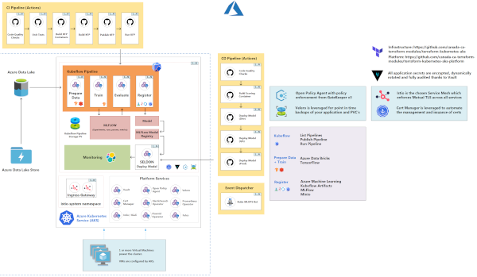

# Overview

## Integrate with Platforms like Databricks and AzureML

The AAW platform is built around the idea of integrations, and so we can
integrate with many _Platform as a Service_ (PaaS) offerings, such as
[Azure ML](https://azure.microsoft.com/en-us/services/machine-learning/) and
[Databricks](https://azure.microsoft.com/en-ca/services/databricks/).

See some examples on our
["MLOps" github Repo](https://github.com/statcan/kubeflow-mlops).

# Setup

If you need help integrating with a platform as a service offering, we're happy to help!
