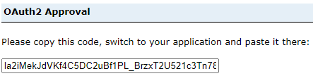

# Geospatial Analytical Environment (GAE) - Cross Platform Access

<!-- prettier-ignore -->
??? danger "Unprotected data only; SSI coming soon:"
	At this time, our Geospatial server can only host and provide access to non-sensitive statistical information.  
	
## Getting Started

<!-- prettier-ignore -->
??? success "Prerequisites"
	1. An onboarded project with access to DAS GAE ArcGIS Portal 	
	2. An ArcGIS Portal Client Id (API Key)

The ArcGIS Enterprise Portal can be accessed in either the AAW or CAE using the API, from any service which leverages the Python programming language. 

For example, in AAW and the use of [Jupyter Notebooks](https://statcan.github.io/daaas/en/1-Experiments/Jupyter/) within the space, or in CAE the use of [Databricks](https://statcan.github.io/cae-eac/en/DataBricks/), DataFactory, etc.

[The DAS GAE ArcGIS Enterprise Portal can be accessed directly here](https://geoanalytics.cloud.statcan.ca/portal)

[For help with self-registering as a DAS Geospatial Portal user](https://statcan.github.io/daaas-dads-geo/english/portal/)

<hr>

## Using the ArcGIS API for Python

### Connecting to ArcGIS Enterprise Portal using ArcGIS API

1. Install packages:

	```python
	conda install -c esri arcgis
	```

	or using Artifactory

	```python3333
	conda install -c https://jfrog.aaw.cloud.statcan.ca/artifactory/api/conda/esri-remote arcgis
	```

2. Import the necessary libraries that you will need in the Notebook.
	```python
	from arcgis.gis import GIS
	from arcgis.gis import Item
	```
	
3. Access the Portal
	Your project group will be provided with a Client ID upon onboarding. Paste the Client ID in between the quotations ```client_id='######'```. 
	
	```python
	gis = GIS("https://geoanalytics.cloud.statcan.ca/portal", client_id=' ')
	print("Successfully logged in as: " + gis.properties.user.username)
	```

4. - The output will redirect you to a login Portal.
	- Use the StatCan Azure Login option, and your Cloud ID 
	- After successful login, you will receive a code to sign in using SAML. 
	- Paste this code into the output. 


	

<hr>

### Display user information
Using the 'me' function, we can display various information about the user logged in.
```python
me = gis.users.me
username = me.username
description = me.description
display(me)
```

<hr>

### Search for Content
Search for the content you have hosted on the DAaaS Geo Portal. Using the 'me' function we can search for all of the hosted content on the account. There are multiple ways to search for content. Two different methods are outlined below.

**Search all of your hosted items in the DAaaS Geo Portal.**
```python
my_content = me.items()
my_content
```
**Search for specific content you own in the DAaaS Geo Portal.**

This is similar to the example above, however if you know the title of they layer you want to use, you can save it as a function.
```python
my_items = me.items()
for items in my_items:
    print(items.title, " | ", items.type)
    if items.title == "Flood in Sorel-Tracy":
        flood_item = items
        
    else:
        continue
print(flood_item)
```

**Search all content you have access to, not just your own.**

```python
flood_item = gis.content.search("tags: flood", item_type ="Feature Service")
flood_item
```

<hr>

### Get Content
We need to get the item from the DAaaS Geo Portal in order to use it in the Jupyter Notebook. This is done by providing the unique identification number of the item you want to use. Three examples are outlined below, all accessing the identical layer.
```python
item1 = gis.content.get(my_content[5].id) #from searching your content above
display(item1)

item2 = gis.content.get(flood_item.id) #from example above -searching for specific content
display(item2)

item3 = gis.content.get('edebfe03764b497f90cda5f0bfe727e2') #the actual content id number
display(item3)
```

<hr>

### Perform Analysis
Once the layers are brought into the Jupyter notebook, we are able to perform similar types of analysis you would expect to find in a GIS software such as ArcGIS. There are many modules containing many sub-modules of which can perform multiple types of analyses.
<br/>

Using the arcgis.features module, import the use_proximity submodule ```from arcgis.features import use_proximity```. This submodule allows us to `.create_buffers` - areas of equal distance from features. Here, we specify the layer we want to use, distance, units, and output name (you may also specify other characteristics such as field, ring type, end type, and others). By specifying an output name, after running the buffer command, a new layer will be automatically uploaded into the DAaaS GEO Portal containing the new feature you just created.
<br/>

```python
buffer_lyr = use_proximity.create_buffers(item1, distances=[1], 
                                          units = "Kilometers", 
                                          output_name='item1_buffer')

display(item1_buffer)
```

Some users prefer to work with Open-Source packages.  Translating from ArcGIS to Spatial Dataframes is simple.
```python
# create a Spatially Enabled DataFrame object
sdf = pd.DataFrame.spatial.from_layer(feature_layer)
```

<hr>

### Update Items
By getting the item as we did similar to the example above, we can use the '.update' function to update existing item within the DAaaS GEO Portal. We can update item properties, data, thumbnails, and metadata.
```python
item1_buffer = gis.content.get('c60c7e57bdb846dnbd7c8226c80414d2')
item1_buffer.update(item_properties={'title': 'Enter Title'
									 'tags': 'tag1, tag2, tag3, tag4',
                                     'description': 'Enter description of item'}
```

<hr>

### Visualize Your Data on an Interactive Map

**Example: MatplotLib Library**
In the code below, we create an ax object, which is a map style plot. We then plot our data ('Population Change') change column on the axes
```python
import matplotlib.pyplot as plt
ax = sdf.boundary.plot(figsize=(10, 5))
shape.plot(ax=ax, column='Population Change', legend=True)
plt.show()
```

**Example: ipyleaflet Library**
In this example we will use the library 'ipyleaflet' to create an interactive map. This map will be centred around Toronto, ON. The data being used will be outlined below.
Begin by pasting ```conda install -c conda-forge ipyleaflet``` allowing you to install ipyleaflet libraries in the Python environment.
<br/>
Import the necessary libraries.
```python
import ipyleaflet 
from ipyleaflet import *
```
Now that we have imported the ipyleaflet module, we can create a simple map by specifying the latitude and longitude of the location we want, zoom level, and basemap [(more basemaps)](https://ipyleaflet.readthedocs.io/en/latest/map_and_basemaps/basemaps.html). Extra controls have been added such as layers and scale.
```python
toronto_map = Map(center=[43.69, -79.35], zoom=11, basemap=basemaps.Esri.WorldStreetMap)

toronto_map.add_control(LayersControl(position='topright'))
toronto_map.add_control(ScaleControl(position='bottomleft'))
toronto_map
```
<br/>

##Learn More about the ArcGIS API for Python
[Full documentation for the ArcGIS API can be located here](https://developers.arcgis.com/python/)

##Learn More about DAS Geospatial Analytical Environment (GAE) and Services
[GAE Help Guide](https://statcan.github.io/daaas-dads-geo/)