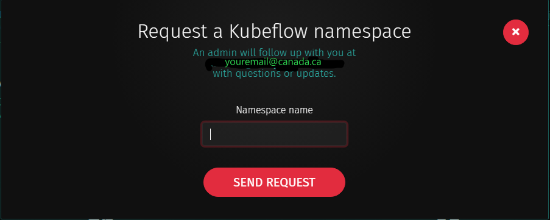

# Overview

By default, everyone gets their own personal namespace, `firstname-lastname`. If
you want to collaborate with your team, you can
[request a new namespace](Request-a-Namespace.md#requesting-a-namespace) to
[share](Overview.md#share-a-namespace-in-kubeflow).

# Setup

## Requesting a namespace

To create a namespace for a team, go to the AAW portal. **Click the &#8942; menu
on
[the Kubeflow section of the portal](https://analytics-platform.statcan.gc.ca/)**.

Enter the name you are requesting and submit the request. Be sure to use only
lower case letters plus dashes.

<!--prettier-ignore-->
!!! warning "The namespace cannot have special characters other than hyphens"
    The namespace name must only be lower-case letters `a-z` with dashes. Otherwise,
    the namespace will not be created.

**You will receive an email notification when the namespace is created.** Once
the shared namespace is created, you can access it the same as any other
namespace you have through the Kubeflow UI, like shown below. You will then be
able to [share and manage](Overview.md#share-compute-namespace-in-kubeflow) to
your namespace.

To switch namespaces, take a look at the top of your window, just to the right
of the Kubeflow Logo.

