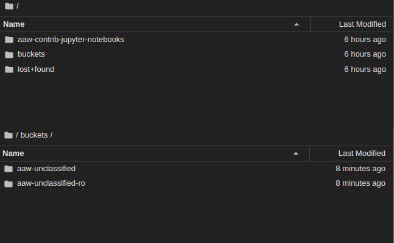

# Overview

[Azure Blob Storage](https://learn.microsoft.com/en-us/azure/storage/blobs/storage-blobs-introduction) is Microsoft's object storage solution for the cloud. Blob Storage is optimized for storing massive amounts of unstructured data. Unstructured data is data that doesn't adhere to a particular data model or definition, such as text or binary data.
Azure Blob Storage Containers are good at three things:

- Large amounts of data - Containers can be huge: way bigger than hard drives. And
  they are still fast.
- Accessible by multiple consumers at once - You can access the same data source
  from multiple Notebook Servers and pipelines at the same time without needing
  to duplicate the data.
- Sharing - Project namespaces can share a container. This is great for sharing data with people
  outside of your workspace.

# Setup

## Blob Container Mounted on a Notebook Server

<!-- prettier-ignore -->

The Blob CSI volumes are persisted under `/home/jovyan/buckets` when creating a Notebook Server. Files under `/buckets` are backed by Blob storage.

These folders can be used like any other - you can copy files to/from using the
file browser, write from Python/R, etc. The only difference is that the data is
being stored in the Blob storage container rather than on a local disk (and is thus
accessible wherever you can access your Kubeflow notebook).

<!-- prettier-ignore -->

## Container Types

The following Blob containers are available:

Accessing all Blob containers is the same. The difference between containers is the
storage type behind them:

- **aaw-unclassified:** By default,
  use this one. Stores unclassified data.

- **aaw-protected-b:** Stores sensitive data protected-b.

- **aaw-unclassified-ro:** This classification is protected-b but read-only access. This is so users can view unclassified
data within a protected-b pod.

Generally if you aren't sure which you need, start with **Standard**. You can
always change your mind if you see your work limited by file transfer speeds.

Within each bucket type, everyone has two storage locations they can use, each
providing different access scopes:

<!-- prettier-ignore -->

## Accessing Internal Data

AAW has an integration with the FAIR Data Infrastructure team that allows users
to transfer unclassified and protected-b data to Azure Storage Accounts, thus allowing users to
access this data from Notebook Servers.

Please reach out to the FAIR Data Infrastructure team if you have a use case for
this data.

## Pricing

<!-- prettier-ignore -->
??? info "Pricing models are based on CPU and Memory usage"
    Pricing is covered by KubeCost for user namespaces (In Kubeflow at the bottom of the Notebooks tab).

In general, Blob Storage is much cheaper than [Azure Manage Disks](https://azure.microsoft.com/en-us/pricing/details/managed-disks/)
and has better I/O than managed SSD.
