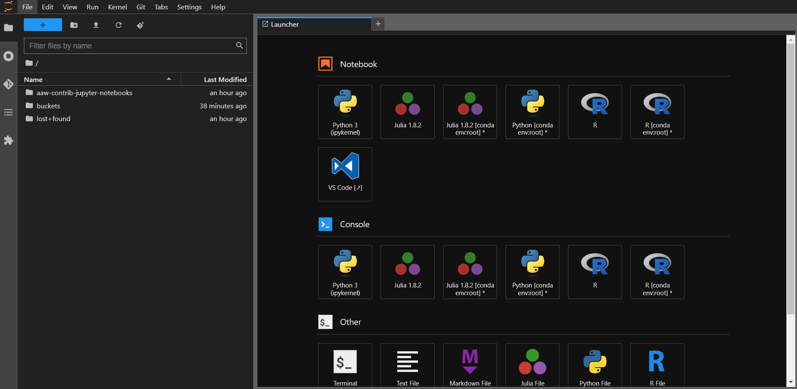
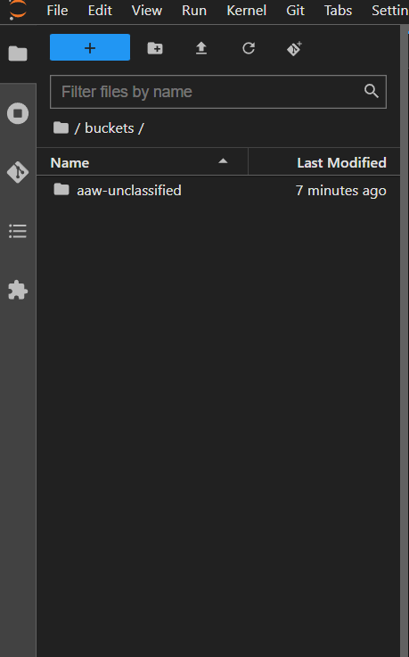
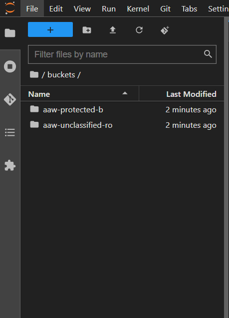

# Overview

[Azure Blob Storage](https://learn.microsoft.com/en-us/azure/storage/blobs/storage-blobs-introduction) is Microsoft's object storage solution for the cloud. Blob Storage is optimized for storing massive amounts of unstructured data. Unstructured data is data that doesn't adhere to a particular data model or definition, such as text or binary data.

Azure Blob Storage Containers are good at three things:

- Large amounts of data - Containers can be huge: way bigger than hard drives. And they are still fast.
- Accessible by multiple consumers at once - You can access the same data source from multiple Notebook Servers and pipelines at the same time without needing to duplicate the data.
- Sharing - Project namespaces can share a container. This is great for sharing data with people outside of your workspace.

# Setup

<!-- prettier-ignore -->
!!! warning "Azure Blob Storage containers and buckets mount will be replacing the Minio Buckets and Minio storage mounts"
    Users will be responsible for migrating data from Minio Buckets to the Azure Storage folders. For larger files, users may contact AAW for assistance.

## Blob Container Mounted on a Notebook Server

<!-- prettier-ignore -->

The Blob CSI volumes are persisted under `/home/jovyan/buckets` when creating a Notebook Server. Files under `/buckets` are backed by Blob storage. All AAW notebooks will have the `/buckets` mounted to the file-system, making data accessible from everywhere.



# Unclassified Notebook AAW folder mount


# Protected-b Notebook AAW folder mount


These folders can be used like any other - you can copy files to/from using the file browser, write from Python/R, etc. The only difference is that the data is being stored in the Blob storage container rather than on a local disk (and is thus accessible wherever you can access your Kubeflow notebook).

## How to Migrate from MinIO to Azure Blob Storage

```
#!/bin/sh
FULLNAME=<your-name-goes-here>

# Obtain credentials
source /vault/secrets/minio-standard-tenant-1

# Add storage under nickname "standard"
mc config host add standard $MINIO_URL $MINIO_ACCESS_KEY $MINIO_SECRET_KEY

# If you want to migrate your MinIO Bucket to Blob Storage.
# Move
mc mv --recursive <minio_path> <blob_path_on_local_system>
# Copy
mc cp --recursive <minio_path> <blob_path_on_local_system>
```

<!-- prettier-ignore -->

## Container Types

The following Blob containers are available:

Accessing all Blob containers is the same. The difference between containers is the storage type behind them:

- **aaw-unclassified:** By default, use this one. Stores unclassified data.

- **aaw-protected-b:** Stores sensitive protected-b data.

- **aaw-unclassified-ro:** This classification is protected-b but read-only access. This is so users can view unclassified data within a protected-b notebook.

<!-- prettier-ignore -->

## Accessing Internal Data

<!-- prettier-ignore -->
Accessing internal data uses the DAS common storage connection which has use for internal and external users that require access to unclassified or protected-b data. The following containers can be provisoned:

- **external-unclassified**
- **external-protected-b**
- **internal-unclassified**
- **internal-protected-b**

They follow the same convention as the AAW containers above in terms of data, however there is a layer of isolation between StatCan employees and non-StatCan employees. Non-Statcan employees are only allowed in **external** containers, while StatCan employees can have access to any container. 

AAW has an integration with the FAIR Data Infrastructure team that allows users to transfer unclassified and protected-b data to Azure Storage Accounts, thus allowing users to access this data from Notebook Servers.

Please reach out to the FAIR Data Infrastructure team if you have a use case for this data.

## Pricing

<!-- prettier-ignore -->
!!! info "Pricing models are based on CPU and Memory usage"
    Pricing is covered by KubeCost for user namespaces (In Kubeflow at the bottom of the Notebooks tab).

In general, Blob Storage is much cheaper than [Azure Manage Disks](https://azure.microsoft.com/en-us/pricing/details/managed-disks/) and has better I/O than managed SSD.
