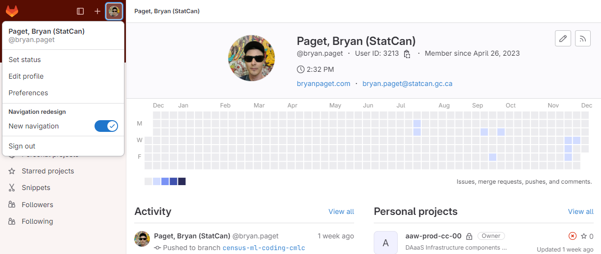
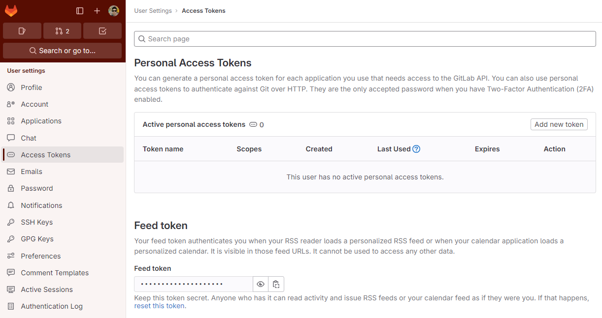
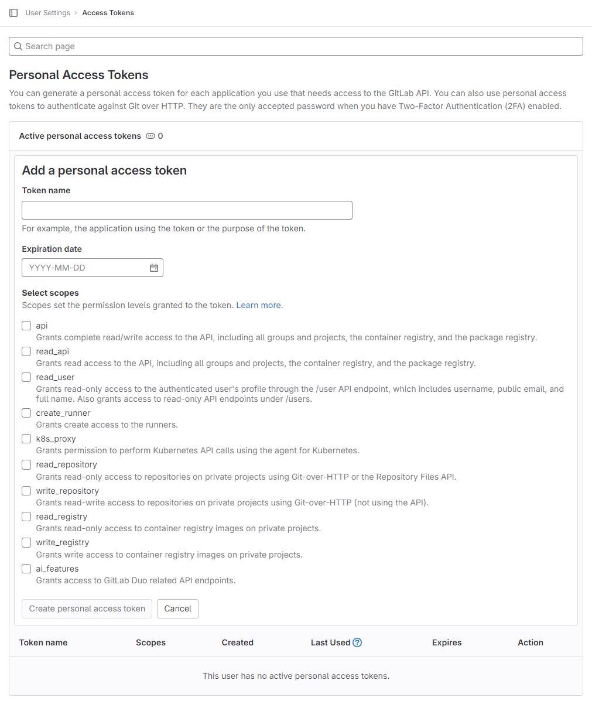
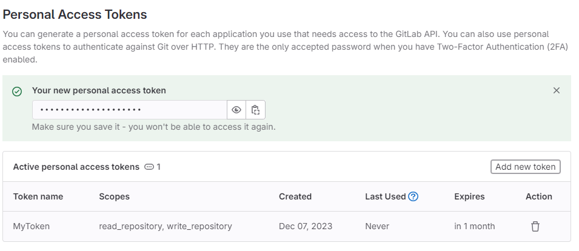
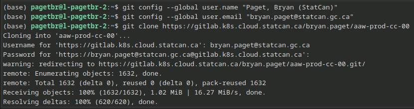

# GitLab Setup Guide

Welcome to GitLab! GitLab is a powerful platform that facilitates collaborative development using Git. Before diving into the world of repositories, let's ensure your Git configuration aligns with your GitLab identity. Below are instructions on personalizing `git` and creating a Personal Access Token (PAT) for seamless interaction with GitLab repositories.

## Personalizing Git

When using `git`, it's essential to set up your identity. Open a new terminal session and run the following commands to configure your name and email associated with GitLab:

### User Name

```bash
git config --global user.name "Your Name"
```

### Email

```bash
git config --global user.email "youremail@yourdomain.com"
```

Now, whenever you interact with GitLab, `git` will use this information to identify you.

## Create a Personal Access Token (PAT)

To interact (push, pull) with any Statistics Canada GitLab repository, you need to create a Personal Access Token. Follow these steps:

1. [Go to GitLab](https://gitlab.k8s.cloud.statcan.ca/).
2. Click your **Profile Icon** in the upper left corner.
3. Select **Preferences** and then **Access Tokens**.

### Profile Icon



### Access Tokens



### Personal Access Token Form



- Complete the form by providing a name for the token (for easy identification), setting the token expiration date, and granting permissions (e.g., `read_repository` and `write_repository`).
- The token expires on that date at midnight UTC.
- If you do not enter an expiry date, the expiry date is automatically set to 365 days later than the current date.
- By default, this date can be a maximum of 365 days later than the current date.

### The Token

<!-- prettier-ignore -->
!!! warning "Keep your secrets to yourself!"
    1. Please do NOT store your personal access token _anywhere_ in your workspace server file system. Contributors to a namespace will have access to them!
    2. If there is a contributor external to Statistics Canada in your namespace, you will lose access to cloud main GitLab access!



The generated token will be copy-able at the top after clicking **Create personal access token**. Copy and securely save this token as it won't be retrievable later.

## Supply the Generated Token as Your GitLab Password

Use the generated token as your GitLab password when prompted. Here's an example of how to incorporate the token into your commands:



We can use git-credential-cache to cache our username and password for a time period. Simply enter the following in your CLI (terminal or command prompt):

``` bash
git config --global credential.helper cache
```

You can also set the timeout period (in seconds) as such:

``` bash
git config --global credential.helper 'cache --timeout=3600'

```

For more information on Gitlab Personal Access Tokens, please visit: [the official documentation](https://docs.gitlab.com/ee/user/profile/personal_access_tokens.html). With these steps, you're now set to collaborate seamlessly on GitLab! Happy coding!
