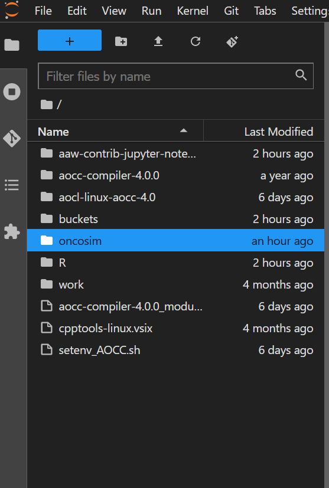
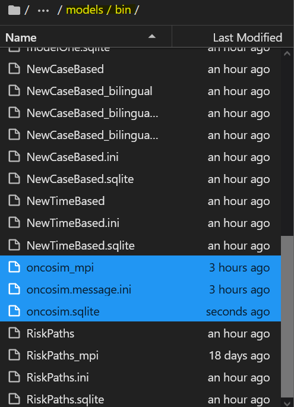
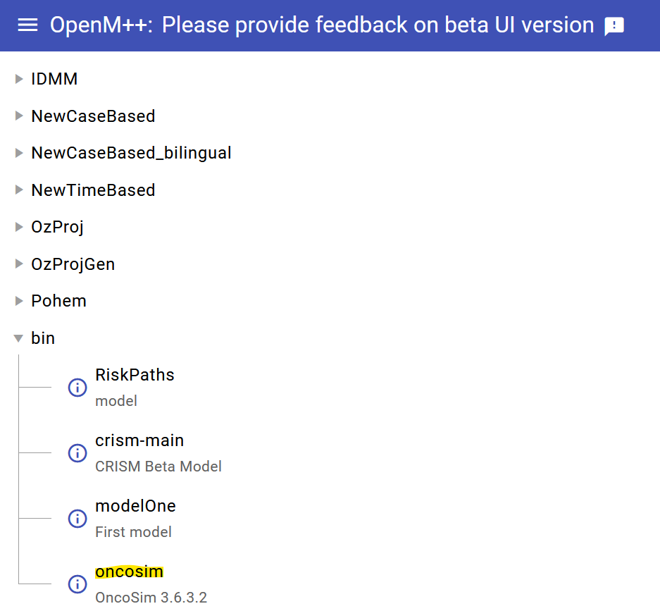

## Adding a New Model

**Note**: use a notebook with at least 6Gb of memory for this full guide. 

First clone the model's repository or download and extract the archived model on your AAW notebook. In our example, we clone oncosim from [gitlab](../6-Gitlab/Gitlab.md):

### Compiling the model

In this case, we are compiling for mpi, so we retrieved the appropriate OMPP release from the [openmpp releases page](https://github.com/openmpp/main/releases). Make sure to use the archived releases provided by openM and not auto-generated by Github. 

We can follow the readme of the model. In this case, we set our `OM_ROOT` environment variable to the same directory as our OMPP release using `export OM_ROOT=~/buckets/aaw-unclassified/microsim/openmpp_ubuntu_mpi_20231115`.

We can now compile. We make sure that we're in the oncosim directory then run `make OM_MSG_USE=MPI RELEASE=1 all publish`. 

Once compilation is complete, our compiled model files appear under `<path-to-model>/ompp-linux/bin/`. Using the terminal, `cp` the files in the `bin` directory to `~/buckets/aaw-unclassified/microsim/models/bin`.

Once complete, run `restart-oms.sh` in the terminal. This will restart the OpenM web service and allow it to pick up the new model.

