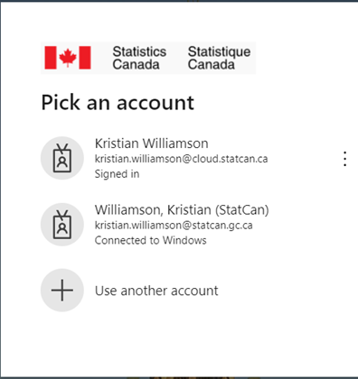
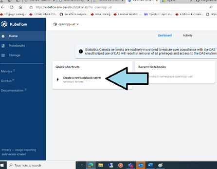
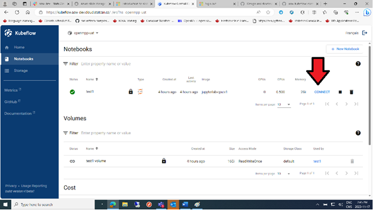
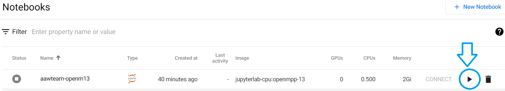
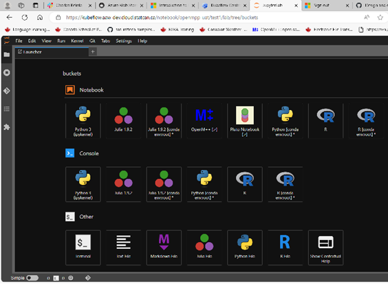
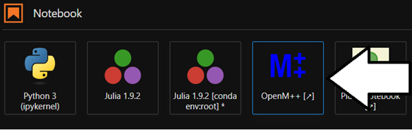
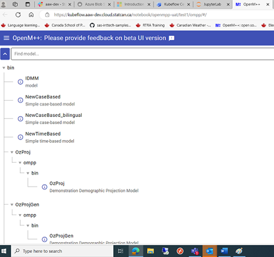
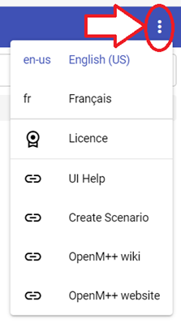
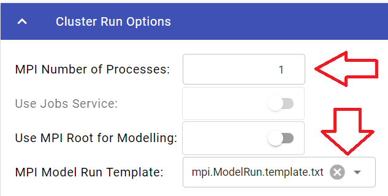

# Getting started with Kubeflow and OpenM++.

This document is intended to act as an introduction to The AAW's Kubeflow Notebook servers and their use for the OpenM++ project.

## Starting

To access the AAW Kubeflow portal, navigate to the following website.

[https://kubeflow.aaw-dev.cloud.statcan.ca/](https://kubeflow.aaw-dev.cloud.statcan.ca/) 

This will redirect you to a Microsoft log-in page.

Select the account you wish to use and proceed with the authentication.

After your credentials are authenticated, you will be redirected to the AAW Kubeflow management panel. 

## Create a notebook.

Click on the Create a New Notebook server button.

This brings up the new Notebook screen.

To create a new Notebook, three things must be set:
- Ensure the correct Namespace is selected.
- A unique name.
- Then click on the Notebook type you want.
  - For OpenM++, select the JupyterLab option.
- If you are working with Protected B Data, select the **Run in Protected B notebook** checkbox

Scroll down to see the **Launch Button.**  The Launch button will only be active after the above options are selected.
 

Press the Launch button to launch you new Notebook.

[For more information about Statcan AAW Kubeflow, Click here.](https://statcan.github.io/aaw/en/1-Experiments/Kubeflow/)

### Existing Notebooks

If you have previously created a notebook, you can reuse it by clicking on the Notebooks Tab.

This will bring up a window with all your existing Notebooks.  

To start an existing Notebook, select it and press the CONNECT button.

If the **Connect button** is disabled, click on the triangle (Start image) button to start the image, and then click on **connect** when it becomes avaliable .

## Your Kubeflow notebook.

To start the OpenM++ UI, click on the OpenM++ icon on the Notebooks page.

This will open a new window with the OpenM++ UI running.

## OpenM++ UI

Click on the Ellipses symbol on the upper Left corner to change language.

Click on the Hamburger Menu on the top right to open the sidebar.

Store Models and Data in the Notebook's mounted Blob storage bucket.

unclassified: `/home/jovyan/buckets/aaw-unclassified/microsim/models`
protected-b: `/home/jovyan/buckets/protected-b/microsim/models`

The log files should appear under the `Microsim` parent directory.

Please see the following link for more information on this topic:

[Azure Blob storage](https://statcan.github.io/aaw/en/5-Storage/AzureBlobStorage/)

Click on the Model you want (Left Panel) to select it.  

This brings up the Model Run Panel and activates the Input Scenarios and Run the Model tabs on the Right Panel.

The horizontal tabs are also active (but greyed out) at this time.

To Run a Model, first the Model name must be entered.  Clicking in the Model Name box will generate a uniquely timestamped Model name for the run.

To run models using multi-processing (MPI), the following must be done.  This will only work for MPI enabled models.

In the **Cluster Run Options** tab, ensure that:
- at least one Process is selected in the **MPI Number of Processes** and
- the templated selected in the **MPI Model Run Template** is: **mpi.ModelRun.template.txt**

You can then click the **Run the Model** to run the job.

This will run the Model and brings up the Model Run Results Panel which shows the results of the run.

