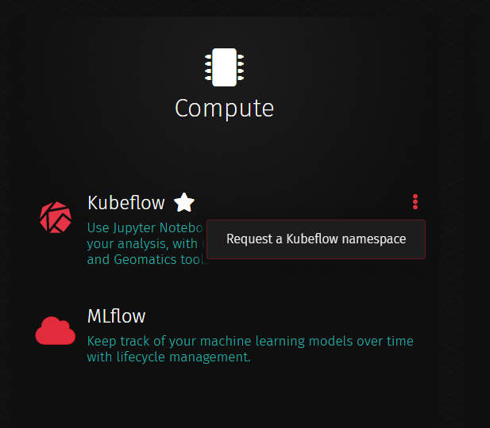
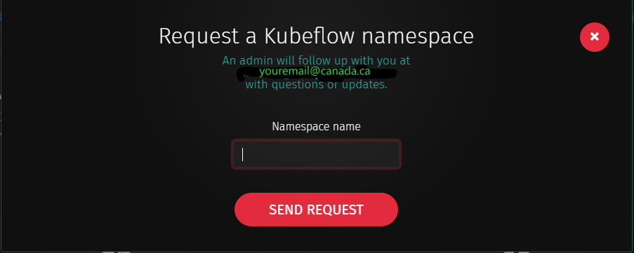

# Overview

By default, everyone gets their own personal namespace, `firstname-lastname`. If you want to collaborate with your team, you can request a shared namespace.  

# Setup
## Requesting a namespace

To create a namespace for a team, go to the AAW portal. **Click the &#8942; menu on
[the Kubeflow section of the portal](https://portal.covid.cloud.statcan.ca/#kubeflow)**.

Enter the name you are requesting and submit the request. Be sure to use only lower case letters plus dashes. 

<!-- prettier-ignore -->
!!! warning "The namespace cannot have special characters other than hyphens"
    The namespace name must only be lowercase letters `a-z` with dashes. Otherwise,
    the namespace will not be created.

**You will receive an email notification when the namespace is created.** Once
the shared namespace is created, you can access it the same as any other
namespace you have through the Kubeflow UI, like shown below. You will then be
able to manage the collaborators list through Kubeflow's **Manage Contributors**
tab, where you can add your colleagues to the shared namespace.

To switch namespaces, take a look at the top of your window, just to the right
of the Kubeflow Logo.

# Once you've got the basics ...

Once you have a shared namespace, you have two shared storage approaches

| Storage Option                               | Benefits                                                         |
| :------------------------------------------- | :--------------------------------------------------------------- |
| Shared Jupyter Servers/Workspaces            | More amenable to small files, notebooks, and little experiments. |
| Shared Buckets (see [Storage](./Storage.md)) | Better suited for use in pipelines, APIs, and for large files.   |

To learn more about the technology behind these, check out the
[Storage section](./Storage.md).

## Sharing with StatCan

In addition to private buckets, or team-shared private buckets, you can also
place your files in _shared storage_. Within all bucket storage options
(`minimal`, `premium`, `pachyderm`), you have a private bucket, **and** a folder
inside of the `shared` bucket. Take a look, for instance, at the link below:

- [`shared/blair-drummond/`](https://minimal-tenant1-minio.covid.cloud.statcan.ca/minio/shared/blair-drummond/)

Any **logged in** user can see these files and read them freely.

## Sharing with the world

Ask about that one in our [Slack channel](https://statcan-aaw.slack.com). There
are many ways to do this from the IT side, but it's important for it to go
through proper processes, so this is not done in a "self-serve" way that the
others are. That said, it is totally possible.
