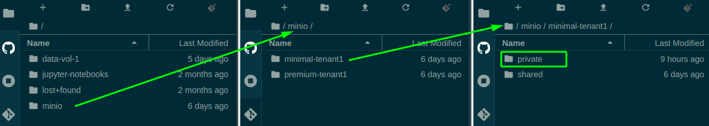

# Overview
MinIO is a cloud-native scalable object store. We use MinIO for buckets (blob or S3 storage). Buckets are good at three things:

- Large amounts of data - Buckets can be huge: way bigger than hard drives. And they are still fast.
- Accessible by multiple consumers at once - You can access the same data source from multiple Notebook Servers and pipelines at the same time without needing to duplicate the data.
- Sharing - You can share files from a bucket by sharing a URL that you can get through a simple web interface. This is great for sharing data with people outside of your workspace.

# Setup
## MinIO Mounted Folders on a Notebook Server
All Notebook Servers have your MinIO storage mounted as directories by default. The MinIO storage is located in `~/minio`:



These folders can be used like any other - you can copy files to/from using the file browser, write from Python/R, etc. The only difference is that the data is
being stored in the MinIO service rather than on a local disk (and is thus accessible wherever you can access your MinIO bucket, rather than just from the
Notebook Server it is attached).

<!-- prettier-ignore -->
??? warning "Files copied into a mounted MinIO folder might take a few moments to be readable"
    When you copy files into a MinIO folder, they are immediately stored and accessible in MinIO (e.g.: you can immediately see them in the [Web Portal](#minio-web-portal)).  But, new files may take a few moments for the mounting service to notice and serve them in the mounted folder.  If your use case needs access to these files immediately after copying them, try the other read methods ([the mc tool](#minio-command-line-tool) or [Other S3 Compliant Methods](#other-s3-compliant-methods)).

# Once you've got the basics ...
## MinIO Web Portal

The MinIO service can be accessible through a
[web portal](https://minio-standard-tenant-1.covid.cloud.statcan.ca/). To sign
in using your existing credentials, use the "Log in with OpenID" button.


From this portal you can browse to your personal bucket, which has the same name
as your Kubeflow namespace (likely `firstname-lastname`):


This lets you browse, upload/download, delete, or share files.

## MinIO Command Line Tool

MinIO provides the command line tool `mc` to access your data from a terminal.
`mc` can communicate with one or more MinIO instances to let you upload/download
files. For example:

<!-- prettier-ignore -->
??? info "To run the below example yourself, replace `BUCKETNAME`'s value with your first/last name."
    For example: `BUCKETNAME=john-smith`.

```sh
#!/bin/sh

# The name of your bucket.  This MUST be the same as your namespace's name.
# Typically this is "firstname-lastname", but it might be different if working in a shared namespace
BUCKETNAME=firstname-lastname

# Get your personal credentials for the "minio-standard-tenant-1" MinIO instance
# (this initializes $MINIO_URL, $MINIO_ACCESS_KEY, and $MINIO_SECRET_KEY environment variables)
source /vault/secrets/minio-standard-tenant-1

# Create a MinIO alias (called "standard") for "standard" using your credentials
mc config host add standard $MINIO_URL $MINIO_ACCESS_KEY $MINIO_SECRET_KEY

# Create a bucket under your name
# NOTE: You can *only* create buckets named the same as your namespace. Any
# other name will be rejected.

# Private bucket ("mb" = "make bucket")
mc mb -p standard/${BUCKETNAME}

# Shared bucket
mc mb -p standard/shared/${BUCKETNAME}

# There you go! Now you can copy over files or folders!
# Create test.txt (if it does not exist) and copy it to your bucket:
[ -f test.txt ] || echo "This is a test" > test.txt
mc cp test.txt standard/${BUCKETNAME}/test.txt
```

Now open the [MinIO Web Portal](#minio-web-portal) or browse to
`~/minio/standard-tenant-1/private` to see your test file!

<!-- prettier-ignore -->
??? tip "`mc` can do a lot"
    In addition to copying files, `mc` can do a lot more (like `mc ls standard/FIRSTNAME-LASTNAME` to list the contents of a bucket).  Check out the [mc docs](https://docs.min.io/docs/minio-client-complete-guide.html) or run `mc --help` for more information.

<!-- prettier-ignore -->
??? tip "See the example notebooks!"
    There is a template provided for connecting in `R`, `python`, or by the
    command line, provided in [jupyter-notebooks/self-serve-storage](https://github.com/StatCan/jupyter-notebooks/tree/master/self-serve-storage) (also auto-mounted to all jupyter notebook servers in `~/jupyter-notebook`). You can
    copy-paste and edit these examples! They should suit most of your needs.

## MinIO Python client

You can also connect to MinIO using a python client such as `minio` or `boto3`.

```python
import json, minio, re

# Get rid of http:// in minio URL
http = lambda url: re.sub('^https?://', '', url)

# Get the MinIO creds
with open("/vault/secrets/minio-standard-tenant-1.json") as secrets:
    d = json.load(f)

# Create the minio client.
s3Client = Minio(
    http(d['MINIO_URL']),
    access_key=d['MINIO_ACCESS_KEY'],
    secret_key=d['MINIO_SECRET_KEY'],
    secure=False,
    region="us-west-1"
)
```

<!-- prettier-ignore -->
!!! tip "But I want to be secure"
    The `secure=False` thing is a bit misleading. It disables `https`
    because this traffic is **inside** the cluster, and the cluster
    auto-magically applies mutual TLS. So your applications don't need
    to worry about https. **Your connection is secure by default.**

<!-- prettier-ignore -->
!!! question "But I'm not in us-west?"
    The "us-west-1" is an artifact of weird S3 API standards. It is
    **required**, even if it doesn't make sense.

## Other S3-Compliant Methods

MinIO is S3 compliant - it uses the same standard as Amazon S3 and other bucket
services. Tools designed to use S3 will generally also work with MinIO, for
example Python packages and instructions on how to access files from S3. Some
examples of this are shown in
[jupyter-notebooks/self-serve-storage](https://github.com/StatCan/jupyter-notebooks/tree/master/self-serve-storage).

## Bucket Types and Access Scopes

The following MinIO tenants (e.g.: separate services) are available:

|                             Tenant | Speed   | Cost    | Access via File Browser      | Access via `mc`                        | Access via Web Portal                                           |
| ---------------------------------: | ------- | ------- | ---------------------------- | -------------------------------------- | --------------------------------------------------------------- |
|                  standard-tenant-1 | Average | Low     | `~/minio/standard-tenant-1`  | `mc ls standard-tenant-1/$NB_NOTEBOOK` | [link](https://minio-standard-tenant-1.covid.cloud.statcan.ca/) |
|                   premium-tenant-1 | Fast    | Average | `~/minio/premium-tenant-1`   | `mc ls premium-tenant-1/$NB_NOTEBOOK`  | [link](https://minio-premium-tenant-1.covid.cloud.statcan.ca/)  |
| minimal-tenant1 **See note below** | Average | Low     | Unavailable (see note below) | `mc ls minimal-tenant1/$NB_NOTEBOOK`   | [link](https://minimal-tenant1-minio.covid.cloud.statcan.ca/)   |
| premium-tenant1 **See note below** | Fast    | Average | Unavailable (see note below) | `mc ls premium-tenant1/$NB_NOTEBOOK`   | [link](https://premium-tenant1-minio.covid.cloud.statcan.ca/)   |

<!-- prettier-ignore -->
!!! danger "`minimal-tenant1` and `premium-tenant1` are being decommissioned" 
    To improve security and stability, `minimal-tenant1` and `premium-tenant1` have been replaced by `standard-tenant-1` and `premium-tenant-1`. `minimal-tenant1` and `premium-tenant1` will for a limited time still be accessible via `mc` and Web Portal, but will not be accessible via File Browser (due to this causing stability issues for Notebook Servers). It is recommended that you migrate your workloads to the new tenants as soon as possible. A forced migration will occur in future.

<!-- prettier-ignore -->
??? note "Note: $NB_NOTEBOOK is an environment variable that contains your namespace"
    You could also just type `mc ls standard-tenant-1/john-smith`, etc.

Accessing all MinIO tenants is the same. The difference between tenants is the
storage type behind them:

- **[Standard](https://minio-standard-tenant-1.covid.cloud.statcan.ca):** By
  default, use this one. It is backed by an SSD and provides a good balance of
  cost and performance.
- **[Premium](https://minio-premium-tenant-1.covid.cloud.statcan.ca/):** Use
  this if you need high read/write speeds and don't mind paying ~2x the storage
  cost. These are somewhat faster than the standard storage.

Generally if you aren't sure which you need, start with **Standard**. You can
always change your mind if you see your work limited by file transfer speeds.

Within each bucket type, everyone has two storage locations they can use, each
providing different access scopes:

|                                        |                                                                                                     Private                                                                                                      |                                                        Shared                                                        |
| -------------------------------------: | :--------------------------------------------------------------------------------------------------------------------------------------------------------------------------------------------------------------: | :------------------------------------------------------------------------------------------------------------------: |
|                                Summary | Accessible only by someone within your namespace (typically only by you from your own notebook servers/remote desktop, unless you're working in a [shared namespace](./Collaboration.md#requesting-a-namespace)) | Writable only by you, but readable by anyone with access to the platform. Great for sharing public data across teams |
| Mount location in the Notebook Server: |                                                                               `~/minio/standard-tenant-1/private/myfolder/myfile`                                                                                |                                  `~/minio/standard-tenant-1/shared/myfolder/myfile`                                  |
|    Location in `mc` tool/MinIO portal: |                                                                                       `firstname-lastname/myfolder/myfile`                                                                                       |                                     `shared/firstname-lastname/myfolder/myfile`                                      |

<!-- prettier-ignore -->
??? info "You can see many directories in the shared MinIO bucket, but you can only write to your own"
    Everyone has read access to all folders in the `shared` MinIO bucket, but write permissions are always restricted to the owner.

## Sharing from Private Buckets

You can easily share individual files from a private bucket. Just use the
"share" option for a specific file and you will be provided a link that you can
send to a collaborator!


## Get MinIO Credentials

<!-- prettier-ignore -->
!!! note "The following methods still work, but you often don't need this anymore because of automation!" 
    If you're accessing MinIO from on a Notebook Server or in a Kubeflow Pipeline, these credentials will automatically be loaded into the `mc` command line tool for you. You can use the `mc` tool without accessing credentials like shown below (e.g.: just type `mc ls standard-tenant-1/MY_NAMESPACE/`). If you do need credentials, you can still get them from `/vault/secrets/minio-*`

To access your MinIO buckets programmatically (for example through the
[`mc` command line tool](#MinIO-Command-Line-Tool), or via Python or R) you
require personal MinIO credentials. Methods for obtaining these credentials are
outlined here.

### Method 1: Get Credentials from Vault

To get your MinIO credentials, you can use the
[Vault](https://vault.covid.cloud.statcan.ca/ui/vault/auth?with=oidc). Select
method OIDC, leave **Role** blank and Sign in with OIDC Provider.


Run the following command in the terminal located at the top right corner:

```sh
# Replace standard with premium depending on your Bucket type
read minio_standard_tenant_1/keys/profile-yourfirstname-yourlastname
```


### Method 2: Get Credentials from Running Notebook Server

Open a terminal in your Notebook and run:

```sh
cat /vault/secrets/minio-standard-tenant-1

# Output:
# export MINIO_URL="http://minio.minio-standard-tenant-1 ..."
# export MINIO_ACCESS_KEY="..."
# export MINIO_SECRET_KEY="..."
```

## Pricing

<!-- prettier-ignore -->
??? info "Pricing models are tentative and may change"
    As of writing, pricing is covered by the platform for initial users.  This guidance explains how things are expected to be priced priced in future, but this may change.

Exact pricing for MinIO resources are hard to state because they're prorated
across multiple users. In general though, the underlying storage is provided by
[Azure Manage Disks](https://azure.microsoft.com/en-us/pricing/details/managed-disks/)
and they give a rough guide for MinIO storage cost based on the MinIO instance:

- premium-tenant-1:
  - See **Premium SSD Managed Disks**
- standard-tenant-1:
  - See **Standard SSD Managed Disks**
  - Typically 50% the cost of `premium-tenant-1`
