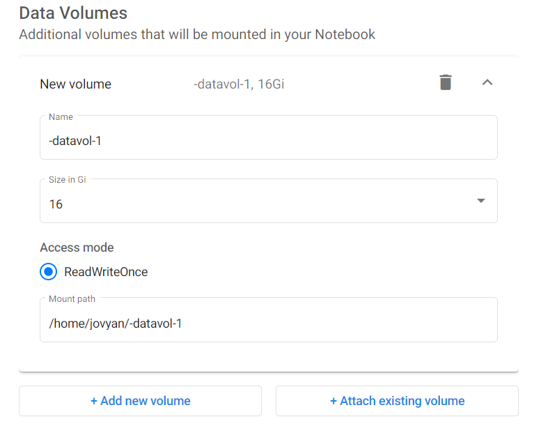
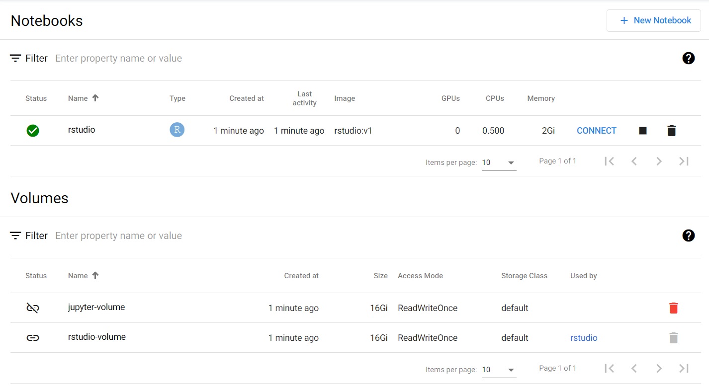

# Overview

The platform provides several main types of storage:

- Disk (also called Volumes on the Notebook Server creation screen)
- Bucket ("Blob" or S3 storage, provided through MinIO)
- Data Lakes (coming soon)

Depending on your use case, either may be most suitable:

|   Type |                                                       Simultaneous Users |                                                   Speed | Total size               | Sharable with Other Users            |
| -----: | -----------------------------------------------------------------------: | ------------------------------------------------------: | ------------------------ | ------------------------------------ |
|   Disk |                                    One machine/notebook server at a time |                        Fastest (throughput and latency) | <=512GB total per drive  | No                                   |
| Bucket | Simultaneous access from many machines/notebook servers at the same time | Fast-ish (Fast download, modest upload, modest latency) | Infinite (within reason) | [Yes](#sharing-from-private-buckets) |

<!-- prettier-ignore -->
??? info "If you're unsure which to choose, don't sweat it"
    These are guidelines, not an exact science - pick what sounds best now and run with it.  The best choice for a complicated usage is non-obvious and often takes hands-on experience, so just trying something will help.  For most situations both options work well even if they're not perfect, and remember that data can always be copied later if you change your mind.

# Disks

## Overview

Disks are the familiar hard drive style file systems you're used to, provided to
you from fast solid state drives (SSDs)! When creating your notebook server, you
request them by adding Data Volumes to your notebook server (pictured below,
with `Type = New`). They are automatically mounted at the directory
(`Mount Point`) you choose, and serve as a simple and reliable way to preserve
data attached to a Notebook Server.



When you delete your Notebook Server, your disks **are not deleted**. This let's
you reuse that same disk (with all its contents) on a new Notebook Server later
(as shown above with `Type = Existing` and the `Name` set to the volume you want
to reuse). If you're done with the disk and it's contents,
[delete it](#deleting-disk-storage).

<!-- prettier-ignore -->
??? warning "You pay for all disks you own, whether they're attached to a Notebook Server or not"
    As soon as you create a disk, you're [paying](#pricing) for it until it is [deleted](#deleting-disk-storage), even if it's original Notebook Server is deleted.  See [Deleting Disk Storage](#deleting-disk-storage) for more info

## Pricing

<!-- prettier-ignore -->
??? info "Pricing models are tentative and may change"
    As of writing, pricing is covered by the platform for initial users.  This guidance explains how things are expected to be priced priced in future, but this may change.

When mounting a disk, you get an
[Azure Managed Disk](https://azure.microsoft.com/en-us/pricing/details/managed-disks/).
The **Premium SSD Managed Disks** pricing shows the cost per disk based on size.
Note that you pay for the size of disk requested, not the amount of space you
are currently using.

<!-- prettier-ignore -->
??? info "Tips to minimize costs"
    As disks can be attached to a Notebook Server and reused, a typical usage pattern could be:

    * At 9AM, create a Notebook Server (request 2CPU/8GB RAM and a 32GB attached
      disk)
    * Do work throughout the day, saving results to the attached disk
    * At 5PM, shut down your Notebook Server to avoid paying for it overnight
      * NOTE: The attached disk **is not destroyed** by this action
    * At 9AM the next day, create a new Notebook Server and **attach your existing
      disk**
    * Continue your work...

    This keeps all your work safe without paying for the computer when you're not using it

## Deleting Disk Storage

To see your disks, check the Notebook Volumes section of the Notebook Server
page (shown below). You can delete any unattached disk (orange icon on the left)
by clicking the trash can icon.



# Buckets (via MinIO)

Buckets are slightly more complicated, but they are good at three things:

- **Large amounts of data**  
  Buckets can be huge: way bigger than hard drives. And they are still fast.
- **Accessible by multiple consumers at once** You can access the same data
  source from multiple Notebook Servers and pipelines at the same time without
  needing to duplicate the data
- **Sharing**  
  You can share files from a bucket by sharing a URL that you can get through a
  simple web interface. This is great for sharing data with people outside of
  your workspace.

## Accessing your Bucket

There are multiple ways to upload and download data from your MinIO buckets:

- [Mounted folders](#minio-mounted-folders-on-a-notebook-server) on a Notebook
  Server
- [MinIO web portal](#minio-web-portal)
- [MinIO command line tool](#minio-command-line-tool) `mc`
- [Other S3-Compliant Methods](#other-s3-compliant-methods)

<!-- prettier-ignore -->
??? info "Different access methods have strengths and weaknesses, but the data all goes to the same place"
    You can:

    - Upload a file using the mounted folder on a notebook server
    - Rename that file using the web portal
    - Download that file using the `mc` tool

    and all steps will be working on **the same file**. This lets you mix and match
    based on what is easiest for your tasks.

<!-- prettier-ignore -->
??? info "There are two different MinIO services"
    The examples below use the `minimal-tenant1` instance of MinIO, but there is also a second instance: `premium-tenant1`.  See [Bucket Types and Access Scopes](#bucket-types-and-access-scopes) for more details.  To use `premium-tenant1` in these examples, just substitute that name in for `minimal-tenant1`.

### MinIO Mounted Folders on a Notebook Server

Automatically, all Notebook Servers have your MinIO storage mounted as
directories. This is located in `~/minio`:


These folders can be used like any other - you can copy files to/from using the
file browser, write from Python/R, etc. The only difference is that the data is
being stored in the MinIO service rather than on a local disk (and is thus
accessible wherever you can access your MinIO bucket, rather than just from the
Notebook Server it is attached to like a [Disk](#disks)).

<!-- prettier-ignore -->
??? warning "Files copied into a mounted MinIO folder might take a few moments to be readable"
    When you copy files into a MinIO folder, they are immediately stored and accessible in MinIO (e.g.: you can immediately see them in the [Web Portal](#minio-web-portal)).  But, new files may take a few moments for the mounting service to notice and serve them in the mounted folder.  If your use case needs access to these files immediately after copying them, try the other read methods ([the mc tool](#minio-command-line-tool) or [Other S3 Compliant Methods](#other-s3-compliant-methods)).

### MinIO Web Portal

The MinIO service can be accessible through a
[web portal](https://minimal-tenant1-minio.covid.cloud.statcan.ca/). To sign in
using your existing credentials, use the "Log in with OpenID" button.


From this portal you can browse to your personal bucket, which has the same name
as your Kubeflow namespace (likely `firstname-lastname`):


This lets you browse, upload/download, delete, or share files.

### MinIO Command Line Tool

MinIO provides the command line tool `mc` to access your data from a terminal.
`mc` can communicate with one or more MinIO instances to let you upload/download
files. For example:

<!-- prettier-ignore -->
??? info "To run the below example yourself, replace `BUCKETNAME`'s value with your first/last name."
    For example: `BUCKETNAME=john-smith`.

```sh
#!/bin/sh

# The name of your bucket.  This MUST be the same as your namespace's name.
# Typically this is "firstname-lastname", but it might be different if working in a shared namespace
BUCKETNAME=firstname-lastname

# Get your personal credentials for the "minimal-tenant1" MinIO instance
# (this initializes $MINIO_URL, $MINIO_ACCESS_KEY, and $MINIO_SECRET_KEY environment variables)
source /vault/secrets/minio-minimal-tenant1

# Create a MinIO alias (called "minimal") for "minimal-tenant1" using your credentials
mc config host add minimal $MINIO_URL $MINIO_ACCESS_KEY $MINIO_SECRET_KEY

# Create a bucket under your name
# NOTE: You can *only* create buckets named the same as your namespace. Any
# other name will be rejected.

# Private bucket ("mb" = "make bucket")
mc mb -p minimal/${BUCKETNAME}

# Shared bucket
mc mb -p minimal/shared/${BUCKETNAME}

# There you go! Now you can copy over files or folders!
# Create test.txt (if it does not exist) and copy it to your bucket:
[ -f test.txt ] || echo "This is a test" > test.txt
mc cp test.txt minimal/${BUCKETNAME}/test.txt
```

Now open the [MinIO Web Portal](#minio-web-portal) or browse to
`~/minio/minimal-tenant1/private` to see your test file!

<!-- prettier-ignore -->
??? tip "`mc` can do a lot" 
    In addition to copying files, `mc` can do a lot more (like `mc ls minio-minimal/FIRSTNAME-LASTNAME` to list the contents of a bucket).  Check out the [mc docs](https://docs.min.io/docs/minio-client-complete-guide.html) or run `mc --help` for more information.

<!-- prettier-ignore -->
??? tip "See the example notebooks!"
    There is a template provided for connecting in `R`, `python`, or by the
    command line, provided in [jupyter-notebooks/self-serve-storage](https://github.com/StatCan/jupyter-notebooks/tree/master/self-serve-storage) (also auto-mounted to all jupyter notebook servers in `~/jupyter-notebook`). You can
    copy-paste and edit these examples! They should suit most of your needs.

### Other S3-Compliant Methods

MinIO is S3 compliant - it uses the same standard as Amazon S3 and other bucket
services. Tools designed to use S3 will generally also work with MinIO, for
example Python packages and instructions on how to access files from S3. Some
examples of this are shown in
[jupyter-notebooks/self-serve-storage](https://github.com/StatCan/jupyter-notebooks/tree/master/self-serve-storage).

## Bucket Types and Access Scopes

Two types of buckets are available:

- **[Minimal](https://minimal-tenant1-minio.covid.cloud.statcan.ca):**  
  By default, use this one. It is backed by an SSD and provides a good balance
  of cost and performance.
- **[Premium](https://premium-tenant1-minio.covid.cloud.statcan.ca):**  
  Use this if you need high read/write speeds and don't mind paying ~2x the
  storage cost. These are somewhat faster than the minimal storage.

Generally if you aren't sure which you need, start with **Minimal**. You can
always change your mind if you see your work limited by file transfer speeds.

Within each bucket type, everyone has two storage locations they can use, each
providing different access scopes:

|                                        |                                                                                                     Private                                                                                                      |                                                        Shared                                                        |
| -------------------------------------: | :--------------------------------------------------------------------------------------------------------------------------------------------------------------------------------------------------------------: | :------------------------------------------------------------------------------------------------------------------: |
|                                Summary | Accessible only by someone within your namespace (typically only by you from your own notebook servers/remote desktop, unless you're working in a [shared namespace](./Collaboration.md#requesting-a-namespace)) | Writable only by you, but readable by anyone with access to the platform. Great for sharing public data across teams |
| Mount location in the Notebook Server: |                                                                                `~/minio/minimal-tenant1/private/myfolder/myfile`                                                                                 |                                   `~/minio/minimal-tenant1/shared/myfolder/myfile`                                   |
|    Location in `mc` tool/MinIO portal: |                                                                                       `firstname-lastname/myfolder/myfile`                                                                                       |                                     `shared/firstname-lastname/myfolder/myfile`                                      |

<!-- prettier-ignore -->
??? info "You can see many directories in the shared MinIO bucket, but you can only write to your own"
    Everyone has read access to all folders in the `shared` MinIO bucket, but write permissions are always restricted to the owner.

## Sharing from Private Buckets

You can easily share individual files from a private bucket. Just use the
"share" option for a specific file and you will be provided a link that you can
send to a collaborator!


## Get MinIO Credentials

To access your MinIO buckets programmatically (for example through the
[`mc` command line tool](#MinIO-Command-Line-Tool), or via Python or R) you
require personal MinIO credentials. Methods for obtaining these credentials are
outlined here.

### Method 1: Get Credentials from Vault

To get your MinIO credentials, you can use the
[Vault](https://vault.covid.cloud.statcan.ca/ui/vault/auth?with=oidc). Select
method OIDC, leave **Role** blank and Sign in with OIDC Provider.


Run the following command in the terminal located at the top right corner:

```sh
# Replace minimal with premium depending on your Bucket type
read minio_minimal_tenant1/keys/profile-yourfirstname-yourlastname
```

<!-- prettier-ignore -->
!!! danger "Credentials from the Vault WebUI expire quickly"
    In order to get *long lived* credentials, you will want to use the 
    [Vault CLI](https://www.vaultproject.io/downloads). For example, 
    these credentials will be valid for two weeks:
    `vault read -address=https://vault.covid.cloud.statcan.ca minio_minimal_tenant1/keys/profile-firstname-lastname`


### Method 2: Get Credentials from Running Notebook Server

Open a terminal in your Notebook and run:

```sh
cat /vault/secrets/minio-minimal-tenant1

# Output:
# export MINIO_URL="http://minimal-tenant1-minio.minio..."
# export MINIO_ACCESS_KEY="..."
# export MINIO_SECRET_KEY="..."
```

## Pricing

<!-- prettier-ignore -->
??? info "Pricing models are tentative and may change"
    As of writing, pricing is covered by the platform for initial users.  This guidance explains how things are expected to be priced priced in future, but this may change.

Exact pricing for MinIO resources are hard to state because they're prorated
across multiple users. In general though, the underlying storage is provided by
[Azure Manage Disks](https://azure.microsoft.com/en-us/pricing/details/managed-disks/)
and they give a rough guide for MinIO storage cost based on the MinIO instance:

- premium-tenant1:
  - See **Premium SSD Managed Disks**
- minimal-tenant1:
  - See **Standard SSD Managed Disks**
  - Typically 50% the cost of `premium-tenant1`
