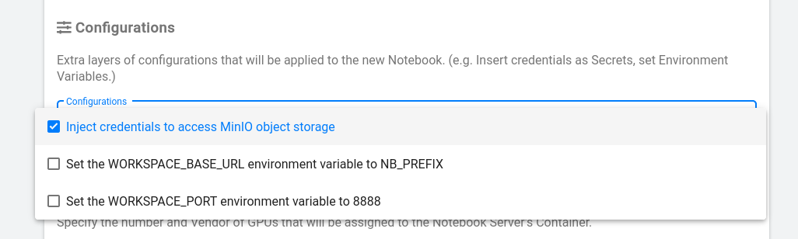

# Storage

The platform has a range of different types of storage meant for a variety of
use-cases, so this storage section applies whether you're experimenting,
creating pipelines, or publishing.

At the surface, there are two kinds of storage

- Disks (also called Volumes)
- Buckets (S3 or "Blob" storage)

## Disks

Disks are the familiar hard drive (or SSD) style file systems! You use them
directly in Kubeflow when you add workspace and data volumes to your notebook
server. They are automatically mounted at the directory you choose, and serve as
a reliable way to preserve your data. Even if you delete your server later, you
can still remount your disks to a new one – by default they are never destroyed.


This is a super simple way to store your data. And if you share a workspace with
a team, your whole team can use the same server's disk just like a shared drive.

## Buckets

Buckets are slightly more complicated, but they are good at three things:

- **Large amounts of data**  
  Buckets can be huge: way bigger than hard drives. And they are fast.

- **Sharing**  
  You can share files from a bucket by sharing a URL that you can get through a
  simple web interface. This is great for sharing data with people outside of
  your workspace.

- **Programmatic Access**  
  Most importantly, it's much easier for pipelines and web browsers to access
  data from buckets than from a hard drive. So if you want to use pipelines, you
  basically have to configure them to work with a bucket.

# Bucket Storage

We have three available types of bucket storage.

**Self-Serve:**

- **[Minimal](https://minimal-tenant1-minio.covid.cloud.statcan.ca):**  
  By default, use this one. It is HDD backed storage.
- **[Premium](https://premium-tenant1-minio.covid.cloud.statcan.ca):**  
  Use this if you need very high read/write speeds, like for training models on
  very large datasets.

**Publicly Available:**

- [Public (Read-Only)](https://datasets.covid.cloud.statcan.ca)

## Self-Serve

In any of the three self-serve options, you can create a personal bucket. To log
in, simply use the **OpenID** option seen below.


Once you are logged in, you are allowed to create a personal bucket with the
format `firstname-lastname`.


## Sharing

You can easily share individual files. Just use the "share" option for a
specific file and you will be provided a link that you can send to a
collaborator!


## Programmatic Access

We are currently working on letting you access your bucket storage via a folder
in your notebook, but in the meantime you can access it programmatically with
the command line tool `mc`, or via S3 API calls in R or Python.

<!-- prettier-ignore -->
!!! danger "Required Kubeflow configuration"
    If you want to enable bucket storage for your notebook, select "Inject
    credentials to access MinIO object storage" from the **Configurations** menu
    when you create your server. Otherwise, your server won't know how to
    sign-in to your personal storage.
    

<!-- prettier-ignore -->
!!! tip "See the example notebooks!"
    There is a template provided for connecting in `R`, `python`, or by the
    command line, provided in `jupyter-notebooks/self-serve-storage`. You can
    copy-paste and edit these examples! They should suit most of your needs.

### Connecting with `mc`

To connect, simply run the following (replace `FULLNAME=blair-drummond` with
your actual `firstname-lastname`)

```sh
#!/bin/sh

FULLNAME=blair-drummond

# Get the credentials
source /vault/secrets/minio-minimal-tenant1

# Add the storage under the alias "minio-minimal"
mc config host add minio-minimal $MINIO_URL $MINIO_ACCESS_KEY $MINIO_SECRET_KEY

# Create a bucket under your name
# NOTE: You can *only* create buckets named with your FIRSTNAME-LASTNAME. Any
# other name will be rejected.

# Private bucket ("mb" = "make bucket")
mc mb minio-minimal/${FULLNAME}

# Shared bucket
mc mb minio-minimal/shared/${FULLNAME}

# There you go! Now you can copy over files or folders!
[ -f test.txt ] || echo "This is a test" > test.txt
mc cp test.txt minio-minimal/${FULLNAME}/test.txt
```

Now open the
[MinIO browser](https://minimal-tenant1-minio.covid.cloud.statcan.ca) and you
will see your test file there!

You can use `mc` to copy files to/from the bucket. It is very fast. You can also
use `mc --help` to see what other options you have, like
`mc ls minio-minimal/FIRSTNAME-LASTNAME/` to list the contents of your bucket.

<!-- prettier-ignore -->
??? tip "Other storage options"
    To use one of our other storage options: `pachyderm` or `premium`, simply
    replace `minimal` in the above program with the type you need.
