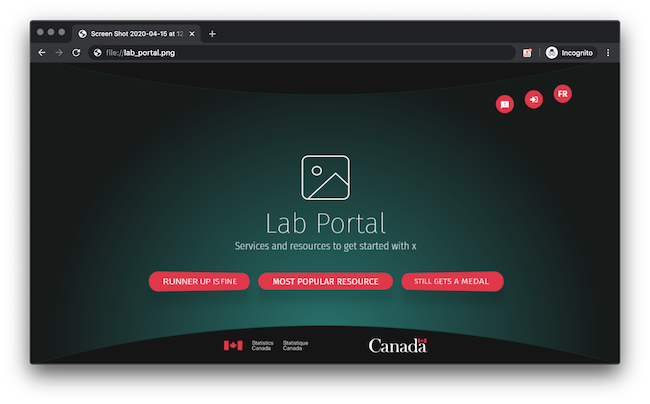
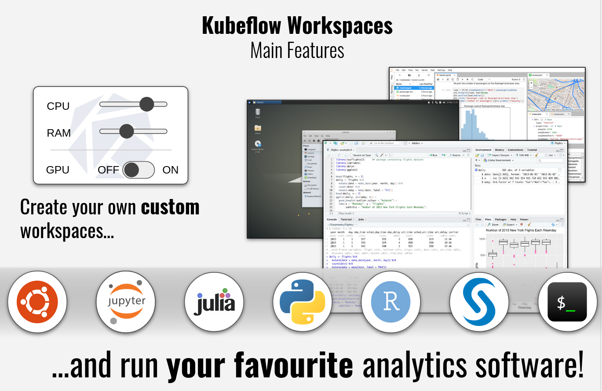
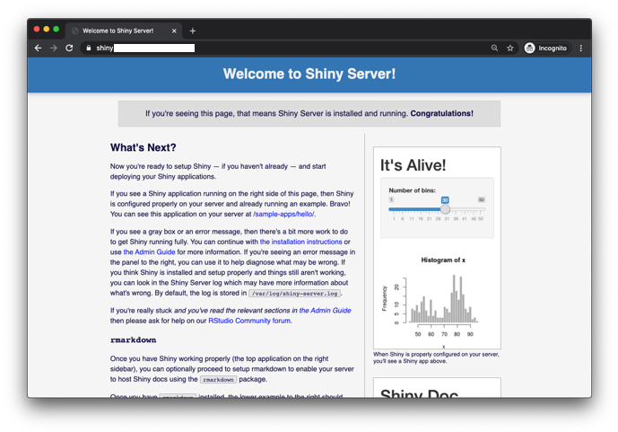
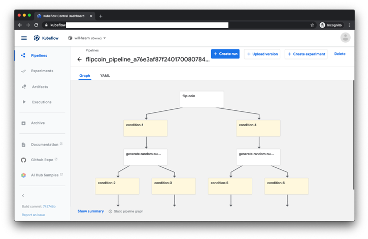

# Starting on the Advanced Analytics Workspace

The
**[Advanced Analytics Workspace portal](https://portal.covid.cloud.statcan.ca)**
is a great place to discover and connect to the available resources we'll be
talking about here.

We'll break down the standard tasks into three categories:

1. **Experimentation / Analysis**
2. **Publishing**
3. **Large scale production**

All are important, and we will address all of them, but we'll focus on the first
two as these are most widely applicable.

# For Experiments

<!-- {: style="max-height:200px"} -->

## Jupyter notebooks

- `R`, `Python`, and `Julia`
- Choose the CPU/RAM you need, big or small, to fit your analysis
- Share your workspace with your team, along with the data and notebooks within

[**Learn More**](1-Experiments/Jupyter)

## Desktops with ML-Workspace

Notebooks are more easily shared than desktops, but we also have the ability to
run a full desktop, with typical applications, right inside your browser.

[**Learn More**](1-Experiments/ML-Workspaces)

# For Publishing

## R Shiny

<!-- prettier-ignore -->
{:style="max-height: 100px; display: block; margin-left: auto; margin-right: auto;"}

The platform is designed to host any kind of open source application you want.
We have an R-Shiny server for hosting R-Shiny apps

To create any an R-Shiny Dashboard, you just have to submit a GitHub pull
request to our
[R-Dashboards GitHub repository](https://github.com/StatCan/R-dashboards).

# For Production

If an experiment turns into a product, then one of the following may be needed:

- Kubeflow pipelines for high-volume/intensity work
- Automation pipelines

<!-- prettier-ignore -->
!!! tip "Ask for help in production"
    The Advanced Analytics Workspace support staff are happy to help with
    production oriented use cases, and we can probably save you lots of time.
    Don't be shy to [ask us for help](Help)!

# How do I get data? How do I submit data?

- Every workspace can be equipped with its own storage.

- There are also storage buckets to publish datasets; either for internal use or
  for wider release.

We will give an overview of the technologies here, and in the next sections
there will be a more in-depth description of each of them.

<!-- prettier-ignore -->
!!! example "Browse some datasets"
    Browse some [datasets](https://datasets.covid.cloud.statcan.ca) here. These
    data sets are meant to store widely shared data. Either data that has been
    brought it, or data to be released out as a product. **As always, ensure
    that the data is not sensitive.**
