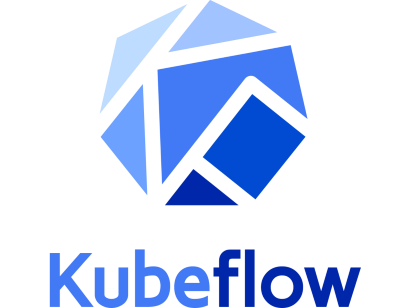

# Welcome to the Advanced Analytics Workspace

## Introduction

Embark on an exciting journey into the realm of data science and machine learning with the Advanced Analytics Workspace (AAW). Developed by Data Analytics Services (DAS) at Statistics Canada, AAW is an open-source platform specifically crafted for data scientists, analysts, and researchers proficient in open-source tools and coding.

## What is the AAW?

The [Advanced Analytics Workspace](https://www.statcan.gc.ca/data-analytics-services/aaw) (AAW) stands as a comprehensive and open-source solution designed to cater to the diverse needs of data scientists. It offers a flexible environment that empowers advanced practitioners to seamlessly conduct their work. AAW is a versatile platform, providing solutions for data science and analytics across various domains.

## What is Kubeflow?

**[👉 Click here to set up your Kubeflow account! 👈](https://kubeflow.aaw.cloud.statcan.ca/)**

### Videos

- [Kubeflow 101](https://www.youtube.com/playlist?list=PLIivdWyY5sqLS4lN75RPDEyBgTro_YX7x) by Google Cloud Tech, a series dedicated to helping you get started with Kubeflow! Learn more about what Kubeflow is, the different parts of Kubeflow, and how to get started with simple, portable, and scalable machine learning.

### Documentation

- [Official](https://www.kubeflow.org/)
- [Introduction to R](https://cran.r-project.org/doc/manuals/r-release/R-intro.pdf)
- [R Data Import/Export](https://cran.r-project.org/doc/manuals/r-release/R-data.pdf)
The AAW is based on [Kubeflow](1-Experiments/Kubeflow/), an open source comprehensive solution for deploying and managing end-to-end ML workflows. [Kubeflow](1-Experiments/Kubeflow/) is a powerful and flexible open source platform that allows for dynamic leverage of cloud compute, with users having the ability to control compute, memory, and storage resources used. Kubeflow simplifies the following tasks:

- Creating customizable environments to work with data with user-controlled resource provisioning (custom CPU, GPU, RAM and storage).
- Managing notebook servers including Ubuntu Desktop (via noVNC), R Studio, JupyterLab with Python, R, Julia and SAS for Statistics Canada employees.
    
## Getting Started

### AAW Portal

Whether you're an internal user from Statistics Canada or an external collaborator, the AAW Portal is your gateway to a world of possibilities.

- **Internal Users**: Access the [Portal Homepage for Statistics Canada Employees](https://www.statcan.gc.ca/data-analytics-service/aaw).
- **External Users**: Explore the [Portal Homepage for External Users](https://www.statcan.gc.ca/data-analytics-services/overview).

### Kubeflow Account

#### External Users

1. External users need a cloud account granted access by the business sponsor.
2. Visit [Kubeflow](https://kubeflow.aaw.cloud.statcan.ca/).

#### Statistics Canada Employees

1. Internal users at Statistics Canada can directly access [https://kubeflow.aaw.cloud.statcan.ca/](https://kubeflow.aaw.cloud.statcan.ca/).

## Creating a Kubeflow Notebook Server

1. Log in to [Kubeflow](https://kubeflow.aaw.cloud.statcan.ca/) with your StatCan guest cloud account.
2. Select Notebook Servers.
3. Click the "➕ New Server" button.
4. Follow the intructions here: ...

## Importing/Accessing Your Data

Dive into the world of data with our [Example Notebooks](https://statcan.github.io/aaw/en/1-Experiments/Notebooks/DrawData_EN.html). Explore different data sets and learn how to interact with them using AAW.

## Examples in JupyterLab

Unlock the potential of AAW in JupyterLab, offering support for Python, R, Julia, and more. 

List of sources of examples:

1. one
2. two

## Learning Resources

- https://machinelearningmastery.com/a-gentle-introduction-to-scikit-learn-a-python-machine-learning-library/

### Data Preparation

- https://machinelearningmastery.com/start-here/#dataprep

### Machine Learning 

- https://machinelearningmastery.com/start-here/#imbalanced

### Python

- https://machinelearningmastery.com/start-here/#pythonskills
- https://www.youtube.com/watch?v=t8pPdKYpowI

### R

- https://www.youtube.com/playlist?list=PLLOxZwkBK52C6_Nkmp0nFCreLfnfJgUL7

## Need Help?

Join our vibrant community on the [Slack channel](https://statcan-aaw.slack.com/) to connect with fellow users, ask questions, and share experiences.

For comprehensive documentation and guidance, refer to the [AAW Portal Documentation](https://statcan.github.io/aaw/) and the [Kubeflow Documentation](https://www.kubeflow.org/docs/). Need real-time assistance? Join our [Slack Support Channel](https://statcan-aaw.slack.com).

## Demos and Contributions

For in-depth demos, personalized assistance, or to contribute to the AAW community, reach out to us on [Slack](https://statcan-aaw.slack.com). Contribute to the platform's development and report issues or feature requests on [GitHub](https://github.com/StatCan/aaw).

Embark on your data science journey with AAW — where possibilities are limitless, and innovation knows no bounds.
