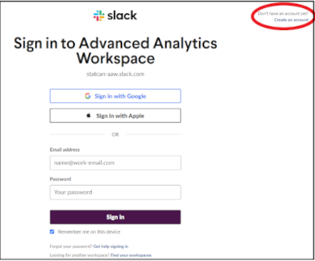

# Get Started

Welcome to the world of data science and machine learning! The **[Advanced Analytics Workspace portal](https://analytics-platform.statcan.gc.ca/)** is your one-stop-shop for all things data. It's like a secret passage to a treasure trove of knowledge, insights, and cutting-edge tools that'll take your data skills to the next level. With just a few clicks, you can unlock a world of possibility and connect to a community of like-minded data wizards. So get ready to don your cape and wizard hat, and join us on an exciting adventure through the Advanced Analytics Workspace portal!

## What are you looking for?

What are you looking to do? Whether you're just getting started or already knee-deep in data analysis, the Advanced Analytics Workspace has everything you need to take your work to the next level. From powerful tools for data pipelines to cloud storage for your datasets, our platform has it all. Need to collaborate with colleagues or publish your results? No problem. We offer seamless collaboration features that make it easy to work together and share your work with others. So, no matter what stage of your data science journey you're at, the Advanced Analytics Workspace has the resources you need to succeed.

# Get Started with AAW

Getting started with the Advanced Analytics Workspace (AAW) is easy and quick. First, you'll want to set up Kubeflow for MLOps and Jupyter Notebooks. Kubeflow makes it easy to deploy and manage end-to-end machine learning workflows, while Jupyter Notebooks provide a flexible and powerful environment for data analysis and experimentation. Once you have Kubeflow and Jupyter Notebooks set up, you can start exploring the many resources and tools available through the AAW portal. Additionally, we encourage you to join our Slack channel to connect with other data scientists and analysts, ask questions, and share your experiences with the AAW platform.

 Everything starts with **[Kubeflow](1-Experiments/Kubeflow/)**! Start by setting it up.

 You're going to have questions. Join our **[Slack channel](https://statcan-aaw.slack.com/)** so we can get you answers!  Click on the link, then choose "Create an account" in the upper right-hand corner. 

Use your @canada.ca email address so that you will be automatically approved.

# Data Science Experiments

Process data using R, Python, or Julia with Kubeflow, a machine learning platform that provides a simple, unified, and scalable infrastructure for machine learning workloads. With Kubeflow, you can process data in a scalable and efficient way using the programming language of your choice. Once you have Kubeflow set up, use Jupyter Notebooks to create and share documents that contain live code, equations, or visualizations.

You can also run Ubuntu as a virtual desktop with Kubeflow, giving you access to a powerful development environment that can be customized to your needs. With R Shiny, a web application framework for R, you can easily create and publish static and interactive dashboards to communicate your analysis results to stakeholders.

For data exploration and data pipelines, Kubeflow provides a range of tools and frameworks, including Apache Beam and TensorFlow Extended (TFX). Apache Beam is an open-source, unified model for defining both batch and streaming data-parallel processing pipelines. TFX is a production-scale machine learning platform that helps you build and deploy your ML models.

Kubeflow also provides integration with external platforms as a service, such as Google Cloud Platform (GCP) and Amazon Web Services (AWS), allowing you to easily move data and workloads between different cloud services. Additionally, with Kubeflow's collaboration features, you can work on your projects with your team in real-time, sharing your analysis, code, and results seamlessly.

## JupyterLab

_Process data using R, Python, or Julia in JupyterLab_

Processing data using R, Python, or Julia is made easy with the Advanced Analytics Workspace. Whether you're new to data analysis or an experienced data scientist, our platform supports a range of programming languages to fit your needs. You can install and run packages for R or Python to perform data processing tasks such as data cleaning, transformation, and modeling. If you prefer Julia, our platform also offers support for this programming language.

Once you have your code ready, use Jupyter Notebooks on our platform to create and share documents that contain live code, equations, or visualizations. You can also run Ubuntu as a virtual desktop for data exploration and other data analysis tasks. Additionally, our platform supports publishing static and interactive dashboards with R Shiny, a popular web application framework for R.

With our platform, you can easily create data pipelines for automating data processing and integrating with external platforms as a service. Whether you're working on a solo project or collaborating with a team, the Advanced Analytics Workspace has the tools you need to streamline your data analysis workflow.

Once you have Kubeflow set up, use
**[Jupyter Notebooks](1-Experiments/Jupyter.md)** to create and share documents
that contain live code, equations, or visualizations.

## R Studio
_Process data using R or Python in R Studio_

R Studio is a powerful integrated development environment (IDE) that supports both the R and Python programming languages, making it an ideal choice for data analysts and scientists. With R Studio, you can perform a wide range of data processing tasks, from data cleaning and transformation to statistical analysis and machine learning. The software provides a user-friendly interface and a variety of tools and libraries that simplify complex data analysis tasks. In addition, R Studio makes it easy to share your work with others by creating dynamic, interactive reports and visualizations that can be published online or shared as standalone documents. Overall, R Studio is a versatile and powerful tool that is essential for anyone working with data in R or Python.

**[R Studio](1-Experiments/RStudio.md)** gives you an integrated development
environment for R and Python. Use the r-studio-cpu image to get an R Studio
environment.

## Ubuntu Virtual Desktop

The Ubuntu Virtual Desktop is a powerful tool for data scientists and machine learning engineers who need to run resource-intensive workloads in the cloud. Ubuntu is a popular Linux distribution that is widely used in the data science and machine learning communities due to its strong support for open source tools such as R and Python. With the Ubuntu Virtual Desktop, you can quickly spin up a virtual machine with Ubuntu pre-installed and access it from anywhere with an internet connection. This means you can perform data analysis and machine learning tasks from your laptop, tablet, or phone without having to worry about hardware limitations.

One of the key advantages of using Ubuntu for data science and machine learning is its rich ecosystem of tools and packages. Ubuntu comes with a vast array of open source packages and libraries for data processing, analysis, and visualization, such as Pandas, NumPy, and Matplotlib. Additionally, Ubuntu is compatible with popular machine learning frameworks like TensorFlow, PyTorch, and Scikit-learn. This makes it easy to run your favorite data science and machine learning tools on the Ubuntu Virtual Desktop without having to worry about compatibility issues or dependencies.

Another advantage of the Ubuntu Virtual Desktop is that it provides a consistent environment for your data science and machine learning workloads. This helps to ensure that your results are reproducible and that you can easily share your work with others. With the Ubuntu Virtual Desktop, you can easily create and manage multiple virtual machines, allowing you to experiment with different configurations and setups without having to worry about damaging your local machine. This makes it easy to collaborate with other data scientists and machine learning engineers and share your work with the wider community.

 You can run a full Ubuntu desktop, with typical applications, right inside your browser, using [**ML Workspaces**](1-Experiments/Remote-Desktop.md)

## Publishing

### R Shiny

_Publish Professional Quality Graphics_

R Shiny is an open-source web application framework that allows data scientists and analysts to create interactive, web-based dashboards and data visualizations using the R programming language. One of the main advantages of R Shiny is that it offers a straightforward way to create high-quality, interactive dashboards without the need for extensive web development expertise. With R Shiny, data scientists can leverage their R coding skills to create dynamic, data-driven web applications that can be shared easily with stakeholders.

Another advantage of R Shiny is that it supports a variety of data visualizations that can be easily customized to meet the needs of the project. Users can create a wide range of charts and graphs, from simple bar charts and scatter plots to more complex heatmaps and network graphs. Additionally, R Shiny supports a variety of interactive widgets that allow users to manipulate and explore data in real-time.

R Shiny is also highly extensible and can be integrated with other open-source tools and platforms to build end-to-end data science workflows. With its powerful and flexible features, R Shiny is a popular choice for building data visualization dashboards for a wide range of applications, from scientific research to business analytics. Overall, R Shiny offers a powerful, customizable, and cost-effective solution for creating interactive dashboards and data visualizations.

 Use **[R-Shiny](/2-Publishing/R-Shiny/)** to build interactive web apps straight from R. You can deploy your R Shiny dashboard by submitting a pull request to our [R-Dashboards GitHub repository](https://github.com/StatCan/R-dashboards). 

### Plotly Dash

_Publish with Canadian-made software._

**[Plotly Dash](/2-Publishing/Dash/)** is a popular Python library that allows you to create interactive web-based visualizations and dashboards with ease. Developed by the Montreal-based company Plotly, Dash has gained a reputation for being a powerful and flexible tool for building custom data science graphics. With Dash, you can create everything from simple line charts to complex, multi-page dashboards with interactive widgets and controls. Because it's built on open-source technologies like Flask, React, and Plotly.js, Dash is highly customizable and can be easily integrated with other data science tools and workflows. Whether you're a data scientist, analyst, or developer, Dash can help you create engaging and informative visualizations that bring your data to life.

### Explore your data

 Use **[Datasette](/2-Publishing/Datasette/)** , an instant JSON API for your SQLite databases. Run SQL queries in a more interactive way!

## Data Science Pipelines

### Build and schedule data/analysis pipelines

 **[Argo Workflows](/3-Pipelines/Kubeflow-Pipelines/)**  is an open-source tool for running and managing workflows on Kubernetes. It provides an easy way to create, run, and manage complex workflows, and it is particularly well-suited for use in machine learning and data science workflows. Argo Workflows allows you to define, execute, and monitor multi-step workflows, making it easy to manage the entire end-to-end machine learning pipeline. With Argo Workflows, you can easily build workflows that incorporate tasks such as data preprocessing, model training, and model deployment, all within a Kubernetes environment. It is an excellent tool for anyone looking to implement MLOps practices and streamline the process of deploying machine learning models in production.

### External Platform as a Service (PaaS) Offerings

_Integration is key to success._

Our open-source platform offers unparalleled optionality to our users. By allowing users to use open-source tools, we empower them to use their preferred data science and machine learning frameworks. But the real power of our platform comes from its ability to integrate with many Platform as a Service (PaaS) offerings, like Databricks or AzureML. This means that our users can leverage the power of the cloud to run complex data processing and machine learning pipelines at scale. With the ability to integrate with PaaS offerings, our platform enables our users to take their work to the next level, by giving them the power to scale their workloads with ease, and take advantage of the latest innovations in the field of data science and machine learning. By providing this level of optionality, we ensure that our users can always choose the right tool for the job, and stay ahead of the curve in an ever-changing field.

We can integrate with many Platform as a Service (PaaS) offerings, like Databricks or AzureML.

## Collaboration

There are many ways collaborate on the platform. Which is best for your situation depends on what you're sharing and how many people you want to share
with. See the [Collaboration Overview](4-Collaboration/Overview.md) for details.

Content to be shared breaks roughly into **Data**, **Code**, or **Compute Environments** (e.g.: sharing the same virtual machines) and who you want to share it with (**No one**, **My Team**, or **Everyone**). This leads to the following table of options

|             |           **Private**            |                  **Team**                  |  **StatCan**  |
| :---------: | :------------------------------: | :----------------------------------------: | :-----------: |
|  **Code**   | GitLab/GitHub or personal folder |        GitLab/GitHub or team folder        | GitLab/GitHub |
|  **Data**   |    Personal folder or bucket     | Team folder or bucket, or shared namespace | Shared Bucket |
| **Compute** |        Personal namespace        |              Shared namespace              |      N/A      |

<!-- prettier-ignore --> ??? question "What is the difference between a bucket and a folder?" Buckets are like Network Storage. See the [Storage section](#storage) section for more discussion of the differences between these two ideas.

Sharing code, disks, and workspaces (e.g.: two people sharing the same virtual machine) is described in more detail in the [Collaboration](4-Collaboration/Overview.md) section. Sharing data through buckets is described in more detail in the **[MinIO](./5-Storage/MinIO.md)** section.

## Cloud Storage

Cloud storage offers numerous advantages over traditional on-premises storage solutions. One of the key benefits is the ability to easily scale up or down your storage needs with just a few clicks, without having to purchase and install additional hardware. With cloud storage, you only pay for the amount of storage you use, making it a cost-effective solution for businesses of all sizes.

Another advantage of cloud storage is that it offers greater accessibility and flexibility. Your data can be accessed from anywhere with an internet connection, making it easier for remote workers to collaborate and share files. Additionally, cloud storage providers often offer advanced security features, such as data encryption and access controls, to help protect your data from unauthorized access or data breaches.

Overall, cloud storage is a reliable and convenient solution for storing and managing your data. Whether you need to store large amounts of data or just a few files, cloud storage makes it easy to manage your storage needs without the hassle of traditional storage solutions.

The platform provides several types of storage:

- Disks (also called Volumes on the Kubeflow Notebook Server creation screen)
- Buckets ("Blob" or S3 storage, provided through MinIO)
- Data Lakes (coming soon)

Depending on your use case, either disk or bucket may be most suitable. Our [storage overview](./5-Storage/Overview.md) will help you compare them.

### Disks

 **[Disks](./5-Storage/Disks.md)** are added to your notebook server by adding Data Volumes.

### Buckets

MinIO is an S3-API compatible object storage system that provides an open source alternative to proprietary cloud storage services. While we currently use MinIO as our cloud storage solution, we plan on replacing it with s3-proxy in the near future. S3-proxy is a lightweight, open source reverse proxy server that allows you to access Amazon S3-compatible storage services with your existing applications. By switching to s3-proxy, we will be able to improve our cloud storage performance, security, and scalability, while maintaining compatibility with the S3 API.

 **[MinIO](./5-Storage/MinIO.md)** is a cloud-native scalable object store. We use it for buckets (blob or S3 storage).

### Data Lakes

A data lake is a central repository that allows you to store all your structured and unstructured data at any scale. It's a cost-effective way to store and manage all types of data, from raw data to processed data, and it's an essential tool for data scientists.

One of the primary advantages of a data lake is its flexibility. It allows you to store all types of data without the need to define a schema in advance, which is especially useful when dealing with unstructured data. This flexibility allows data scientists to easily explore, experiment, and extract insights from their data without being constrained by the limitations of a traditional relational database.

Data lakes also enable data scientists to centralize their data, making it easier to manage and analyze large volumes of data from various sources. With a data lake, data scientists can easily ingest and store data from a variety of sources, such as databases, cloud storage, and third-party APIs. Additionally, data lakes often provide features for data governance, metadata management, and access control, which helps ensure the data is of high quality and compliant with relevant regulations.

Furthermore, cloud-based data lakes provide scalable, cost-effective storage solutions that can be easily expanded at the click of a button. As a data scientist's data storage needs grow, they can add additional storage capacity to their data lake with minimal effort, without worrying about the underlying infrastructure or maintenance.

Overall, data lakes are a critical tool for data scientists, as they provide the flexibility, scalability, and ease of use needed to store and manage large volumes of data, enabling data scientists to focus on extracting insights and value from the data.
