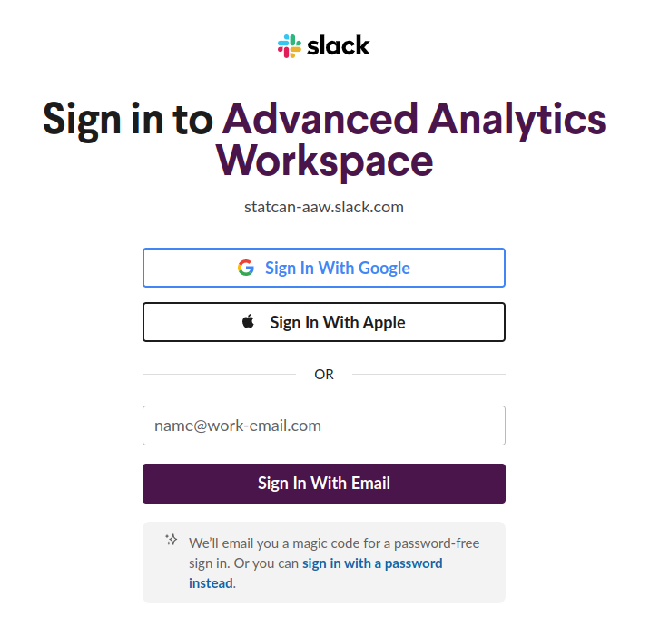

# Welcome to the Advanced Analytics Workspace

## What are you looking for?

- [Getting Started with AAW](#kubeflow-account)
- [Data Analysis](1-Experiments/RStudio.md)
- [Data Science Experimentation](#data-science-experimentation)
- [Data Science Pipelines](#data-science-pipelines)
- [Statistical Publishing](#statistical-publishing)
- [Cloud Storage](#cloud-storage)
- [Integration with External Platform as a Service (PaaS) Offerings](#integration-with-external-platform-as-a-service-paas-offerings)
- [Collaboration](#collaboration)

## The Advanced Analytics Workspace Documentation

_Welcome to the world of data science and machine learning!_

The **[Advanced Analytics Workspace](https://analytics-platform.statcan.gc.ca/)** is your one-stop-shop for all things data. It's like a secret passage to a treasure trove of knowledge, insights, and cutting-edge tools that'll take your data skills to the next level. With just a few clicks, you can unlock a world of possibility and connect to a community of like-minded data wizards. So get ready to don your cape and wizard hat, and join us on an exciting adventure through the Advanced Analytics Workspace portal!

!!! info "What is the AAW?"
    Advanced Analytics Workspace (AAW) is an open source platform designed for data science and machine learning (ML) practitioners. Developed by data scientists for data scientists, AAW provides an unrestricted environment that enables advanced practitioners to get their work done with ease.

Built on the Kubeflow project, the AAW is a comprehensive solution for deploying and managing end-to-end ML workflows. It simplifies the deployment of ML workflows on Kubernetes, making it simple, portable, and scalable. With the AAW, you can customize notebook server deployments to suit your specific data science needs. We have a small number of expertly crafted Docker images made by our team of data science experts.

!!! info "What is Kubeflow?"
    The AAW is based on the Kubeflow project which is an open source comprehensive solution for deploying and managing end-to-end ML workflows. Kubeflow is designed to make deployments of ML workflows on Kubernetes simple, portable and scalable.

Whether you're just getting started or already knee-deep in data analysis, the Advanced Analytics Workspace has everything you need to take your work to the next level. From powerful tools for data pipelines to cloud storage for your datasets, our platform has it all. Need to collaborate with colleagues or publish your results? No problem. We offer seamless collaboration features that make it easy to work together and share your work with others.

No matter what stage of your data science journey you're at, the Advanced Analytics Workspace has the resources you need to succeed.

## Getting Started with the AAW

### The AAW Portal

The AAW portal homepage is available for internal users only. However, external users with a cloud account granted access by the business sponsor can access the platform through the analytics-platform URL.

!!! info annotate "AAW Portal Homepage"
    - [**Portal Homepage for Statistics Canada Employees**](https://www.statcan.gc.ca/data-analytics-service/aaw)
    - [**Portal Homepage for External Users**](https://analytics-platform.statcan.gc.ca/covid19)

!!! info "Kubeflow Dashboard"
    - [**Kubeflow Dashboard**](https://kubeflow.aaw.cloud.statcan.ca/) Use this link once you have your cloud account!

Getting started with the Advanced Analytics Workspace (AAW) is easy and quick. First, you'll want to set up Kubeflow for MLOps and Jupyter Notebooks. Kubeflow makes it easy to deploy and manage end-to-end machine learning workflows, while Jupyter Notebooks provide a flexible and powerful environment for data analysis and experimentation. Once you have Kubeflow and Jupyter Notebooks set up, you can start exploring the many resources and tools available through the AAW portal. Additionally, we encourage you to join our Slack channel to connect with other data scientists and analysts, ask questions, and share your experiences with the AAW platform.

### Kubeflow Account

!!! important "Attention External Users!"
    Users external to Statistics Canada will require a cloud account granted access by the business sponsor.

!!! note ""
    

    
    <h3>**[👉 Click here to setup your Kubeflow account! 👈](https://kubeflow.aaw.cloud.statcan.ca/)**</h3>
    

**[Kubeflow](1-Experiments/Kubeflow/)** is a powerful and flexible open source platform that has revolutionized the way we build, deploy, and manage machine learning workflows. With its robust set of tools and frameworks, Kubeflow is the perfect starting point for data scientists and developers who want to accelerate their projects and bring them to the next level. By using up Kubeflow, you can harness the full potential of cloud-native machine learning and unlock new opportunities for innovation and growth.

!!! important "Attention Statistics Canada Employees!"
    Users internal to Statistics Canada can get started right away without any additional sign up procedures, just head to  [https://kubeflow.aaw.cloud.statcan.ca/](https://kubeflow.aaw.cloud.statcan.ca/).

Kubeflow offers an unparalleled level of flexibility and customization, empowering you to create and deploy machine learning workflows that meet your specific needs and requirements. By embracing Kubeflow, you'll be at the forefront of the machine learning revolution, and who knows what incredible insights and breakthroughs you'll discover along the way.

### Slack

- **[Click here sign in to our Slack Support Workspace](https://statcan-aaw.slack.com/)**

- **Use the _General_ Channel!**

At StatCan, we understand that embarking on a new project can be overwhelming, and you're likely to have many questions along the way. That's why we've created a dedicated  **[Slack channel](https://statcan-aaw.slack.com/)** to provide you with the support you need. Our team of experts is standing by to answer your questions, address any concerns, and guide you through every step of the process.

To join our  **[Slack channel](https://statcan-aaw.slack.com/)**, simply click on the link provided and follow the instructions. You'll be prompted to create an account in the upper right-hand corner of the page. If you have an `@statcan.gc.ca` email address, use it when signing up as this will ensure that you are automatically approved and can start engaging with our community right away.

Once you've created your account, you'll have access to a wealth of resources and information, as well as the opportunity to connect with other users who are working on similar projects. Our  **[Slack channel](https://statcan-aaw.slack.com/)** is the perfect place to ask questions, share insights, and collaborate with your peers in real-time. Whether you're just getting started with a new project or you're looking for expert advice on a complex issue, our team is here to help.

So don't hesitate - join our **[Slack channel](https://statcan-aaw.slack.com/)** today and start getting the answers you need to succeed. We look forward to welcoming you to our community!

Click on the link, then choose "Create an account" in the upper right-hand corner.

!!! note ""
    

    
    <h3>Use your @statcan.gc.ca email address so that you will be automatically approved.</h3>
    

## 🧭 Getting Started

To access AAW services, you need to log in to Kubeflow with your StatCan guest cloud account. Once logged in, select Notebook Servers and click the "New Server" button to get started.

1. Login to [Kubeflow](https://kubeflow.aaw.cloud.statcan.ca/) with your StatCan guest cloud account. You will be prompted to authenticate the account.
2. Select Notebook Servers.
3. Click the "➕ New Server" button.

## 🧰 Tools Offered

AAW is a flexible platform for data analysis and machine learning. It offers a range of languages, including Python, R, and Julia. AAW also supports development environments such as VS Code, R Studio, and Jupyter Notebooks. Additionally, Linux virtual desktops are available for users who require additional tools such as OpenM++ and QGIS.

Here's a list of tools we offer:

- 📜 Languages:
  - 🐍 Python
  - 📈 R
  - 👩‍🔬 Julia
- 🧮 Development environments:
  - VS Code
  - R Studio
  - Jupyter Notebooks
- 🐧 Linux virtual desktops for additional tools (🧫 OpenM++, 🌏 QGIS etc.)

Sharing code, disks, and workspaces (e.g.: two people sharing the same virtual machine) is described in more detail in the [Collaboration](4-Collaboration/Overview.md) section. Sharing data through buckets is described in more detail in the **[Azure Blob Storage](./5-Storage/AzureBlobStorage.md)** section.

### 💡 Help

- Disk (also called Volumes on the Notebook Server creation screen)
- Containers (Blob Storage)
- Data Lakes (coming soon)

- 📗 AAW Portal Documentation
  - [https://statcan.github.io/daaas/](https://statcan.github.io/daaas/)
- 📘 Kubeflow Documentation
  - [https://www.kubeflow.org/docs/](https://www.kubeflow.org/docs/)  
- 🤝 Slack Support Channel
  - [https://statcan-aaw.slack.com](https://statcan-aaw.slack.com)
- Github Issues
  - [https://github.com/StatCan/daaas/issues](https://github.com/StatCan/daaas/issues)

## 🐱 Demos

If you require a quick onboarding demo session, need help, or have any questions, please reach out to us through our [🤝 Slack Support Channel](https://statcan-aaw.slack.com).

**Thank you for choosing Advanced Analytics Workspace!**