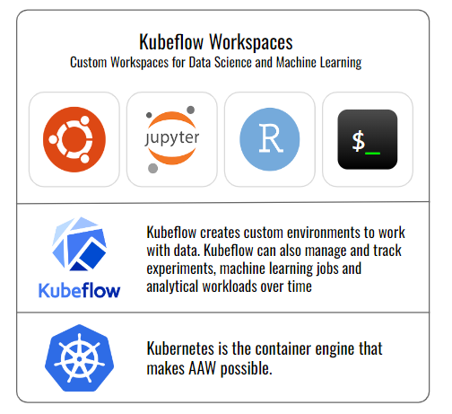

# Welcome to the Advanced Analytics Workspace

_Embark on an exciting journey into the realm of data science and machine learning with the Advanced Analytics Workspace (AAW). Developed by Data Analytics Services (DAS) at Statistics Canada, AAW is an open-source platform specifically crafted for data scientists, analysts, and researchers proficient in open-source tools and coding._

## What is the AAW?

The [Advanced Analytics Workspace](https://www.statcan.gc.ca/data-analytics-services/aaw) (AAW) stands as a comprehensive and open-source solution designed to cater to the diverse needs of data scientists. It offers a flexible environment that empowers advanced practitioners to seamlessly conduct their work. AAW is a versatile platform, providing solutions for data science and analytics across various domains.

More information about the AAW can be found on [the DAS Portal](https://www.statcan.gc.ca/data-analytics-services/aaw).

TODO: Many of the links on https://www.statcan.gc.ca/data-analytics-services/aaw are broken.

## Getting Started

### AAW Portal

Whether you're an internal user from Statistics Canada or an external collaborator, the AAW Portal is your gateway to a world of possibilities.

- **Internal Users**: Access the [Portal Homepage for Statistics Canada Employees](https://www.statcan.gc.ca/data-analytics-service/aaw) and click Kubeflow to enter your Kubeflow dashboard.
- **External Users**: Explore the [Portal Homepage for External Users](https://www.statcan.gc.ca/data-analytics-services/overview) and click getting started to open the onboarding form.

### Kubeflow

[Click here to set up your Kubeflow account!](https://kubeflow.aaw.cloud.statcan.ca/)

The AAW is based on [Kubeflow](1-Experiments/Kubeflow/), an open source comprehensive solution for deploying and managing end-to-end ML workflows. [Kubeflow](1-Experiments/Kubeflow/) is a powerful and flexible open source platform that allows for dynamic leverage of cloud compute, with users having the ability to control compute, memory, and storage resources used. Kubeflow simplifies the following tasks:

- Creating customizable environments to work with data with user-controlled resource provisioning (custom CPU, GPU, RAM and storage).
- Managing notebook servers including Ubuntu Desktop (via noVNC), R Studio, JupyterLab with Python, R, Julia and SAS for Statistics Canada employees.

### Kubeflow Account

To create a namespace, go to [the DAS Portal](https://www.statcan.gc.ca/data-analytics-services/overview) where you'll find a link to [the onboarding form](https://forms.office.com/pages/responsepage.aspx?id=mR-PJT3ux0K_xXrxsjQ-ApbSRgATuERFkV3XLiwQ8xFUQ1NHRzBVWEFYUktZRzBJRDIwUDZFSDQ0USQlQCN0PWcu).

#### External Users

1. External users need a StatCan Cloud account granted by the business sponsor.
2. Visit [Kubeflow](https://kubeflow.aaw.cloud.statcan.ca/) once the StatCan Cloud account has been created.

#### Statistics Canada Employees

1. Internal users at Statistics Canada can directly access [https://kubeflow.aaw.cloud.statcan.ca/](https://kubeflow.aaw.cloud.statcan.ca/).

### Creating a Kubeflow Notebook Server. 

1. Log in to [Kubeflow](https://kubeflow.aaw.cloud.statcan.ca/) with your StatCan guest cloud account.
2. Select Notebook Servers.
3. Click the "➕ New Server" button.
4. Follow [the instructions here](https://statcan.github.io/aaw/en/1-Experiments/Kubeflow.html#setup).

#### Kubeflow Documentation

- [Official Kubeflow Documentation](https://www.kubeflow.org/docs/started/introduction/)
    
#### Kubeflow Videos

- [Kubeflow 101](https://www.youtube.com/playlist?list=PLIivdWyY5sqLS4lN75RPDEyBgTro_YX7x) by Google Cloud Tech.

## Your Data

Instructions on how to add storage to your notebook server can be found here on [the documentation page for storage](https://statcan.github.io/aaw/en/5-Storage/Disks.html).

If your project requires protected data, cloud storage buckets will be created for you at the time of your projects onboarding. Access protected data by opening the buckets folder, see [the documentation](https://statcan.github.io/aaw/en/5-Storage/AzureBlobStorage.html).

Uploading data into JupyterLab is simple, [the official JupyterLab documentation](https://jupyterlab.readthedocs.io/en/stable/user/files.html#uploading-and-downloading) has a section on uploading and downloading files from the JupyterLab web interface.

## JupyterLab

Unlock the potential of AAW in JupyterLab, offering support for Python, R, Julia, and more. 

When conducting data science experiments, it's a best practice to utilize Python and/or conda virtual environments to manage your project dependencies. It is common to create a dedicated environment for each project or, in some cases, separate environments for different features or aspects of your work (for instance, one environment for general projects and an additional environment tailored for GPU-accelerated deep learning tasks).

### JupyterLab Documentation

- [Official Getting Started with JupyterLab Docs.](https://jupyterlab.readthedocs.io/en/stable/getting_started/overview.html)

If you find yourself frequently switching between environments and desire a more convenient way to access them within JupyterLab, you can follow [these instructions](https://statcan.github.io/aaw/en/1-Experiments/Virtual-Environments.html#creating-and-adding-environments-to-the-jupyterlab-launcher).

List of sources of examples:

1. [Visual Python: Simplifying Data Analysis for Python Learners](https://statcan.github.io/aaw/en/1-Experiments/Notebooks/VisualPython_EN.html)
2. [YData Profiling: Streamlining Data Analysis](https://statcan.github.io/aaw/en/1-Experiments/Notebooks/YData-Profiling_EN.html)

## External Learning Resources

- [A Gentle Introduction to SciKit Learn (Python)](https://machinelearningmastery.com/a-gentle-introduction-to-scikit-learn-a-python-machine-learning-library/)
- [Official SciKit Learn Tutorials](https://scikit-learn.org/stable/tutorial/index.html)

### Data Preparation

- [Machine Learning Mastery's Data Preparation Course](https://machinelearningmastery.com/start-here/#dataprep)

### Machine Learning 

- [How to Handle Imbalanced Datasets](https://machinelearningmastery.com/start-here/#imbalanced)

### Python

- [Real Python's Introduction to Python](https://realpython.com/learning-paths/python3-introduction/)
- [W3School's Introduction to Python](https://www.w3schools.com/python/python_intro.asp)
- [Google Developers' Introduction to Python](https://developers.google.com/edu/python)
- [Machine Learning Mastery's Python Skills](https://machinelearningmastery.com/start-here/#pythonskills)
- [TechWorld with Nana's Python Tutorial for Beginners](https://www.youtube.com/watch?v=t8pPdKYpowI)

### R

- [Videos on R](https://www.youtube.com/playlist?list=PLLOxZwkBK52C6_Nkmp0nFCreLfnfJgUL7)
- [Introduction to R](https://cran.r-project.org/doc/manuals/r-release/R-intro.pdf)
- [R Data Import/Export](https://cran.r-project.org/doc/manuals/r-release/R-data.pdf)

## Need Help?

Join our vibrant community on the [Slack channel](https://statcan-aaw.slack.com/) to connect with fellow users, ask questions, and share experiences.

For comprehensive documentation and guidance, refer to the [AAW Portal Documentation](https://statcan.github.io/aaw/) and the [Kubeflow Documentation](https://www.kubeflow.org/docs/). Need real-time assistance? Join our [Slack Support Channel](https://statcan-aaw.slack.com).

## Demos and Contributions

For in-depth demos, personalized assistance, or to contribute to the AAW community, reach out to us on [Slack](https://statcan-aaw.slack.com). Contribute to the platform's development and report issues or feature requests on [GitHub](https://github.com/StatCan/aaw).

Embark on your data science journey with AAW — where possibilities are limitless, and innovation knows no bounds.
