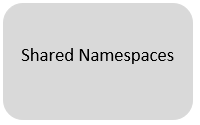

# Starting on the Advanced Analytics Workspace

The
**[Advanced Analytics Workspace portal](https://portal.covid.cloud.statcan.ca)**
is a great place to discover and connect to the available resources we'll be
talking about here.

## What are you looking for?

# Get Started with AAW

 Everything
starts with **[Kubeflow](1-Experiments/Kubeflow/)**! Start by setting it up.

You're going to have questions. Join our
**[Slack channel](https://statcan-aaw.slack.com/)** so we can get you answers!

Click on the link, then choose "Create an account" in the upper right-hand
corner.

Use your @canada.ca email address so that you will be automatically approved.

# Experiments

## Process data using `R`, `Python`, or `Julia`

Once you have Kubeflow set up, use
**[Jupyter Notebooks](1-Experiments/Jupyter/)** to create and share documents
that contain live code, equations, or visualizations.

## Process data using 'R' or 'Python'

**[R Studio](1-Experiments/RStudio/)** gives you an integrated development
environment for R and Python. Use the r-studio-cpu image to get an R Studio
environment.

## Run a virtual desktop

 You
can run a full Ubuntu desktop, with typical applications, right inside your
browser, using [**ML Workspaces**](1-Experiments/ML-Workspaces)

## Manage machine learning models and metadata

**[ML Flow](1-Experiments/MLflow/)** lets you manage the machine learning
lifecycle. It's a model registry for storing machine learning models and
metrics.

# Publishing

## Build and publish an interactive dashboard

Use **[R-Shiny](/2-Publishing/R-Shiny/)** to build interactive web apps straight
from R. You can deploy your R-Shiny dashboard by submitting a pull request to
our [R-Dashboards GitHub repository](https://github.com/StatCan/R-dashboards).

**[Dash](/2-Publishing/Dash/)** is a data visualization tool that lets you build
an interactive GUI around your data analysis code.

## Explore your data

 Use
**[Datasette](/2-Publishing/Datasette/)** , an instant JSON API for your SQLite
databases. Run SQL queries in a more interactive way!

# Pipelines

## Build and schedule data/analysis pipelines

**[Kubeflow Pipelines](/3-Pipelines/Kubeflow-Pipelines/)** allows you to set up
pipelines. Each pipeline encapsulates analytical workflows, and can be shared,
reused, and scheduled.

## Integrate with Platform as a Service (PaaS) offerings

We can integrate with many Platform as a Service (PaaS) offerings, like
Databricks or AzureML.

# Collaboration

There are lots of ways to collaborate on the platform, and what's best for you
depends on what you're sharing and how many people you want to share with.
We can roughly break the shareable things into **Data** and **Code**, and we
can share the scope of who you're sharing with **No one** vs. **My Team** vs.
**Everyone**. This leads to the following table of options

|          |           **Private**            |           **Team**           |  **StatCan**  |
| :------: | :------------------------------: | :--------------------------: | :-----------: |
| **Code** | GitLab/GitHub or personal folder | GitLab/GitHub or team folder | GitLab/GitHub |
| **Data** |    Personal folder or bucket     |    Team folder or bucket     | Shared Bucket |

<!-- prettier-ignore -->
??? question "What is the difference between a bucket and a folder?"
    Buckets are like Network Storage. See the [Storage section](./Storage.md)
    section for more discussion of the differences between these two ideas.

## Share code among team members

The way that **Private** vs. **Team** based access is configured is with
**namespaces**. 

 Use GitHub or GitLab to
share code.
The advantage of sharing with git is that it works with users across namespaces,
and keeping code in git is a great way to manage large software projects.

<!-- prettier-ignore -->
!!! note "Don't forget to include a License!"
    If your code is public, do not forget to keep with the Innovation Team's
    guidelines and use a proper License if your work is done for Statistics
    Canada.
    
## Share a workspace in Kubeflow

You can also request a **[shared workspace](Collaboration.md/)**. 

The advantage of sharing inside Kubeflow is that it's more free-form and it
works better for `.ipynb` files (Jupyter notebooks). This method also lets you
share a compute environment, so you can share resources very easily. When you
share a workspace, you share

- A Private and Shared bucket (`/team-name` and `/shared/team-name`)
- All notebook servers in the Kubeflow Namespace

<!-- prettier-ignore -->
!!! tip "Ask for help in production"
    The Advanced Analytics Workspace support staff are happy to help with
    production oriented use cases, and we can probably save you lots of time.
    Don't be shy about [asking us for help](Help)!
    
## Recommendation: Combine both

It's a great idea to always use git, and using git along with shared workspaces
is a great way to combine ad hoc sharing (through files) while also keeping your
code organized and tracked.

## Share data
Sharing data can be done using **[MinIO](./MinIO.md/)**

# Storage
The platform provides several types of storage:

- Disk (also called Volumes on the Notebook Server creation screen)
- Bucket ("Blob" or S3 storage, provided through MinIO)
- Data Lakes (coming soon)

Depending on your use case, either disk or bucket may be most suitable:

|   Type |                                                       Simultaneous Users |                                                   Speed | Total size               | Sharable with Other Users            |
| -----: | -----------------------------------------------------------------------: | ------------------------------------------------------: | ------------------------ | ------------------------------------ |
|   Disk |                                    One machine/notebook server at a time |                        Fastest (throughput and latency) | <=512GB total per drive  | No                                   |
| Bucket | Simultaneous access from many machines/notebook servers at the same time | Fast-ish (Fast download, modest upload, modest latency) | Infinite (within reason) | [Yes] |

<!-- prettier-ignore -->
??? info "If you're unsure which to choose, don't sweat it"
    These are guidelines, not an exact science - pick what sounds best now and run with it.  The best choice for a complicated usage is non-obvious and often takes hands-on experience, so just trying something will help.  For most situations both options work well even if they're not perfect, and remember that data can always be copied later if you change your mind.

<!-- prettier-ignore -->
!!! example "Browse some datasets"
    Browse some [datasets](https://datasets.covid.cloud.statcan.ca) here. These
    data sets are meant to store widely shared data. Either data that has been
    brought it, or data to be released out as a product. **As always, ensure
    that the data is not sensitive.**
    
## Disks

**[Disks](Storage.md/)** are added to your notebook server by adding Data Volumes.

## Buckets

**[MinIO](MinIO.md/)** is a cloud-native scalable object store. We use it for buckets (blob or S3 storage).

