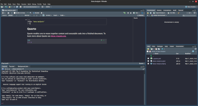

# Welcome to Advanced Analytics Workspace (AAW)

Please find below additional information, videos and links to help better
understand how to get started with Advanced Analytics Workspace (AAW).

Advanced Analytics Workspace (AAW) is our **_open source platform for data
science and machine learning (ML)_** for **advanced practitioners** to get their
work done in an **unrestricted environment** made by data scientists _for_ data
scientists. With AAW, you can customize your notebook deployments to suit your
data science needs. We also have a small number of expertly crafted images made
by our expert data science team.

AAW is based on the Kubeflow project which is an open source comprehensive
solution for deploying and managing end-to-end ML workflows. Kubeflow is
designed to make deployments of ML workflows on **Kubernetes** simple, portable
and scalable.

🔔 **Important!** Users external to Statistics Canada will require a cloud
account granted access by the business sponsor.

🔔 **Important!** Users internal to Statistics Canada can get started right away
without any additional sign up procedures, just head to
[https://kubeflow.aaw.cloud.statcan.ca/](https://kubeflow.aaw.cloud.statcan.ca/).

## AAW Services

The Advanced Analytics Workspaces' services can be accessed from one of two portals.

-    [**External**](https://analytics-platform.statcan.gc.ca/covid19){ .md-button .md-button--primary }
-    [**Internal**](https://www.statcan.gc.ca/data-analytics-service/aaw){ .md-button }

## Getting Help

https://statcan.github.io/daaas/
https://statcan-aaw.slack.com

  - __HTML__ for content and structure
  - __JavaScript__ for interactivity
  - __CSS__ for text running out of boxes
  - __Internet Explorer__ ... huh?

## Getting Started

In order to access the AAW services, you will need to:

1. Login to [Kubeflow](https://kubeflow.aaw.cloud.statcan.ca/) with your StatCan
   guest cloud account. You will be prompted to authenticate the account.
2. Select Notebook Servers.
3. Click the "➕ New Server" button.

## Tools Offered

AAW is a flexible platform for data analysis and machine learning, featuring:

- Languages: Python, R, Julia, SAS
- Development environments: VS Code, R Studio, Jupyter Notebooks
- Linux virtual desktops for additional tools: OpenM++, QGIS

## Demos

If you would like a quick Onboarding Demo session or require any help or have
any questions, please do not hesitate to reach out through our
[Slack Support Channel](https://statcan-aaw.slack.com).

## FAQ

- Frequently Asked Questions are located
  [here](https://github.com/StatCan/daaas/blob/master/README.md).

Thank you!

# Starting on the Advanced Analytics Workspace

The
**[Advanced Analytics Workspace portal](https://analytics-platform.statcan.gc.ca/)**
is a great place to discover and connect to the available resources we'll be
talking about here.

## What are you looking for?

| Tools and Services | | |
|---|---|---|
| 
<h3>    [Getting Started](#gettingstarted) </h3>
 | 
<h3>    [Data Analysis](#experiments) </h3>
 | 
<h3>    [Data Publishing](#publishing) </h3>
 |
| 
<h3>    [Kubeflow Pipelines](#pipelines) </h3>
 | 
<h3>    [Collaboration](#collaboration) </h3>
 | 
<h3>    [Storage](#storage) </h3>
 |

# Get Started with AAW

Everything starts with **[Kubeflow](1-Experiments/Kubeflow/)**! Start by setting it up.

You're going to have questions. Join our **[Slack channel](https://statcan-aaw.slack.com/)** so we can get you answers!

Click on the link, then choose "Create an account" in the upper right-hand corner.

Use your @canada.ca email address so that you will be automatically approved.

# Experiments

## Process data using `R`, `Python`, or `Julia`

Once you have Kubeflow set up, use
**[Jupyter Notebooks](1-Experiments/Jupyter.md)** to create and share documents
that contain live code, equations, or visualizations.

## Process data using 'R' or 'Python'

**[R Studio](1-Experiments/RStudio.md)** gives you an integrated development
environment for R and Python. Use the r-studio-cpu image to get an R Studio
environment.

## Run a virtual desktop

You can run a full Ubuntu desktop, with typical applications, right inside your
browser, using [**ML Workspaces**](1-Experiments/Remote-Desktop.md)

# Publishing

## Build and publish an interactive dashboard

Use **[R-Shiny](/2-Publishing/R-Shiny/)** to build interactive web apps straight
from R. You can deploy your R-Shiny dashboard by submitting a pull request to
our [R-Dashboards GitHub repository](https://github.com/StatCan/R-dashboards).

**[Dash](/2-Publishing/Dash/)** is a data visualization tool that lets you build
an interactive GUI around your data analysis code.

## Explore your data

 Use
**[Datasette](/2-Publishing/Datasette/)** , an instant JSON API for your SQLite
databases. Run SQL queries in a more interactive way!

# Pipelines

## Build and schedule data/analysis pipelines

**[Kubeflow Pipelines](/3-Pipelines/Kubeflow-Pipelines/)** allows you to set up
pipelines. Each pipeline encapsulates analytical workflows, and can be shared,
reused, and scheduled.

## Integrate with Platform as a Service (PaaS) offerings

We can integrate with many Platform as a Service (PaaS) offerings, like
Databricks or AzureML.

# Collaboration

There are many ways collaborate on the platform. Which is best for your
situation depends on what you're sharing and how many people you want to share
with. See the [Collaboration Overview](4-Collaboration/Overview.md) for details.

Content to be shared breaks roughly into **Data**, **Code**, or **Compute
Environments** (e.g.: sharing the same virtual machines) and who you want to
share it with (**No one**, **My Team**, or **Everyone**). This leads to the
following table of options

|             |           **Private**            |                  **Team**                  |  **StatCan**  |
| :---------: | :------------------------------: | :----------------------------------------: | :-----------: |
|  **Code**   | GitLab/GitHub or personal folder |        GitLab/GitHub or team folder        | GitLab/GitHub |
|  **Data**   |    Personal folder or bucket     | Team folder or bucket, or shared namespace | Shared Bucket |
| **Compute** |        Personal namespace        |              Shared namespace              |      N/A      |

<!-- prettier-ignore -->
??? question "What is the difference between a bucket and a folder?"
    Buckets are like Network Storage. See the [Storage section](#storage) section for more discussion of the differences between these two ideas.

Sharing code, disks, and workspaces (e.g.: two people sharing the same virtual
machine) is described in more detail in the
[Collaboration](4-Collaboration/Overview.md) section. Sharing data through
buckets is described in more detail in the **[MinIO](./5-Storage/MinIO.md)**
section.

# Storage

The platform provides several types of storage:

- Disk (also called Volumes on the Notebook Server creation screen)
- Bucket ("Blob" or S3 storage, provided through MinIO)
- Data Lakes (coming soon)

Depending on your use case, either disk or bucket may be most suitable. Our
[storage overview](./5-Storage/Overview.md) will help you compare them.

## Disks

 **[Disks](./5-Storage/Disks.md)** are
added to your notebook server by adding Data Volumes.

## Buckets

 **[MinIO](./5-Storage/MinIO.md)** is a
cloud-native scalable object store. We use it for buckets (blob or S3 storage).
