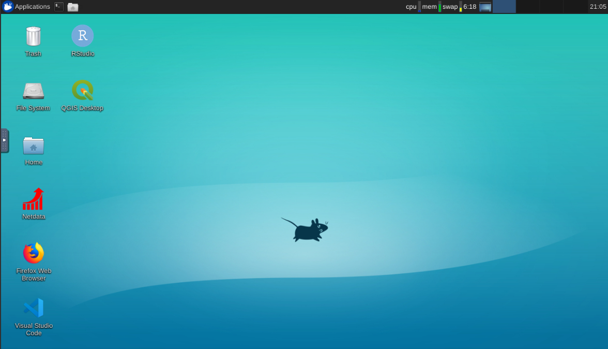
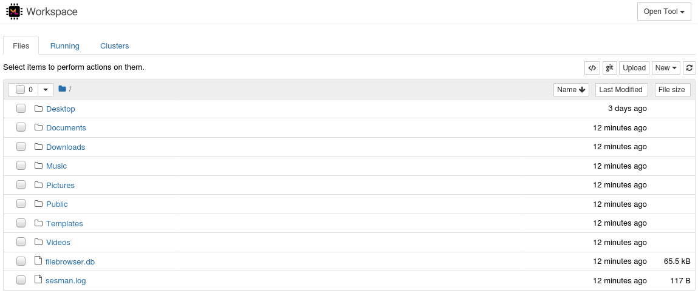
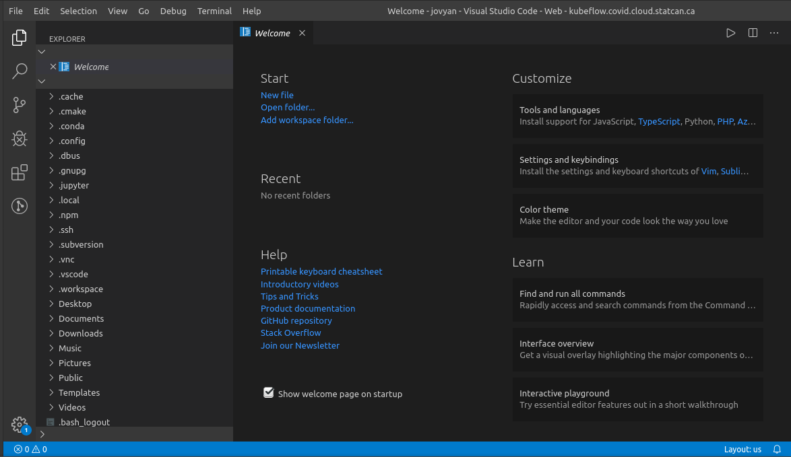
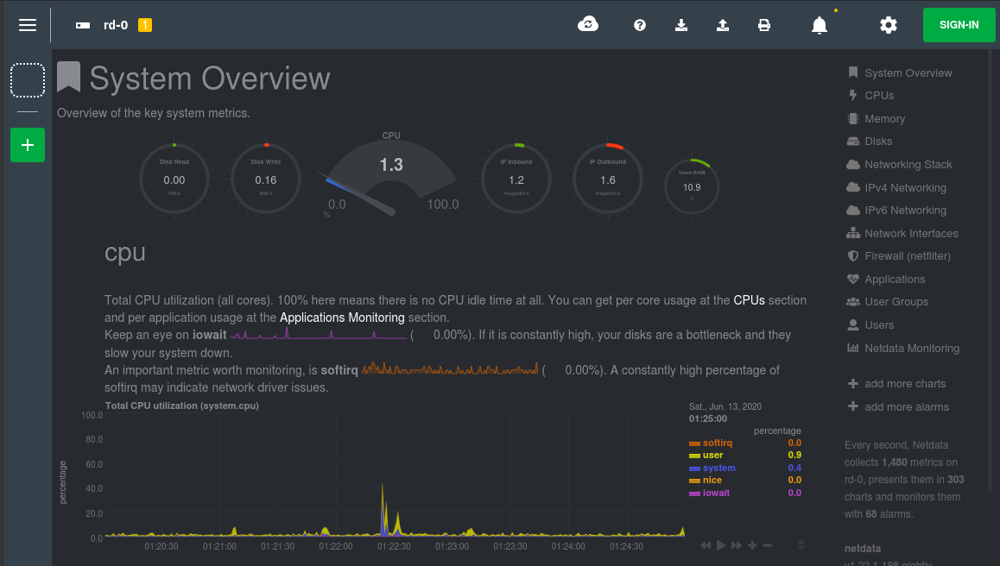
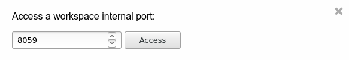

# Bureau à distance

# Qu’est-ce que Bureau à distance?

Bureau à distance offre une expérience bureau sur Ubuntu avec l’interface
utilisateur graphique dans le navigateur et un accès rapide aux outils de
soutien. Le système d’exploitation est [**Ubuntu**](https://ubuntu.com/about)
**18.04** dans l’environnement de bureau [**XFCE**](https://www.xfce.org/about).

## Versions

Deux versions de Bureau à distance sont disponibles. La version _R_ comprend R
et RStudio. La version _Geomatics_ élargit la version _R_ avec QGIS et diverses
bibliothèques de soutien. Vous pouvez personnaliser davantage votre espace de
travail Bureau à distance pour répondre à vos besoins particuliers et tenir
compte de vos préférences.

## Personnalisation

_pip_, _conda_, _npm_ et _yarn_ sont disponibles pour installer divers
progiciels.

# Accéder à Bureau à distance

Pour lancer Bureau à distance ou l’un de ses outils de soutien, créez un serveur
de bloc-notes dans [Kubeflow](./Kubeflow.md) et sélectionnez une des versions
disponibles dans la liste déroulante de l’image. Ensuite, cliquez sur `Connect`
pour accéder à la page de renvoi.

_Remote Desktop_ vous amène à l’interface utilisateur graphique de bureau par
une session noVNC. Cliquez sur < à gauche de l’écran pour élargir une fenêtre
comportant des options comme l’affichage en mode plein écran et l’accès au
presse-papiers.

## Interface héritée : Bloc-notes Jupyter

_Jupyter Notebook_ est une interface héritée pour la gestion de blocs-notes
Jupyter jusqu’à ce que l’intégration de stockage avec les
[images JupyterLab](./Jupyter.md) soit accessible.

Vous pouvez accéder à d’autres outils et interfaces avec le bouton _Open Tool_
dans le coin supérieur droit, ou en retournant à la page de renvoi.

# Outils dans le navigateur

## Visual Studio Code

_VS Code_ vous amène dans l’environnement de développement intégré de Visual
Studio Code.

## Netdata

_Netdata_ assure une surveillance interactive approfondie des ressources. Vous
pouvez vous déplacer sur des graphiques en les faisant glisser. Vous pouvez
également faire un zoom avant et arrière avec `SHIFT + mouse wheel`, ou zoomer
sur une sélection en maintenant la touche `SHIFT` enfoncée tout en vous
déplaçant sur le graphique.

## File Browser

_Filebrowser_ peut être utilisé pour explorer rapidement le système de fichiers
de Bureau à distance et transférer des fichiers entre Bureau à distance et votre
ordinateur.

## Accès à un port

Finalement, _Access Port_ fournit l’accès dans le navigateur à tout ce qui passe
par un port spécifié dans Bureau à distance (accessible en interne à, par
exemple, `localhost:8059`).

Comme pour les autres outils, il s’ouvre dans une page distincte de votre
navigateur. Vos collaborateurs d’espace de noms peuvent également accéder à
cette page si vous leur envoyez l’URL.

_Exemple : Accéder à l’interface API superviseur sur le port 8059_

# Notes

Bureau à distance est fondé sur
[ml-tooling/ml-workspace](https://github.com/ml-tooling/ml-workspace).
