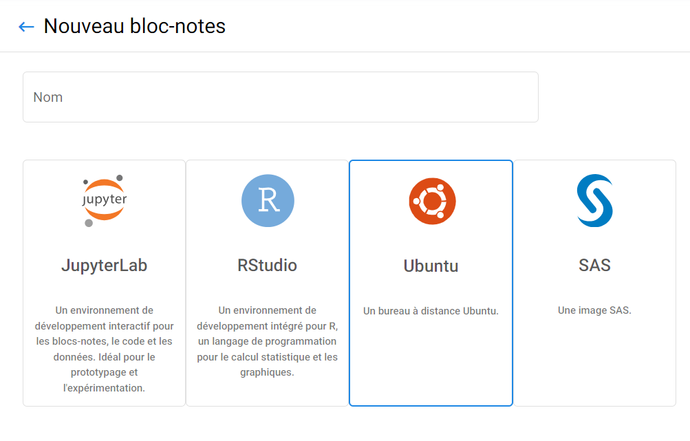
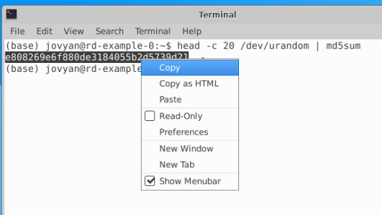

# Aperçu

### Bureau virtuel Ubuntu

_Vous pouvez exécuter un [**Bureau Ubuntu**](https://ubuntu.com/desktop) complet, avec des applications typiques, directement dans votre navigateur, en utilisant [**Kubeflow!**](https://kubeflow. aaw.cloud.statcan.ca/)_

Le bureau virtuel Ubuntu est un outil puissant pour les scientifiques de données et les ingénieurs en apprentissage automatique qui doivent exécuter des charges de travail gourmandes en ressources dans le nuage informatique. Ubuntu est une distribution Linux populaire largement utilisée dans les communautés de science des données et d'apprentissage automatique en raison de sa forte prise en charge des outils open source tels que R et Python. Avec Ubuntu Virtual Desktop, vous pouvez rapidement démarrer une machine virtuelle avec Ubuntu préinstallé et y accéder depuis n'importe où avec une connexion Internet. Cela signifie que vous pouvez effectuer des tâches d'analyse de données et d'apprentissage automatique depuis votre ordinateur portable, votre tablette ou votre téléphone sans avoir à vous soucier des limitations matérielles.

## Qu'est-ce que le Bureau à distance ?

Le bureau à distance offre une expérience de bureau Ubuntu avec interface graphique dans le navigateur ainsi que l'accès rapide aux outils de support. Le système d'exploitation est
[**Ubuntu**](https://ubuntu.com/about) **22.04** avec le
[**XFCE**](https://www.xfce.org/about) pour environnement de bureau.

## Géomatique

Notre version de bureau à distance est construite sur une image R Geospatiale.

## Personnalisation

_pip_, _conda_, _npm_ et _yarn_ sont disponibles pour installer divers packages.

# Installation

## Accéder au bureau à distance

Pour lancer le Bureau à distance ou l'un de ses outils de support, créez un serveur bloc-notes dans [Kubeflow](./Kubeflow.md) et sélectionnez l'option de bureau à distance, qui est l'image Ubuntu.

Une fois créé, cliquez sur « Connecter » pour être redirigé vers le serveur de bureau à distance

_Remote Desktop_ vous amène à l'interface graphique du bureau via une session noVNC. Cliquer sur le > sur le côté gauche de l'écran pour développer un panneau avec des options telles que le plein écran et presse-papiers.

## Accéder au Presse-papiers

Cela se fait via le deuxième bouton en partant du haut du panneau à gauche. Il fait apparaître une zone de texte que nous pouvons modifier pour changer le contenu du presse-papiers ou copiez des éléments du presse-papiers du bureau distant.

Par exemple, supposons que nous souhaitions exécuter la commande `head -c 20 /dev/urandom | somme md5` et copiez-collez le résultat dans un fichier texte sur notre ordinateur utilisé pour se connecter au bureau à distance.

Nous ouvrons d’abord le presse-papiers à partir du panneau de gauche et collons cette commande dans la zone de texte :

Pour fermer la fenêtre du presse-papiers sur le bureau distant, cliquez simplement sur le bouton presse-papiers à nouveau.

Nous faisons ensuite un clic droit sur une fenêtre de terminal pour coller cette commande et appuyons sur Entrée pour exécuter la commande. À ce stade, nous sélectionnons le résultat MD5, faisons un clic droit et cliquons copie:

Si nous ouvrons à nouveau le presse-papiers depuis le panneau de gauche, il aura désormais le nouveau contenu:

La fenêtre du presse-papiers sera même mise à jour sur place si nous la laissons ouverte tout le temps et nous sélectionnons simplement le nouveau matériel sur le bureau distant et appuyons à nouveau sur copier. Nous pouvons simplement copiez ce que nous avons dans cette zone de texte et collez-le dans n'importe quel autre logiciel en cours d'exécution sur l'ordinateur utilisé pour se connecter.

## Outils dans le navigateur

### VSCode

Visual Studio Code est un éditeur de code source léger mais puissant. Il inclut la prise en charge intégrée de JavaScript, TypeScript et Node.js et dispose d'un riche écosystème d'extensions pour plusieurs langages (tels que C++, C#, Java, Python,PHP, Go).

## Notes de bas de page

Le Bureau à distance est basé sur
[ml-tooling/ml-workspace](https://github.com/ml-tooling/ml-workspace).