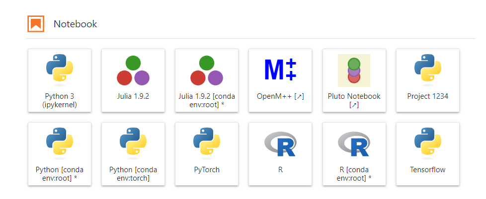

# Environnements virtuels



Lorsque vous effectuez des expériences de science des données, il est recommandé d'utiliser des environnements virtuels Python et/ou conda pour gérer les dépendances de votre projet. Il est courant de créer un environnement dédié pour chaque projet ou, dans certains cas, des environnements distincts pour différentes fonctionnalités ou aspects de votre travail (par exemple, un environnement pour les projets généraux et un environnement supplémentaire adapté aux tâches d'apprentissage en profondeur accélérées par GPU).

Si vous basculez fréquemment entre les environnements et souhaitez un moyen plus pratique d'y accéder dans JupyterLab, vous pouvez suivre ces instructions :

### Création et ajout d'environnements au lanceur JupyterLab

#### Étape 1 : Créer l'environnement

Ouvrez une session de terminal et exécutez le code suivant pour créer un nouvel environnement virtuel. Vous pouvez utiliser conda ou python venv en fonction de vos préférences et des exigences du projet. Chacun a ses propres avantages :

#### Utilisation de conda :

```bash
conda create -n torch
```

##### Avantages de conda :

- Gère à la fois les packages et les environnements Python.
- Simplifie la gestion des packages, y compris les bibliothèques et dépendances non Python.

#### Utilisation de venv :

```bash
python -m torch venv
```

##### Avantages de venv :

- Fait partie de la bibliothèque standard Python (aucune installation séparée requise).
- Fournit un environnement virtuel léger et centré sur Python.

#### Étape 2 : Ajouter l'environnement au lanceur

Après avoir créé l'environnement, ajoutez-le au lanceur JupyterLab avec la commande suivante :

```bash
python -m ipykernel install --user --name "torch" --display-name "PyTorch"
```

- `--name "torch"` spécifie le nom du noyau (remplacez "torch" si nécessaire).
- `--display-name "PyTorch"` définit le nom d'affichage du noyau dans le lanceur JupyterLab (personnalisez si nécessaire).

#### Étape 3 : Actualiser JupyterLab

Pour voir les modifications dans le lanceur JupyterLab, actualisez votre navigateur en cliquant sur le bouton d'actualisation ou en utilisant le raccourci clavier F5.

Ces étapes vous permettent de gérer de manière transparente vos environnements Python et d'y accéder facilement depuis le lanceur JupyterLab, favorisant ainsi un flux de travail plus organisé et plus efficace pour vos expériences de science des données.
