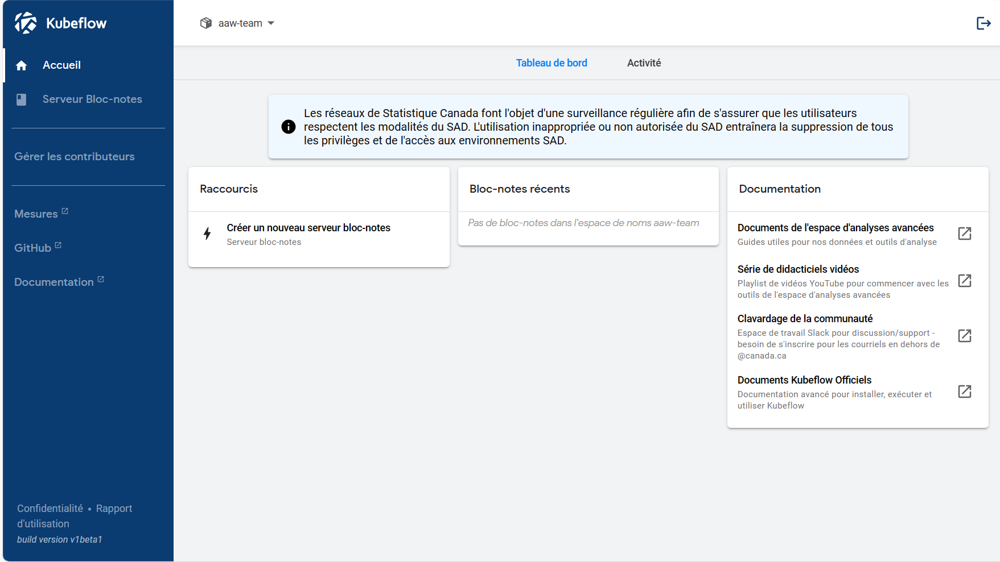
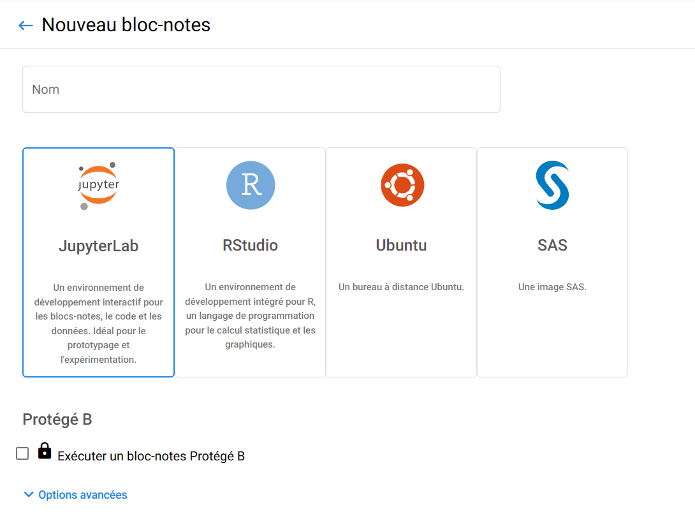
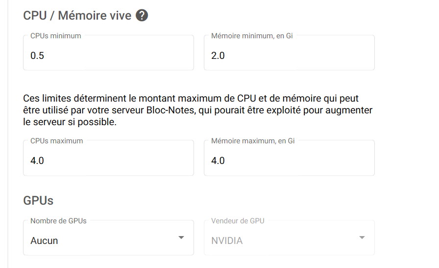
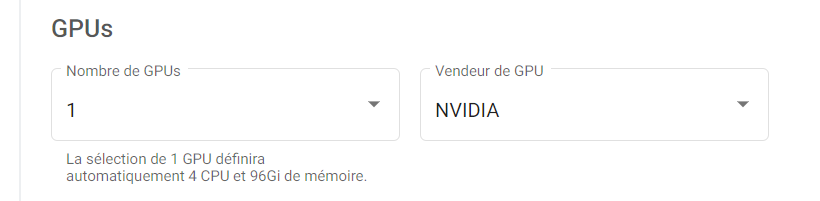

# Aperçu

## Que fait Kubeflow?

Kubeflow exécute vos **espaces de travail**. Vous pouvez avoir des serveurs de
bloc-notes (appelés serveurs Jupyter), et vous pouvez y créer des analyses en R
et Python avec des visuels interactifs. Vous pouvez enregistrer et charger des
données, télécharger des données, et créer des espaces de travail partagés pour
votre équipe.

**Commençons sans plus tarder!**

<!-- Video is removed until weget the green light to activate it again
# Didacticiel vidéo

!!! note "" 
    Cette vidéo n'est pas à jour, certaines choses pourraient avoir changé depuis.

-->

# Installation

## Connectez-vous à Kubeflow

<!-- prettier-ignore -->
!!! warning "Connectez-vous au portail Azure à l'aide de vos identifiants cloud"
    Vous devez vous connecter au portail Azure ** en utilisant vos informations d'identification StatCan **.`first.lastname@cloud.statcan.ca` ou ** en utilisant vos informations d'identification StatCan ** `first.lastname@statcan.gc.ca`. Vous pouvez le faire en utilisant
    [Portail Azure](https://portal.azure.com).
    

- Se connecter à [Kubeflow](https://kubeflow.aaw.cloud.statcan.ca)

- Accédez à l'onglet Serveurs bloc-notes

- Assurez-vous que l'espace de noms de votre projet est sélectionné dans le menu déroulant des espaces de noms et que l'exemple dans la capture d'écran est "aaw-team".

- Puis clique **+ Nouveau serveur**

## Configuration de votre serveur

- Vous obtiendrez un modèle pour créer votre serveur de bloc-notes. **Remarque
  :** le nom de votre serveur doit être en lettres minuscules avec des tirets.
  **Pas d'espaces, et non souligne.**

## Image

Vous devrez choisir une image. Il existe JupyterLab, RStudio, bureau à distance Ubuntu et SAS disponibles. L'image SAS est disponible uniquement pour les employés de StatCan (en raison des limitations de licence), les autres sont disponibles pour tout le monde. Sélectionnez le menu déroulant pour sélectionner des options supplémentaires parmi celles-ci (par exemple les images CPU, PyTorch et TensorFlow pour JupyterLab).

Vérifiez le nom des images et choisissez-en une qui correspond à ce que vous souhaitez faire. Je ne sais pas lequel choisir ? Découvrez vos options [ici](../Selectionner-une-image).

### Image personnalisée

Un utilisateur peut utiliser une image personnalisée, auquel cas il doit connaître la forme exacte de l'image et son nom.

Les images personnalisées de l'utilisateur sont fournies via le dépôt aaw-contrib-containers qui, une fois poussées vers la branche principale, poussera également l'image vers notre ACR. Une fois cette action terminée avec succès, vous pouvez utiliser l'image personnalisée.

Lors de la création d'un bloc-notes, cliquez sur « Options avancées », cochez la case pour l'image personnalisée et saisissez l'image en saisissant `k8scc01covidacr.azurecr.io/[your-image-name-here]:[sha]`.

Une fois le bloc-note créé, si le statut n'est pas prêt au bout de quelques minutes, cliquez sur son nom pour voir la page de détails. Ensuite l'onglet « Événements » vous permet de savoir exactement ce qui se passe. Si nécessaire, contactez le canal d’aide sur Slack si le problème persiste.

## CPU et mémoire

- Au moment de la rédaction (23 décembre, 2021), il existe deux types
  d'ordinateurs dans la grappe

  - **CPU:** `D16s v3` (16 CPU , 64 G mémoire; 15 CPU et 48 G mémoire sont
    disponible pour l'utilisateur, 1 CPU et 16 G mémoire sont réservés pour
    l'utilisation du système)
  - **GPU:** `NC6s_v3` (6 CPU , 112 G mémoire, 1 GPU; 96 G de mémoire disponible
    pour l'utilisateur, 16 G sont réservés pour l'utilisation du système)

Lors de la création d'un serveur de bloc-notes, le système vous limitera aux
spécifications maximales ci-dessus. Pour les serveurs de bloc-notes CPU, vous
pouvez spécifier la quantité exacte de CPU et de mémoire dont vous avez besoin.
Cela vous permet de répondre à vos besoins de calcul tout en minimisant les
coûts. Pour un serveur portable GPU, vous obtiendrez toujours le serveur complet
(6 cœurs CPU, 96 Gio de mémoire accessible et 1 GPU).

Dans les options avancées, vous pouvez sélectionner une limite supérieure au nombre de cœurs de processeur et de RAM demandés. Le montant demandé est le montant garanti disponible pour votre serveur bloc-notes et vous paierez toujours au moins ce montant. Si la limite est supérieure à la quantité demandée, si des cœurs de RAM et de processeur supplémentaires sont disponibles sur ce serveur partagé dans le cluster, votre serveur de bloc-notes peut les utiliser selon vos besoins. Un cas d’utilisation est celui des tâches qui ne nécessitent généralement qu’un seul cœur de processeur mais qui peuvent bénéficier du multithreading pour accélérer certaines opérations. En demandant un cœur de processeur mais une limite plus élevée, vous pouvez payer beaucoup moins pour le serveur boc-notes tout en lui permettant d'utiliser des cœurs de processeur de rechange inutilisés si nécessaire pour accélérer les calculs.

## GPUs

Si vous voulez un serveur GPU, sélectionnez « 1 » comme nombre de GPU et « NVIDIA » comme fournisseur de GPU (le bouton de création sera grisé jusqu'à ce que le fournisseur de GPU soit sélectionné si
vous avez un GPU spécifié). Les serveurs multi-GPU sont actuellement pris en charge sur le
système ETAA uniquement sur une base spéciale sur demande, veuillez contacter les mainteneurs d'ETAA si
vous souhaitez un serveur multi-GPU.

Comme mentionné précédemment, si vous sélectionnez un serveur GPU, vous obtiendrez automatiquement 6 CPU
cœurs et 112 Go de mémoire.

<!-- prettier-ignore -->
!!! note "Utilisez les machines GPU de manière responsable"
     Les machines GPU sont nettement plus chères que les machines CPU,
     alors utilisez-les de manière responsable.

## Volume d'espace de travail

Vous aurez besoin d'un volume d'espace de travail, sur lequel le dossier personnel sera monté. Ces différentes options de configuration sont disponibles :

- Vous pouvez soit réutiliser un volume d'espace de travail existant auparavant, soit en créer un nouveau.

- Vous pouvez spécifier la taille du volume de l'espace de travail, de 4 Gio à 32 Gio.

<!-- prettier-ignore -->
!!! conseil "Vérifiez les anciens volumes en regardant l'option Existant"
     Lorsque vous créez votre serveur vous avez la possibilité de réutiliser un ancien volume
     ou en créer un nouveau. Vous souhaitez probablement réutiliser votre ancien volume.

## Volumes de données

Vous pouvez également créer des volumes de données pouvant être utilisés pour stocker des données supplémentaires. Plusieurs volumes de données peuvent être créés. Cliquez sur le bouton Ajouter un nouveau volume pour créer un nouveau volume et préciser sa configuration. Cliquez sur le bouton Attacher un volume existant pour monter un volume existant vers le serveur de bloc-notes. Il existe les paramètres de configuration suivants pour les volumes de données :

- **Nom** : Nom du volume.

- **Taille en GiB** : De 4 Gio à 512 Gio.

- **Chemin de montage** : Chemin où le volume de données est accessible sur le serveur bloc-notes, par
   par défaut `/home/jovyan/vol-1`, `/home/jovyan/vol-2`, etc. (compteur incrémentiel par données
   volume monté).

Lors du montage d'un volume de données existant, l'option de nom devient une liste déroulante du
volumes de données existants. Uniquement un volume non actuellement monté sur un serveur de bloc-notes existant
peut être utilisé. L'option du chemin de montage reste configurable par l'utilisateur avec les mêmes valeurs par défaut que
créer un nouveau volume.

L'icône de la poubelle à droite peut être utilisée pour supprimer un volume de données existant ou créé accidentellement.

## Configuration

Si des configurations sont disponibles, elles sont présentées ici sous forme de cases à cocher. Actuellement, aucune configuration n'existe.

## Paramètres divers

Les éléments suivants peuvent être personnalisés ici :

- **Activer la mémoire partagée** : ceci est requis si vous utilisez PyTorch avec plusieurs données
   chargeurs, qui autrement généreront une erreur. Si vous utilisez PyTorch, assurez-vous de ceci
   est activé, sinon cela n'a pas d'importance sauf si vous avez une autre application
   cela nécessite une mémoire partagée.
- **Langue du système** : Vous pouvez spécifier ici l'anglais ou le français.

## Et... Créer!!!

- Si vous êtes satisfait des paramètres, vous pouvez maintenant créer le serveur
  ! Cela pourrait prenez quelques minutes pour démarrer en fonction des
  ressources que vous avez demandées. (GPU prendre plus de temps.)

<!-- prettier-ignore -->
!!! success "Votre serveur est en cours d'exécution"
    Si tout se passe bien, votre serveur devrait fonctionner !!! Vous aurez maintenant le
    possibilité de se connecter, et [essayer Jupyter!](../Jupyter)

# Une fois que vous avez les bases...

## Partagez votre espace de travail

Dans Kubeflow, chaque utilisateur dispose d'un **espace de noms** qui contient son travail (ses serveurs blocs-note, pipelines, disques, etc.). Votre espace de nom vous appartient, mais peut être partagé si vous souhaitez collaborer avec d'autres. **Pour plus de détails sur collaboration sur la plateforme, voir
[Collaboration](../4-Collaboration/Aperçu.md).**
