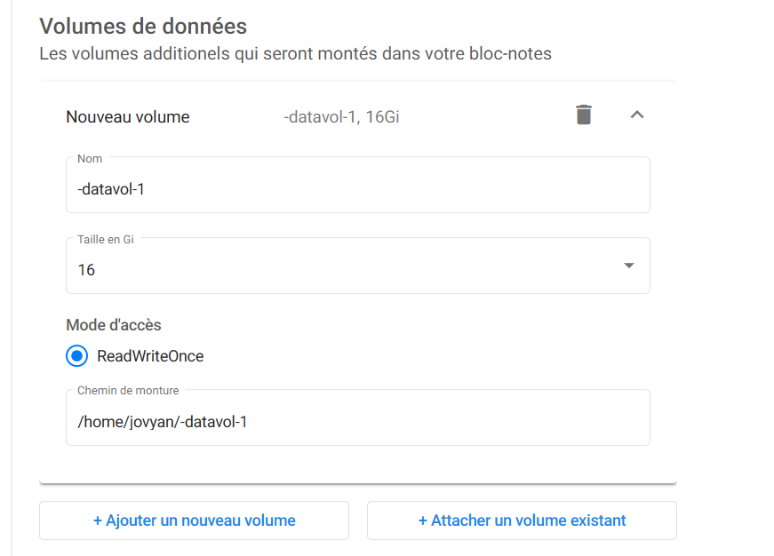
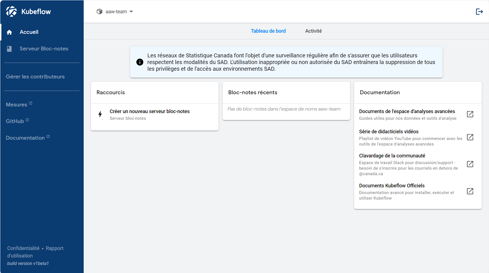

# Démarrer avec Kubeflow

## Que fait Kubeflow?

Kubeflow exécute vos **espaces de travail**. Vous pouvez avoir des serveurs de
bloc-notes (appelés serveurs Jupyter), et vous pouvez y créer des analyses en R
et Python avec des visuels interactifs. Vous pouvez enregistrer et charger des
données, télécharger des données, et créer des espaces de travail partagés pour
votre équipe.

**Commençons sans plus tarder!**

# Créer un serveur

## Se connecter à Kubeflow

- Connectez-vous au [portail Azure](https://portal.azure.com) **à l'aide de vos
  justificatifs d'identité `@cloud.statcan.ca`**.

<!-- prettier-ignore -->
??? warning "Connectez-vous au portail Azure au moyen de vos justificatifs d'identité dans le nuage"
    Vous devez vous connecter au portail Azure **au moyen de vos justificatifs
    d'identité StatCan** : `prenom.nom@cloud.statcan.ca`. Vous pouvez le faire
    ici [sur le portail Azure](https://portal.azure.com).
    

- Après avoir ouvert une session dans Azure, connectez-vous à
  [Kubeflow](https://kubeflow.covid.cloud.statcan.ca)

<!-- prettier-ignore -->
??? failure « Pourquoi est-ce que je reçois le message `Paramètre URL manquant : code`? »
    Si vous essayez de vous connecter à Kubeflow et que vous obtenez le message

    > Paramètre URL manquant : code

    c'est parce que vous êtes connecté avec le mauvais compte Azure. Vous devez
    vous connecter avec vos justificatifs d'identité dans le nuage.

    

- Allez à l'onglet des serveurs Jupyter

- Cliquez ensuite sur **+ Nouveau serveur**.

## Configuration de votre serveur

- Vous recevrez un modèle pour créer votre serveur de bloc-notes. **Nota :** Le
  nom doit être en minuscules avec des tirets. **Pas d'espace ou de trait de
  soulignement.**

- **Vous devrez choisir une image** Vous voudrez probablement une image de :
  - **Apprentissage automatique**
  - **Géomatique**
  - **Minime**

- Si vous voulez utiliser un processeur graphique (GPU), vérifiez si l'image
  indique **CPU** ou **GPU**.

## Unité centrale (CPU) et mémoire vive

- Au moment de la rédaction du présent document (21 avril 2020), il y a deux
  types d'ordinateurs dans la grappe :

  - **CPU :** `D16s_v3` (16 unités centrales virtuelles, mémoire vive de 64 Go)
  - **GPU :** `NC6s_v3` (6 unités centrales virtuelles, mémoire vive de 112 Go,
    1 carte graphiques)

  Pour cette raison, si vous demandez trop de mémoire vive ou trop de CPU, il
  pourrait être difficile ou impossible de satisfaire votre demande.

  Il est possible que plus tard (peut-être lorsque vous lirez ceci), des
  appareils plus puissants soient disponibles, et que les restrictions soient
  moins strictes.

<!-- prettier-ignore -->
!!! note "Utilisez les GPU de manière responsable"
    Il y a moins d'appareils avec GPU que d'appareils avec CPU, alors
    utilisez-les de manière responsable.

## Stockage de vos données

- Vous voudrez créer un volume de données. Vous pouvez enregistrer votre travail
  dans ce volume de données, et si vous éteignez votre serveur, vous pourrez
  simplement remonter vos anciennes données en saisissant le nom de votre ancien
  disque. **Il est important que vous vous souveniez du nom du volume.**

<!-- prettier-ignore -->
!!! tip "Trouvez des anciens volumes en jetant un coup d'œil à l'option Existant"
    Lorsque vous créez votre serveur, vous avez la possibilité de réutiliser un
    ancien volume ou d'en créer un nouveau. Vous souhaiterez probablement
    réutiliser votre ancien volume.

## Et... Créez!!!

- Si vous êtes satisfait des paramètres, vous pouvez maintenant créer le
  serveur! Il se peut que cela prenne quelques minutes pour se mettre en route,
  selon les ressources que vous avez demandées. (Les GPU prennent plus de
  temps.)

<!-- prettier-ignore -->
!!! success "Votre serveur est en fonctionnement"
    Si tout va bien, votre serveur devrait fonctionner! Vous aurez désormais
    la possibilité de connecter et [d'essayer Jupyter.](/1-Experiences/Jupyter)

# Partager votre espace de travail

Dans Kubeflow, chaque utilisateur dispose d'un **espace de noms**. Cet espace
vous appartient, et toutes vous ressources s'y trouvent. Si vous souhaitez
collaborer avec quelqu'un, vous devez partager un espace de noms. Pour ce faire,
pouvez partager votre propre espace de noms ou, préférablement, **créer un
espace de noms d'équipe**.

## Créer un nouvel espace de noms partagé

Le lien pour créer un nouvel espace de noms est ici :

- à FAIRE, IL N'Y A PAS ENCORE DE LIEN. <!-- TODO -->

## Gérer les contributeurs

Vous pouvez ajouter ou supprimer des personnes d'un espace de noms que vous
possédez à partir du menu **Gérer les contributeurs** dans Kubeflow.

<!-- prettier-ignore -->
!!! success "Vos collègues et vous pouvez maintenant partager l'accès à un serveur!"
    Vous pouvez maintenant partager un serveur avec vos collègues! Essayez-le!

**Pour plus de détails sur la collaboration avec le plateforme, voyez
[Collaboration](/Collaboration).**
